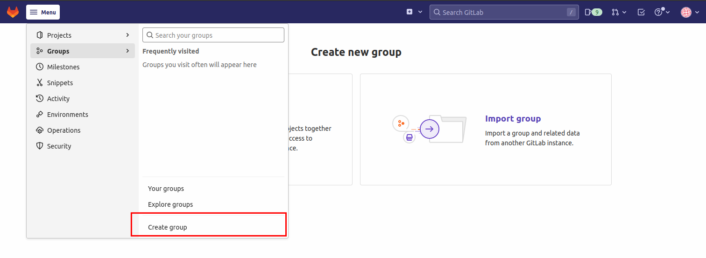
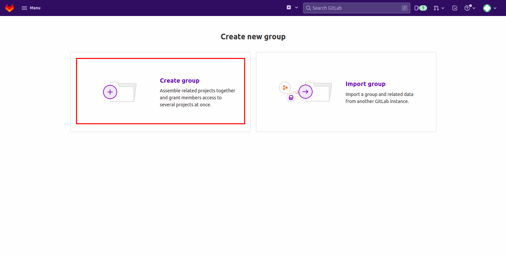
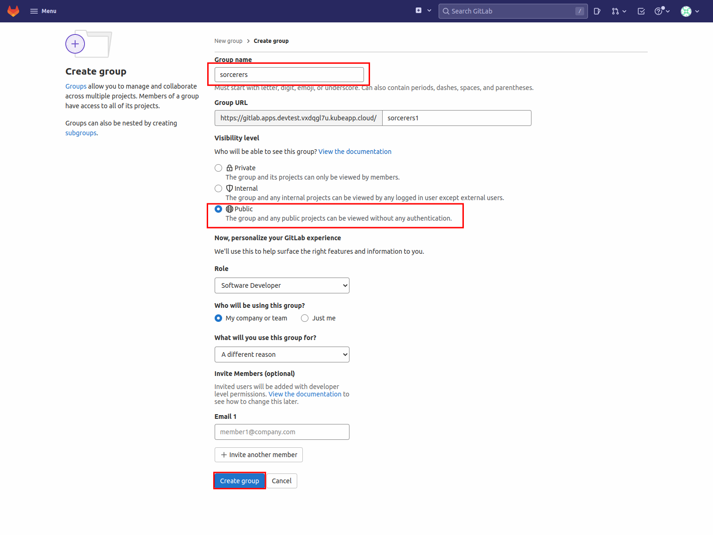
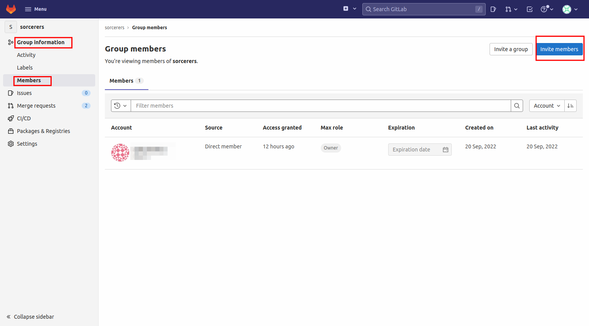
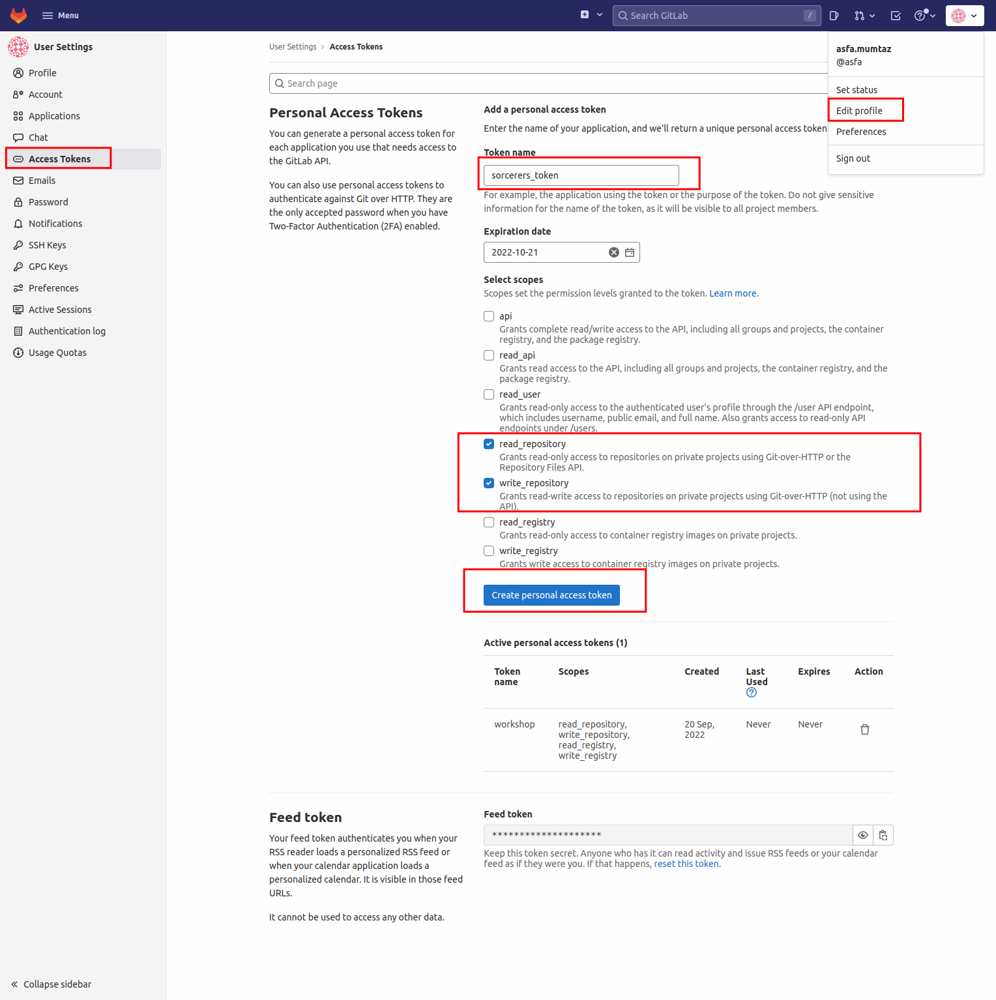
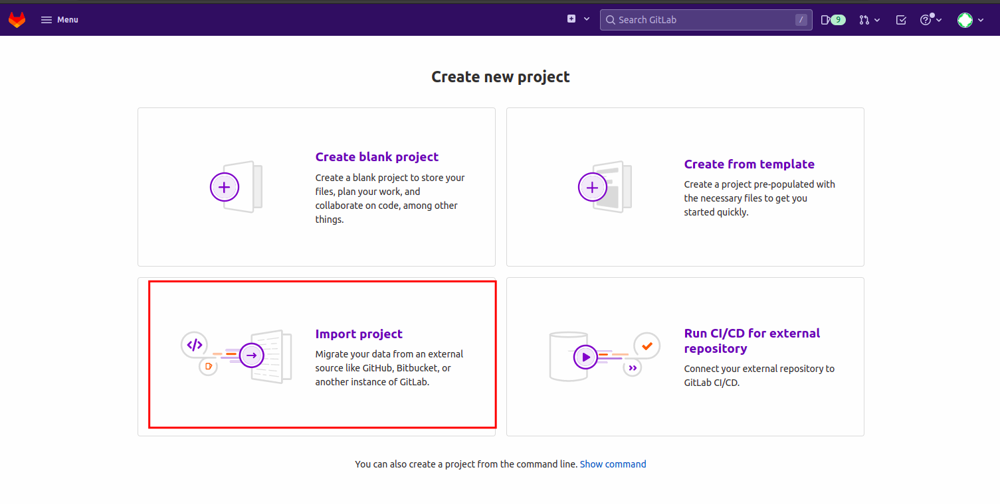
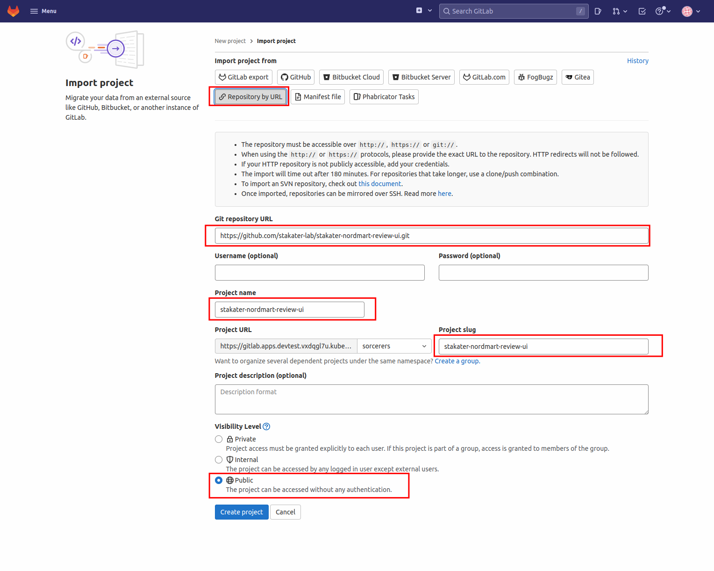

# Getting GitLab Ready for GitOps
> In this section we will get GitLab ready for our exercise. We will then import a couple of projects and prep them up to be deployed to the cluster.

1. Log into GitLab with your credentials. You can find the GitLab URL in Forecastle UI. GitLab URL:

    ```bash
     https://gitlab.apps.devtest.vxdqgl7u.kubeapp.cloud/
    ```

   First, we need to create a GitLab group with name as the <team_name> or <participant_name>
   For this open up the menu and select "Create group" from the "Groups" tab:

   

   This will redirect you to the following screen. Select "Create group" option.

   

2. Put your TEAM_NAME (`<TEAM_NAME>`) or YOUR_NAME (`<YOUR_NAME>`)  as the group name, select **Public** for Visibility level, and hit Create group. This is so we can easily share code and view other teams' activity.
   For the purpose of this manual, we will use the group name `sorcerers`. Please choose your own unique name.

   

   GitLab will redirect you to the group's home page, once the group is created.

    > Remember that **group name** and **tenant name** should be the same. Make the tenant with the same name in `nordmart-infra-gitops-config` repo.


3. If you are working as a team, you must add your team members to this group. This will give them permissions to work on the projects created in this group. Select "Members" from the left panel and invite your team members via "Invite member" option. Make sure to choose "Maintainer" or "Owner" role permission. You can ignore this step if you are not working as a team.
   To do this, select "Group information from the left panel" and click member

   


Add member to the group using the "Invite member" option.

4. We are going to create a GitLab Personal Access Token (PAT). The token is a more secure and reliable method for accessing GitLab from our scripts later on. Note, that for reference's sake, you can also generate a PAT in GitLab under User > Settings > Access Tokens in the Web UI. We use a helper script here to help automate that process. To generate the token, open a terminal if you have not got one open and run the following commands.

   

   Export your GitLab username.

    ```bash
    export GIT_USERNAME=<YOUR_GITLAB_USERNAME>
    ```
   Export your Email. (use the email used in registering)

    ```bash
    export GIT_EMAIL=<YOUR_GITLAB_EMAIL>
    ```

   Export your GitLab password.

    ```bash
    export GIT_PASSWORD=<YOUR_GITLAB_PERSONAL_ACCESS_TOKEN>
    ```

    <p class="tip">
    ⛷️ <b>TIP</b> ⛷️ - If your password includes special characters, try putting it in single quotes. ie: <strong>'A8y?Rpm!9+A3B/KG'</strong>
    </p>

    Lets add these config to git 
    ```bash
        git config --global user.name $GIT_USERNAME
        git config --global user.email $GIT_EMAIL
        git config --global user.password $GIT_PASSWORD
    ```


## Importing Nordmart Review
> In this part, we will import the projects we need to deploy on the cluster.

1. Select "Projects" from the menu and click "Create project". This will redirect you to the following screen. Select "Import Project".
   

2. Now select the "Repository by URL" option and paste in the following repository URL:
    ```
        https://github.com/stakater-lab/stakater-nordmart-review.git
    ```
   > Make sure you mark the repository as public and choose the group you previously created as the group name. 
    
   > Make sure that Project Name is lower case and doesn't contain spaces. Use '-' instead.  

      


## Importing Nordmart Review UI 
1. Select "Projects" from the menu and click "Create project". This will redirect you to the following screen. Select "Import Project".
   

2. Now select the "Repository by URL" option and paste in the following repository URL:
    ```
        https://github.com/stakater-lab/stakater-nordmart-review-ui.git
    ```

   

   > Make sure you mark the repository as public and choose the group you previously created as the group name.
   
   > Make sure that Project Name is lower case and doesn't contain spaces. Use '-' instead.
    
