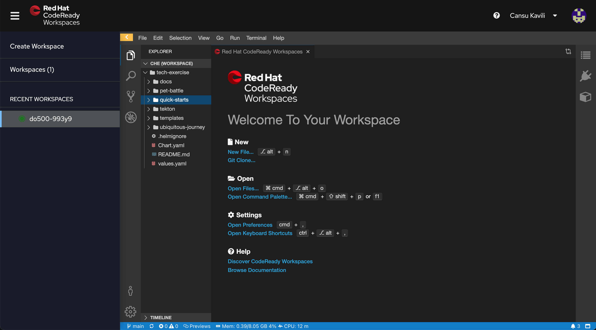
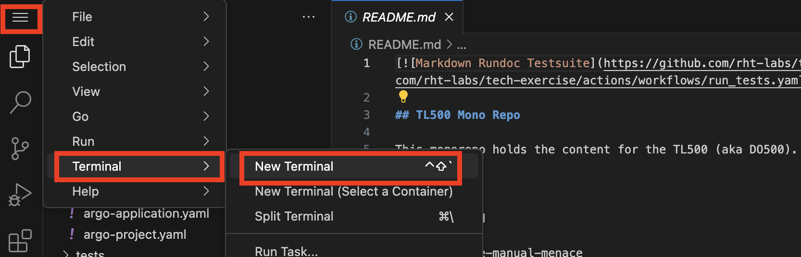
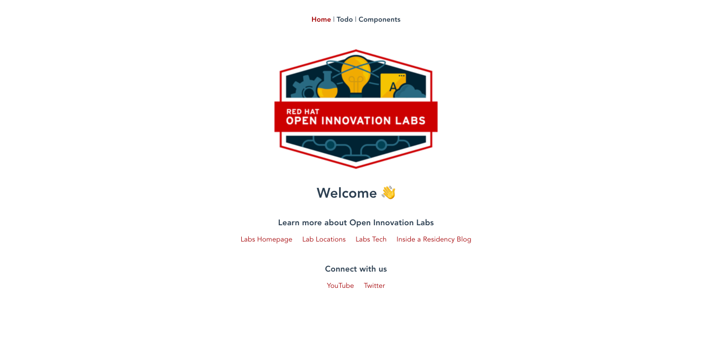

## 🐌 The Basics - CRW, OCP & Helm
## CodeReady Workspaces setup

1. Login to your CodeReadyWorkspace (CRW) Editor. The link to this will be provided by your instructor.

    

    <p class="warn">
    If the workspace has not been set up for you, you can create one from this devfile.
    </br>
    On CodeReady Workspaces, "Create Workspace > Custom Workspace".
    </br>
    For OpenShift 4.9, 4.10 - Enter this URL to load the TL500 stack:</br>
    <span style="color:blue;"><a id=crw_dev_filelocation href=""></a></span>
    </br>
    On DevSpaces Workspaces, "Add Workspace > Import from Git".
    </br>
    For OpenShift 4.11+ - Enter this URL to load the TL500 stack:</br>
    <span style="color:blue;"><a id=crw_dev_filelocation_4.11 href=""></a></span>
    </p>

2. In your IDE (it may take some time to open ... ⏰☕️), open a new terminal by hitting `Terminal > Open Terminal in Specific Container > stack-tl500` from the menu.

    

3. Notice the nifty default shell in the stack-tl500 container is `zsh` which rhymes with swish. It also has neat shortcuts and plugins - plus all the cool kids are using it 😎! We will be setting our environment variables in both `~/.zshrc` and `~/.bashrc` in case you want to switch to `bash`.

4. Setup your `TEAM_NAME` name in the environment of the CodeReadyWorkspace by running the command below. We will use the `TEAM_NAME` variable throughout the exercises so having it stored in our session means less changing of this variable throughout the exercises 💪. **Ensure your `TEAM_NAME` consists of only lower case alphanumeric characters or '-', and must start and end with an alphanumeric character (e.g. 'my-name',  or '123-abc.)**

    ```bash#test
    echo export TEAM_NAME="<TEAM_NAME>" | tee -a ~/.bashrc -a ~/.zshrc
    ```

5. Add the `CLUSTER_DOMAIN` to the environment:

    ```bash#test
    echo export CLUSTER_DOMAIN="<CLUSTER_DOMAIN>" | tee -a ~/.bashrc -a ~/.zshrc
    ```

6. Add the `GIT_SERVER` to the environment:

    ```bash#test
    echo export GIT_SERVER="<GIT_SERVER>" | tee -a ~/.bashrc -a ~/.zshrc
    ```

7. Verify the variables you have set:

    ```zsh#test
    source ~/.zshrc
    echo ${TEAM_NAME}
    echo ${CLUSTER_DOMAIN}
    echo ${GIT_SERVER}
    ```

8. Check if you can connect to OpenShift. Run the command below.

    <p class="tip">
    ⛷️ <b>TIP</b> ⛷️ - Before you hit enter, make sure you change the username and password to match your team's login details. If your password includes special characters, put it in single quotes. ie: <strong>'A8y?Rpm!9+A3B/KG'</strong>
    </p>

    ```bash
    oc login --server=https://api.${CLUSTER_DOMAIN##apps.}:6443 -u <USER_NAME> -p <PASSWORD>
    ```

9. Check your user permissions in OpenShift by creating your team's `ci-cd` project. 

    ```bash#test
    oc new-project ${TEAM_NAME}-ci-cd || true
    ```

    

    <p class="warn">
        ⛷️ <b>NOTE</b> ⛷️ - If you are working as a team and are using the same TEAM_NAME, you may receive a message saying this project already exists. One of your team mates would have already created this project. It's all good!
    </p>

### Helm 101

> Helm is the package manager for Kubernetes. It provides a way to create templates for the Kubernetes YAML that defines our application. The Kubernetes resources such as `DeploymentConfig`, `Route` & `Service` can be processed by supplying `values` to the templates. In Helm land, there are a few ways to do this. A package containing the templates and their default values is called a `chart`. 

Let's deploy a simple application using Helm.

1. Helm charts are packaged and stored in repositories. They can be added as dependencies of other charts or used directly. Let's add a chart repository now. The chart repository stores the version history of our charts as well as the packaged tar file.

    ```bash#test
    helm repo add tl500 https://rht-labs.com/todolist/
    ```

2. Let's install a chart from this repo. First search the repository to see what is available.

    ```bash#test
    helm search repo todolist
    ```

    Now install the latest version. Helm likes to give each install a release, for convenience we've set ours to `my`. This will add a prefix of `my-` to all the resources that are created.

    ```bash#test
    helm install my tl500/todolist --namespace ${TEAM_NAME}-ci-cd || true
    ```

3. Open the application up in the browser to verify it's up and running. Here's a handy one-liner to get the address of the app

    ```bash#test
    echo https://$(oc get route/my-todolist -n ${TEAM_NAME}-ci-cd --template='{{.spec.host}}')
    ```

    

4. You can overwrite the default <span style="color:blue;">[values](https://github.com/rht-labs/todolist/blob/master/chart/values.yaml)</span> in a chart from the command line. Let's upgrade our deployment to show this. We'll make a simple change to the values to scale up our app. By default, we only have 1 replica.

    ```bash#test
    oc get pods -n ${TEAM_NAME}-ci-cd
    ```

    By default, we only have one replica of our application. Let's use helm to set this to 5.

    ```bash#test
    helm upgrade my tl500/todolist --set replicas=5 --namespace ${TEAM_NAME}-ci-cd
    ```

    Verify the deployment has scaled up to 5 replicas.

    ```bash#test
    oc get pods -n ${TEAM_NAME}-ci-cd
    ```

5. If you're done playing with the #amazing-todolist-app then let's tidy up our work by removing the chart. To do this, run helm uninstall to remove our release of the chart.

    ```bash#test
    helm uninstall my --namespace ${TEAM_NAME}-ci-cd
    ```

    Verify the clean up

    ```bash#test
    oc get pods -n ${TEAM_NAME}-ci-cd | grep todolist
    ```

6. For those who are really interested, this is the anatomy of our Helm chart. It can be <span style="color:blue;">[found here](https://github.com/rht-labs/todolist)</span>, but the basic structure is as follows:

    <div class="highlight" style="background: #f7f7f7">
    <pre><code class="language-bash">
    todolist/chart
    ├── Chart.yaml
    ├── templates
    │   ├── _helpers.tpl
    │   ├── deploymentconfig.yaml
    │   ├── route.yaml
    │   └── service.yaml
    └── values.yaml
    </code></pre></div>

    where:
    * `Chart.yaml` - is the manifest of the chart. It defines the name, version and dependencies for our chart.
    * `values.yaml` - is the sensible defaults for our chart to work, it contains the variables that are passed to the templates. We can overwrite these values on the command line.
    * `templates/*.yaml` - they are our k8s resources. 
    * `_helpers.tpl` - is a collection of reusable variables an yaml snippets that are applied across all of the k8s resources uniformly for example, labels are defined in here and included on each k8s resource file as necessary.

🪄🪄 Now, let's continue with even more exciting tools... !🪄🪄
