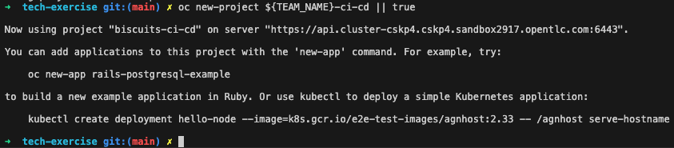

## 🐌 The Basics - CRW, OCP & Helm
## CodeReady Workspaces setup

1. Login to your CodeReadyWorkspace Editor. The link to this will be provided by your instructor.


2. In your IDE, open a new terminal by hitting `Terminal > Open Terminal in Specific Container > do500-stack` from the menu.


<!--@Cansu - this is how you style a colour on a word mid sentence <span style="color:purple;" >zsh</span>  -->
3. <strong>OPTIONAL</strong> - if you want to use `zsh` as opposed to `sh`, you can set it as the default shell by running. `zsh` is swish and all the cool kids are using it 😎!
```bash
echo "zsh" >> ~/.bashrc
```

4. Setup your `<TEAM_NAME>` name in the environment of the CodeReadyWorkspace by replacing this and running the command below. We will use the `TEAM_NAME` variable throughout the exercises so having it stored in our session means less changing of this variable throughout the exercises 💪:
```bash
# setup for commands
echo export TEAM_NAME="<TEAM_NAME>" | tee -a ~/.bashrc -a ~/.zshrc
```

5. Retrieve the `CLUSTER_DOMAIN` from the facilitator and add it to the environment
```bash
# setup cluster domain
echo export CLUSTER_DOMAIN="<CLUSTER_DOMAIN>" | tee -a ~/.bashrc -a ~/.zshrc
```

6. Verify the variables you have set
```bash
# verify variables
source ~/.bashrc
echo ${CLUSTER_DOMAIN}
echo ${TEAM_NAME}
```

7. Check if you can connect to OpenShift. The `<CLUSTER_DOMAIN>` should be provided by your facilitator. Update it and run the command below. 
```bash
# check if you can access the cluster
oc login --server=https://api.${CLUSTER_DOMAIN}:6443 -u <USERNAME> -p <PASSWORD>
```

8. Check your user permissions in OpenShift by creating your team's CICD project. 
```bash
# verify your can create a project
oc new-project ${TEAM_NAME}-ci-cd
```

### Helm 101
[TODO]

Helm is the package manager for Kubernetes. It provides a way to templatise the kubernetes yaml that make up our application. The Kubernetes resources such as `DeploymentConfig`, `Route` & `Service`.

Let's deploy a simple application using helm.


1. something something add a chart repository

2. something something helm install it

3. something something change a var and helm install it again
### TODO - Familiarise yourself with some basic helm...
    * thinking add some random chart / website / app eg Residency Microsite? 
    * change values eg defaults and then override on the command line
    * show values changed?
