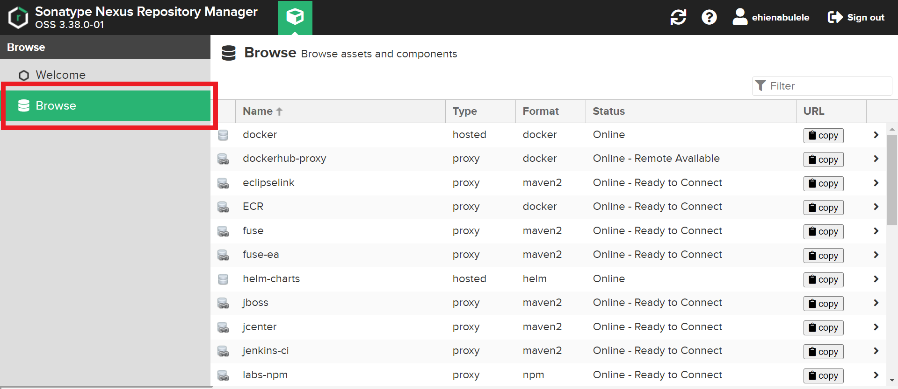

# 🐋 Nexus 101

Nexus is an open-source repository manager which supports many artifact formats. With Nexus, you can store, organize, and retrieve your dependencies, making collaboration more seamless for your team and your software easier to distribute.

The flexibility of hosting your repository  with Nexus provides a lot of benefits to your organization including;

- Providing a single source of truth for all your binaries, artifacts, and dependencies.
- Reducing cost and saving on build time by caching artifacts.
- Nexus supports a wide variety of package managers including NPM, Maven, Pypi, Docker, Helm, Apt, Yum, etc. allowing you a central location for all your binaries.
- Visualizing your software dependencies.
- Gaining visibility into your consumption of third-party and open-source software.

Your SAAP instance comes with a fully-managed instance of Nexus. 

1. To access your Nexus Instance, from your `Forecastle` console, click on the `Nexus` tile.

2. You will be brought to your `Nexus` home page.

3. To view a list of your artifacts, from the top left corner, click on the `Browse` tile.

