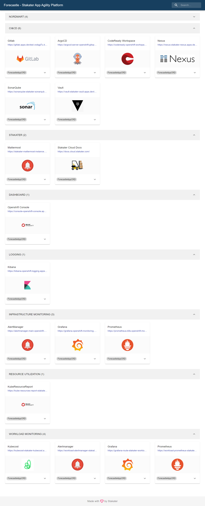
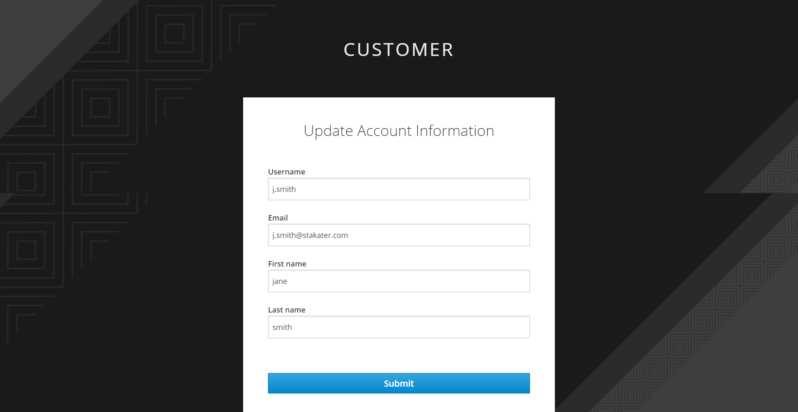
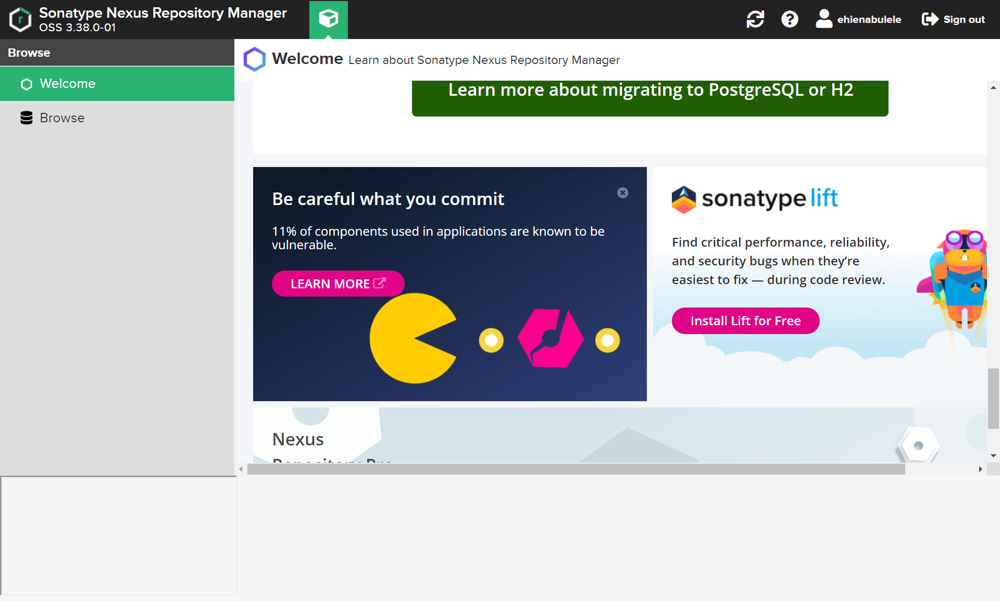

# 🐋 Nexus 101

> [Nexus](https://www.sonatype.com/products/nexus-repository) is an open-source repository manager which supports many artifact formats. With Nexus, you can store, organize, and retrieve your dependencies, making collaboration more seamless for your team, and your software easier to distribute.

The flexibility of managing your repository with Nexus provides a lot of benefits for your organization including;

- Providing a single source of truth for all your binaries (`NPM`, `Maven`, `PyPI`, `Docker`, `Helm`, `Apt`, `Yum`, etc.) artifacts, and dependencies.
- Reducing cost and saving on build time by caching artifacts.
- Visualizing your software dependencies.
- Gaining visibility into your consumption of third-party and open-source software.

   > SAAP comes with a fully managed instance of Nexus OSS. 

1. To access Nexus, go to [Forecastle](https://forecastle-stakater-forecastle.apps.devtest.vxdqgl7u.kubeapp.cloud) console, click on the `Nexus` tile.

   

2. First time logging into Nexus, you will be asked for an email, input your preferred email and select `Submit` to begin using Nexus.

   

3. You will be brought to your `Nexus` home page.

   

