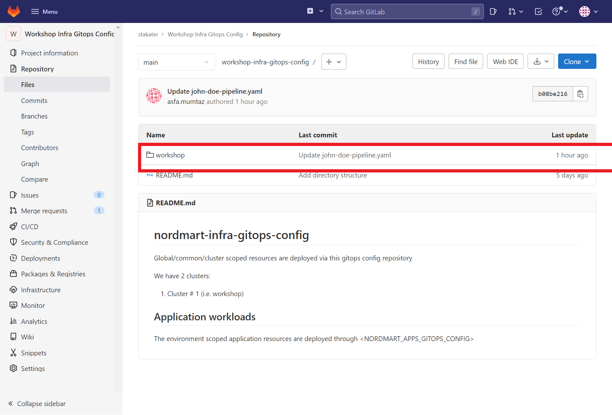
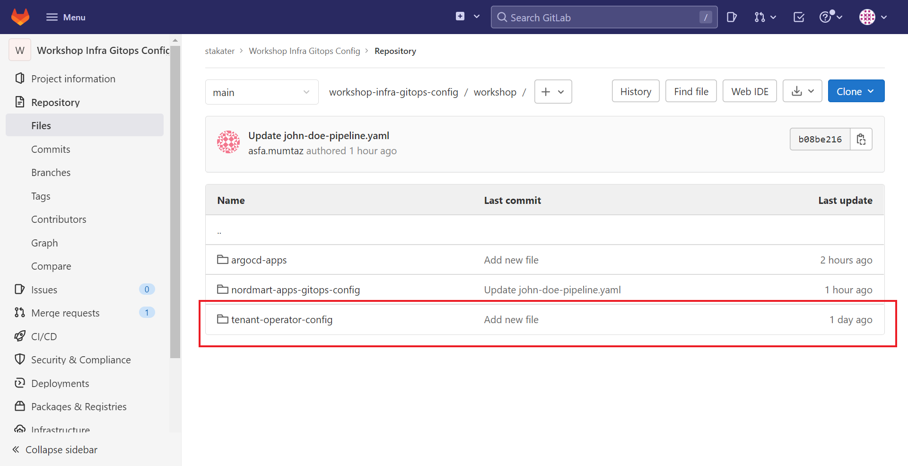
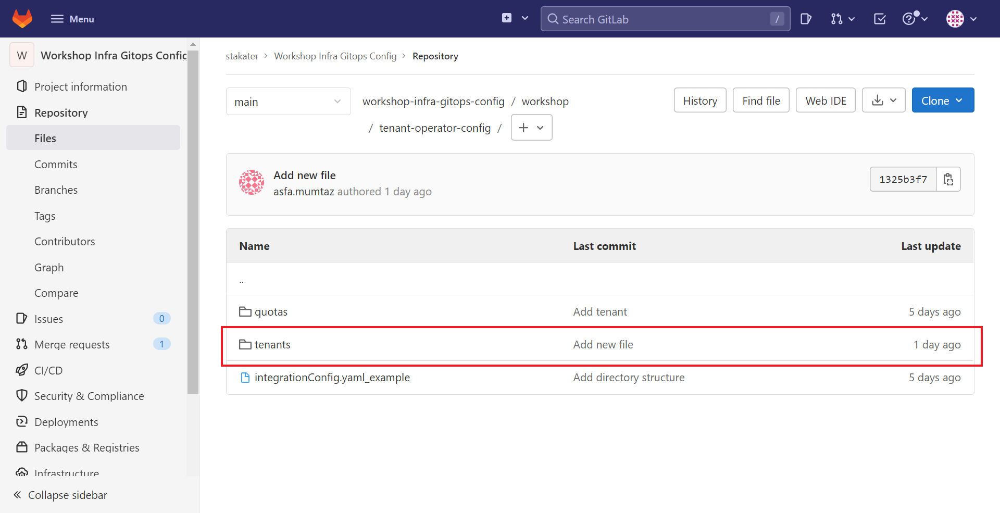
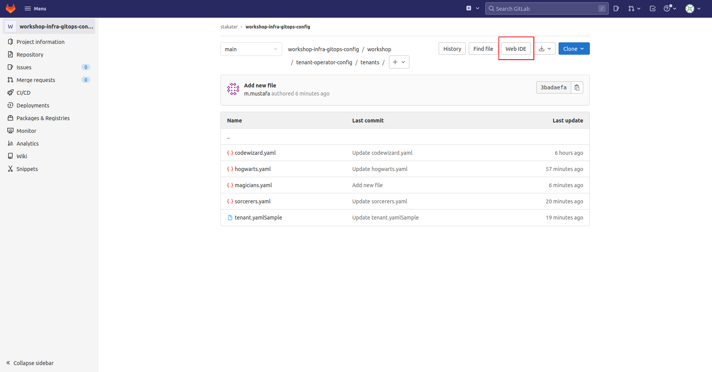
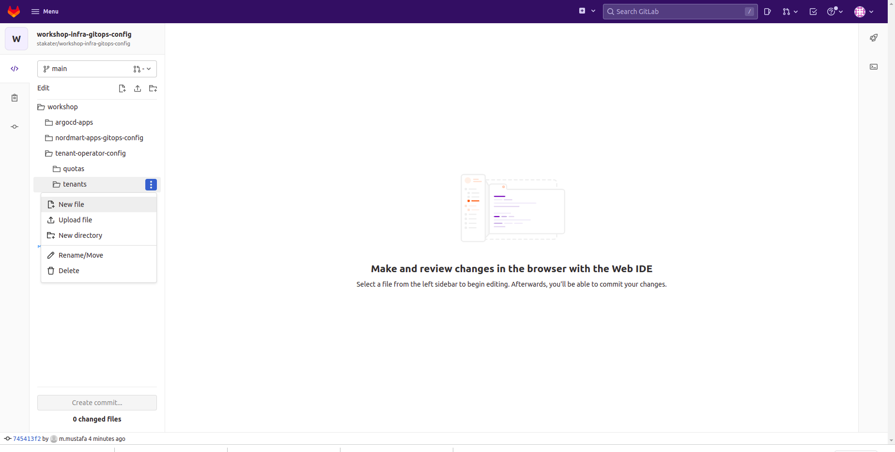

# 🐓 Tenant Operator 101

Stakater’s [Tenant-Operator](https://docs.cloud.stakater.com/content/sre/tenant-operator/overview.html) makes it easy to implement multi-tenancy in your organisation.
OpenShift is designed to support a single tenant platform, hence making it difficult for cluster admins to host multi-tenancy in a single OpenShift cluster. If multi-tenancy is achieved by sharing a cluster, it can have many advantages, e.g. efficient resource utilization, less configuration effort and easier sharing of cluster-internal resources among different tenants. Stakater Multi-Tenancy Operator helps to solve the complexity issues of doing true multi-tenancy by providing simplified abstractions on top of the native primitives to provide organizations and platform providers the tooling, self-service capabilities and robust automation needed to do secure and efficient Multi-Tenancy in a single OpenShift cluster.
Tenant operator provides wrappers around OpenShift resources to provide a higher level of abstraction to the users. With Tenant Operator admins can configure Network and Security Policies, Resource Quotas, Limit Ranges, RBAC for every tenant, which are automatically inherited by all the namespaces and users in the tenant. Depending on users role, they are free to operate within their tenants in complete autonomy. Tenant Operator supports initializing new tenants using GitOps management pattern. Changes can be managed via PRs just like a typical GitOps workflow, so tenants can request changes; add new user or remove user.

The idea of Tenant Operator is to use namespaces as independent sandboxes, where tenant applications can run independently from each other. To minimize cluster admin efforts, cluster admins shall configure Tenant Operator's custom resources, which then become a self-service system for tenants. Tenant Operator enables cluster admins to host multiple tenants in a single OpenShift Cluster, i.e.

- Share an OpenShift cluster with multiple tenants

- Share managed applications with multiple tenants

- Configure and manage tenants and their sandboxes

> Normart Infra Gitops Config : https://gitlab.apps.devtest.vxdqgl7u.kubeapp.cloud/stakater/workshop-infra-gitops-config

## Creating Tenants with GitOps

The following [Repository](https://gitlab.apps.devtest.vxdqgl7u.kubeapp.cloud/stakater/workshop-infra-gitops-config) contains ArgoCD app configurations to help automate the creation of your tenant.

1. Open the Nordmart Infra GitOps Config, Click on the `request access` button near project name and wait for admin to approve the access.

   

2. Once the access request is approved, from the repository, click on the `workshop` folder.

   


   The `workshop` folder contains the following folders:

   - `argocd-apps` This contains all the argocd apps “watching” your repositories.

   - `nordmart-apps-gitops-config` Which containing the argocd configuration “watching” your apps

   - `tenant-operator-config` which contains your Tenants configurations.


3. Click on the `tenant-operator-config` folder.

   


4. Click on the `tenants` folder.

   

   > The `tenants` folder contains the configuration for all the tenants. The idea of Tenant Operator is to use namespaces as independent sandboxes, where tenant applications can run independently from each other.

5. Click the `Edit in Web IDE` tile to fork the repository.

   

6. Create a new file by clicking on the `file` icon at the right corner of your IDE console.

    
   


7. Name your file using the following directory prefix `workshop/tenant-operator-config/tenants/<TENANT-NAME>.yaml`   


   


8. Paste the code below to create a new tenant with a user, a list of argoCD “watched” repositories belonging to the tenant and its accompanying namespaces.

   ```yaml
   apiVersion: tenantoperator.stakater.com/v1beta1
   kind: Tenant
   metadata:
   name: <TENANT_NAME>
   spec:
   quota: workshop-medium
   owners:
      users:
         - <USER_NAME>
   argocd:
      sourceRepos:
         - 'https://gitlab.apps.devtest.vxdqgl7u.kubeapp.cloud/stakater/workshop-infra-gitops-config.git'
         - 'https://gitlab.apps.devtest.vxdqgl7u.kubeapp.cloud/<TENANT_NAME>/nordmart-apps-gitops-config.git'
         - 'https://stakater.github.io/stakater-charts'
         - 'https://nexus-helm-stakater-nexus.apps.devtest.vxdqgl7u.kubeapp.cloud/repository/helm-charts/'
   namespaces:
   - dev
   - build
   - preview
   - test
   - prod
   templateInstances:
   - spec:
         template: tenant-vault-access
         sync: true
   specificMetadata:
      - namespaces:
         - <TENANT_NAME>-build
         annotations:
         openshift.io/node-selector: node-role.kubernetes.io/pipeline=

   ```

   > Replace INSERT_YOUR_TENANT_NAME and INSERT_YOUR_USER_NAME with your preferred tenant name and the username you and your team members registered with.


9. Add a useful commit message indicating the changes you wish to make. In the `Target Branch` tile, input your branch name and select `commit changes` to create a merge request.


   

10. Create a merge request by adding a suitable description and clicking `Create Merge Request`

   


11. Once your merge request is accepted, your tenant will be created. ArgoCD automates the creation of tenants by syncing your desired state with the actual state of your SAAP instance making tenant creation seamless.
You can view your created tenant and namespaces via your OpenShift Console.

   


