# 🐠 CodeReady Workspaces 101

[CodeReady Workspaces](https://www.redhat.com/en/technologies/jboss-middleware/codeready-workspaces) is a developer friendly tool that makes collaboration amongst cloud-native development teams easier. It provides members of a team with a consistent, preconfigured Integrated Development Environment (IDE) where developers can create code, build, and test in containers running on their SAAP Instance.

CodeReady Workspaces supports multi-tenancy, with each developer having their own login and their workspaces. Your SAAP comes with a fully managed instance of CodeReady Workspaces which you can configure  for your users with `Tenant Operator` by including the sandbox namespace in your tenant configurations.

````yaml
   sandbox: true
   onDelete:
      cleanNamespaces: false
````

This creates a `Sandbox` namespace where your Workspaces will reside. You can view your sandbox by searching for it from your list of projects, using the following format `<TENANT_NAME-USERNAME-SANDBOX>`

   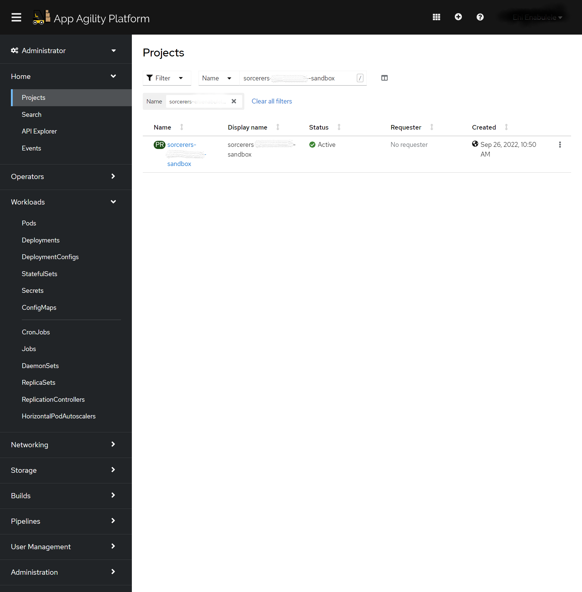


## Creating a Workspace

1. Log in to your CodeReady Workspace by selecting the `CodeReady Workspace` tile from your Forecastle Console.

   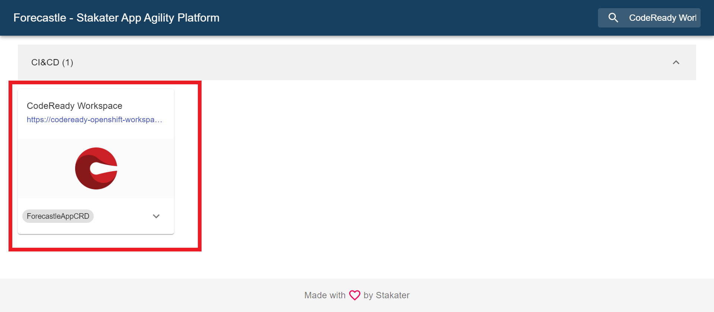


2. If this is your first time logging in, you will be asked to provide your email address. Add your email address and select `Submit`

   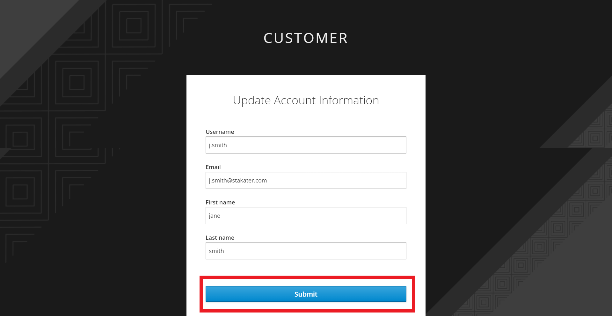

3. Once you are logged in to your CodeReady Workspace, from your `Custom Workspace` tab, paste the following [URL](https://raw.githubusercontent.com/stakater/workshop-exercise/main/devfile.yaml) in your `Enter devfile URL` input box and select `Load Devfile` to create a new workspace by importing from a URL.

> URL: https://raw.githubusercontent.com/stakater/workshop-exercise/main/devfile.yaml

   

4. You can see your workspace prepopulated in your Web IDE as your workspace configurations are imported. 
   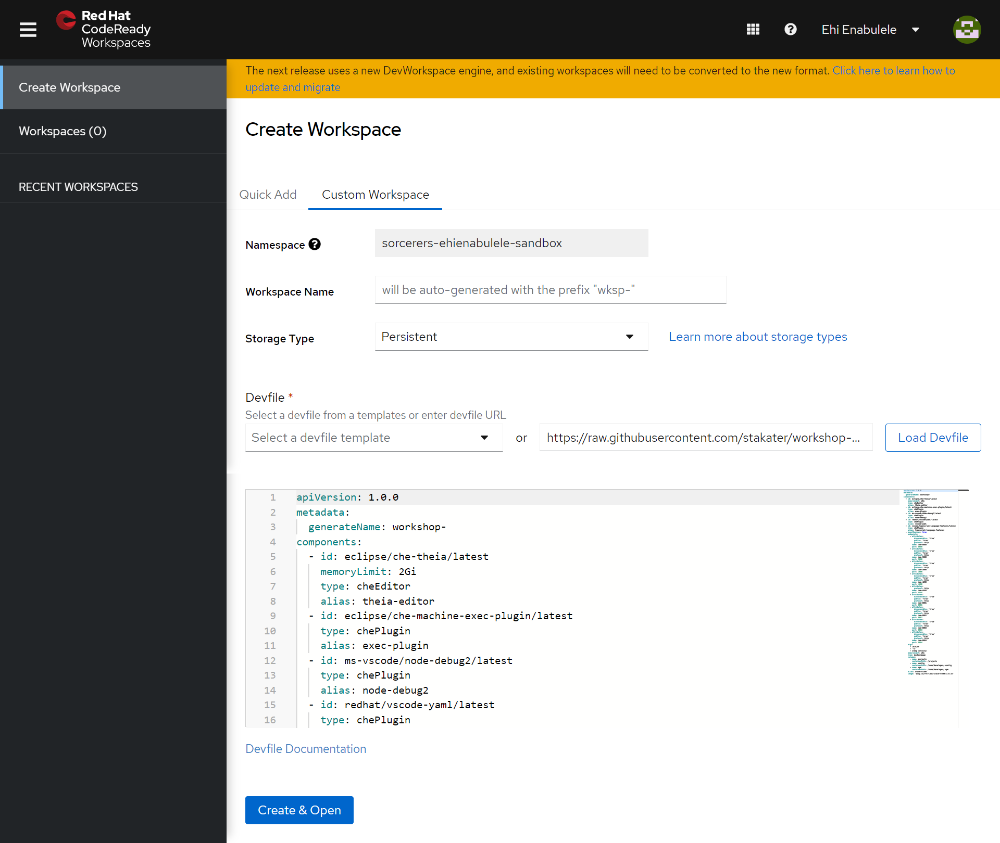
   
5. CRW takes about 1-3 minutes to initialise. After which your SAAP managed Workspace is ready for use!

   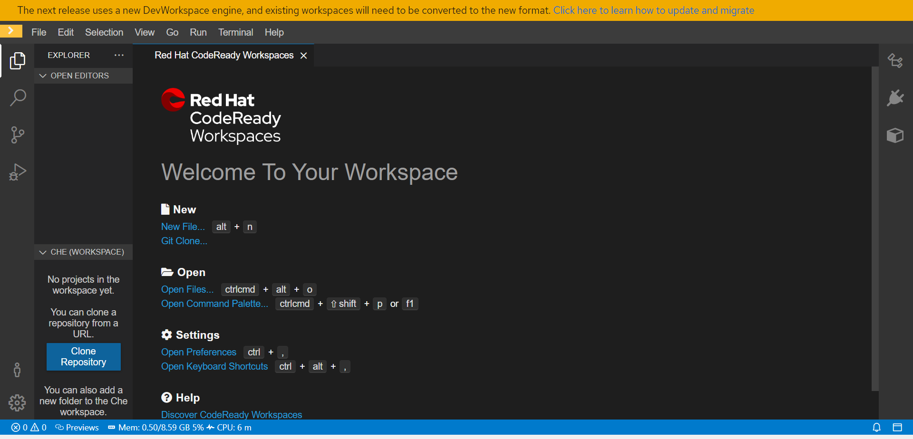


6. Your CodeReady Workspaces' components are run in containers managed by pods. For debugging and other management purposes, you can access your workspace pod by going to your Sandbox Project from your OpenShift Console, and selecting `Pods` from the left corner.


   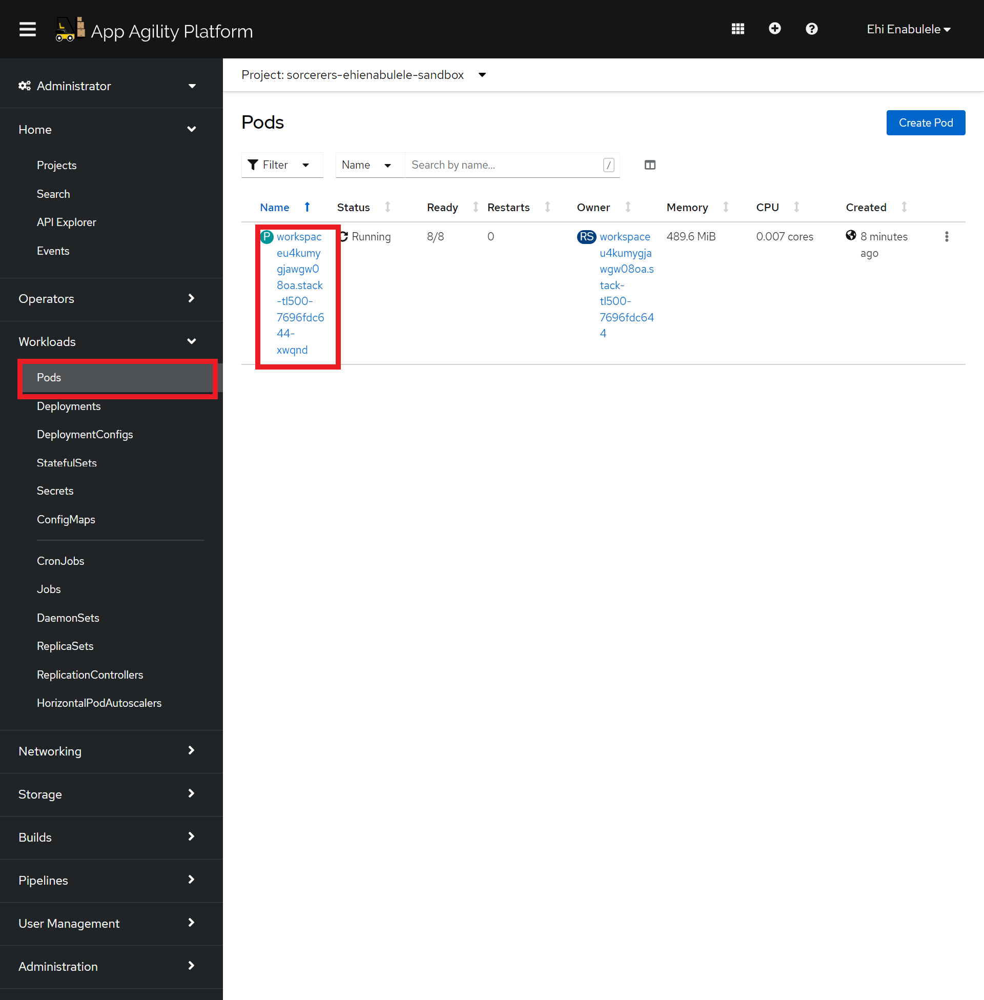

7. You now have everything you need to create and deploy your code from your SAAP Instance. 


## Preparing your Development Environment.

To get your Workspace ready for local development, you will start by configuring your shell with some Environment Variables and configuring your dev environment to interact safely with your SAAP Instance.

1. To start a `zsh` shell, from your top right console, select `Terminal`, then select `Open Terminal in specific container`
   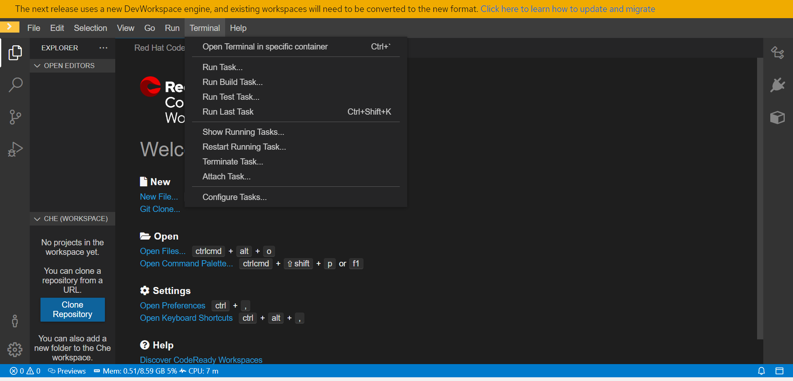


2. Select `Stack-tl500`.

   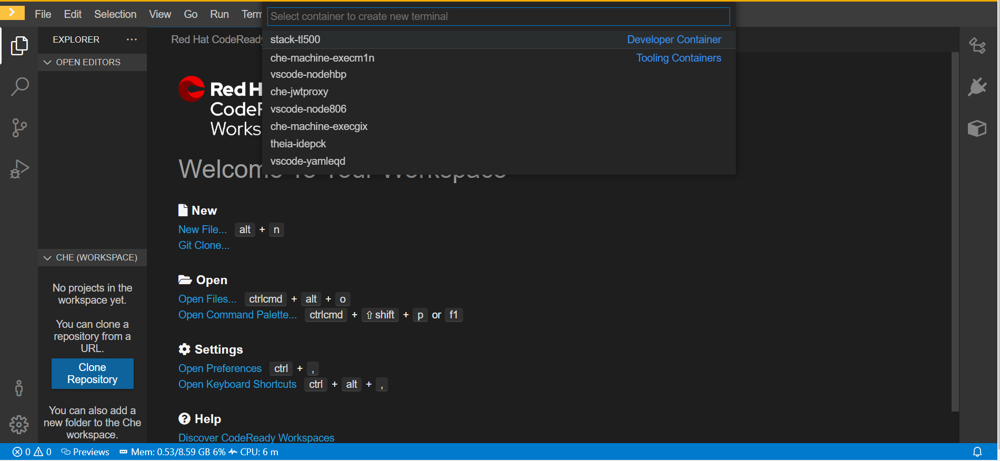


3. An instance of a `zsh` shell will be opened for you.

   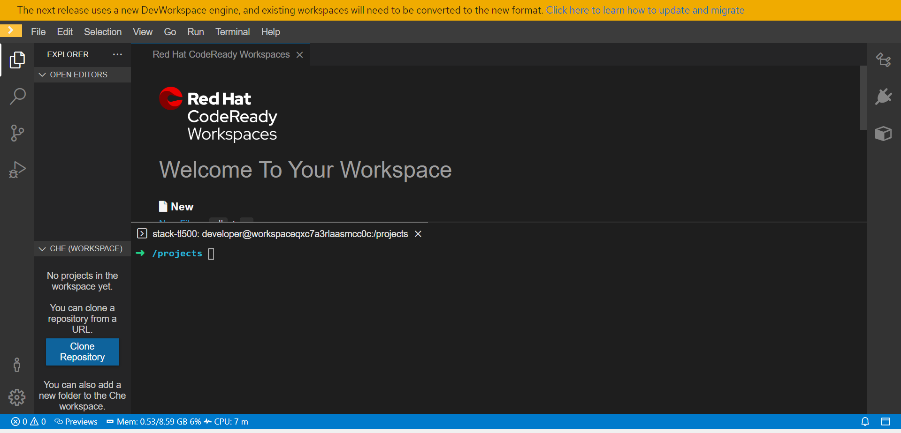


4. Next export your `TENANT_NAME` as an environment variable using the following command.

````bash
echo export TENANT_NAME="<TENANT_NAME>" | tee -a ~/.bashrc -a ~/.zshrc

````
> Replace `TENANT_NAME` with your Tenant Name. 

5. Verify that your environment variable has been saved using the following command.

````bash
source ~/.zshrc
echo ${TENANT_NAME}
````

You will now allow your Developemnt Environment interact safely with your SAAP Instance by logging in.

1. From your `OpenShift Console` at the top right corner, click on your username and select `Copy login command`

   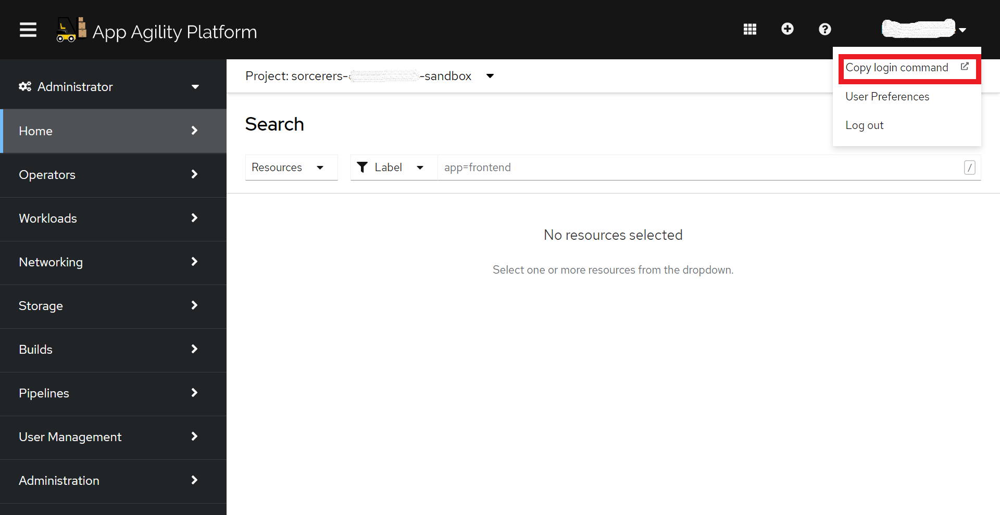

2. Click on `Display token` to view your token and login command.

   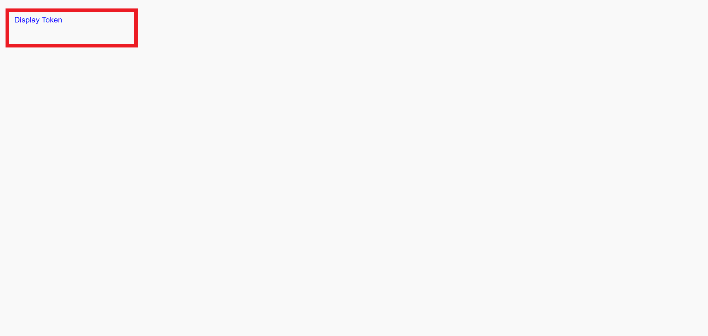

3. Copy your Log in command.

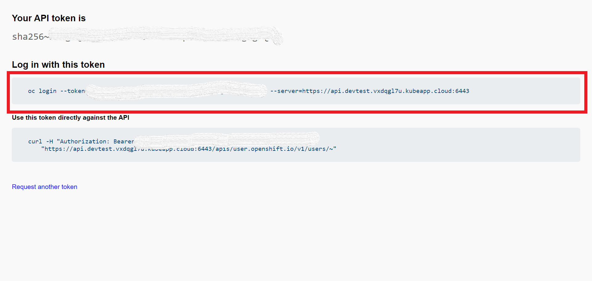

4. From your workspaces command line, paste your login command and hit the `Enter` button. Your Workspaces Devlopement environment will now be able to interact safely with your SAAP instance.

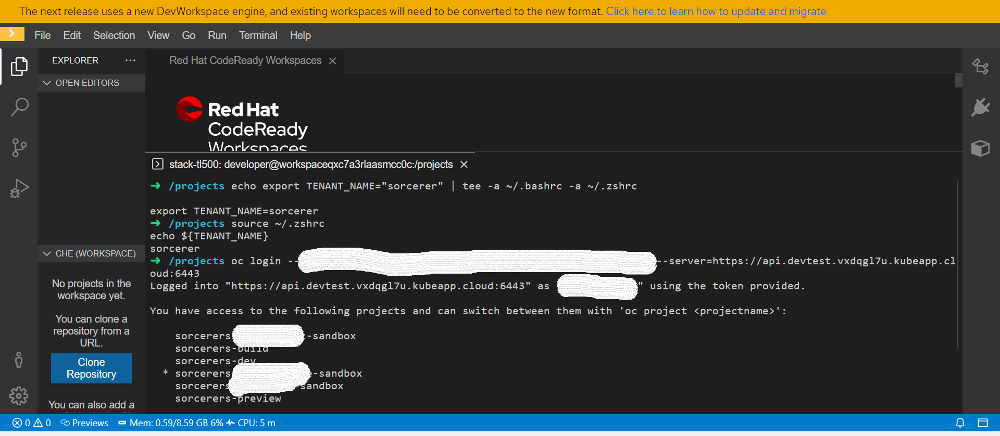