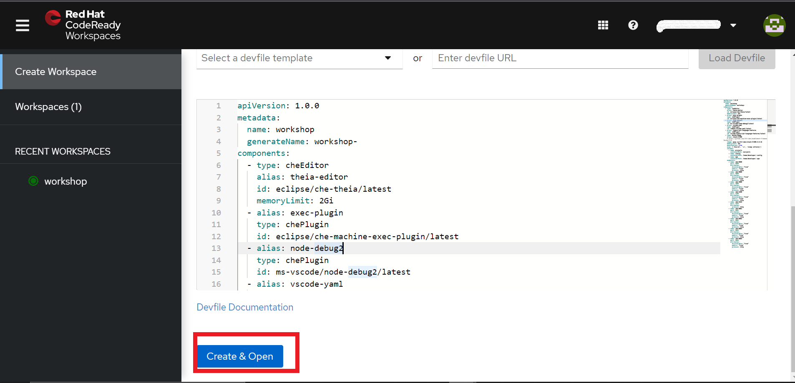

# 🐠 CodeReady Workspaces 101

[CodeReady Workspaces](https://www.redhat.com/en/technologies/jboss-middleware/codeready-workspaces) is a developer friendly tool that makes collaboration amongst cloud-native development teams easier. It provides members of a team with a consistent, preconfigured Integrated Development Environment (IDE) where developers can create code, build, and test in containers running on their SAAP Instance.

CodeReady Workspaces supports multi-tenancy, with each developer having their own login and their workspaces. Your SAAP comes with a fully managed instance of CodeReady Workspaces which you can configure  for your users with `Tenant Operator` by including the sandbox namespace in your tenant configurations.

````yaml
   sandbox: true
   onDelete:
      cleanNamespaces: false
````

This creates a `Sandbox` namespace where your Workspaces will reside. You can view your sandbox by searching for it from your list of projects, using the following format `<TENANT_NAME-USERNAME-SANDBOX>`

   


## Creating a Workspace

1. Log in to your CodeReady Workspace by selecting the `CodeReady Workspace` tile from your Forecastle Console.

   


2. If this is your first time logging in, you will be asked to provide your email address. Add your email address and select `Submit`

   

3. Once you are logged in to your CodeReady Workspace, select `Custom Workspace` to create a new custom workspace. 

   


4. Paste the following code in the Web IDE provided, and select `Create and Open`.

````yaml
apiVersion: 1.0.0
metadata:
  name: workshop
  generateName: workshop-
components:
  - type: cheEditor
    alias: theia-editor
    id: eclipse/che-theia/latest
    memoryLimit: 2Gi
  - alias: exec-plugin
    type: chePlugin
    id: eclipse/che-machine-exec-plugin/latest
  - alias: node-debug2
    type: chePlugin
    id: ms-vscode/node-debug2/latest
  - alias: vscode-yaml
    type: chePlugin
    id: redhat/vscode-yaml/latest
  - alias: typescript-language-features
    type: chePlugin
    id: vscode/typescript-language-features/latest
  - type: dockerimage
    alias: stack-tl500
    # https://github.com/rht-labs/enablement-framework/blob/main/codereadyworkspaces/stack/Dockerfile
    image: quay.io/rht-labs/stack-tl500:3.0.16
    memoryLimit: 2Gi
    mountSources: true
    args: ['/bin/sh', '-c', 'sleep infinity']
    volumes:
      - name: projects
        containerPath: /projects
      - name: config
        containerPath: /home/developer/.config
      - name: npm
        containerPath: /home/developer/.npm
    endpoints:
      - name: ide-8080
        port: 8080
        attributes:
          discoverable: "true"
          public: "true"
          protocol: http
      - name: ide-9000
        port: 9000
        attributes:
          discoverable: "true"
          public: "true"
          protocol: http
      - name: ide-3000
        port: 3000
        attributes:
          discoverable: "true"
          public: "true"
          protocol: http
      - name: ide-4200
        port: 4200
        attributes:
          discoverable: "true"
          public: "true"
          protocol: http
      - name: ide-4444
        port: 4444
        attributes:
          protocol: http
      - name: ide-8081
        port: 8081
        attributes:
          discoverable: "true"
          public: "true"
          protocol: http
      - name: ide-8082
        port: 8082
        attributes:
          discoverable: "true"
          public: "true"
          protocol: http
      - name: ide-8083
        port: 8083
        attributes:
          discoverable: "true"
          public: "true"
          protocol: http
      - name: ide-8084
        port: 8084
        attributes:
          discoverable: "true"
          public: "true"
          protocol: http
````

   

5. CRW takes about 1-3 minutes to initialise. After which your SAAP managed Workspace is ready for use!

   


6. Your CodeReady Workspaces' components are run in containers managed by pods. For debugging and other management purposes, you can access your workspace pod by going to your Sandbox Project from your OpenShift Console, and selecting `Pods` from the left corner.


   

7. You now have everything you need to create and deploy your code from your SAAP Instance.  