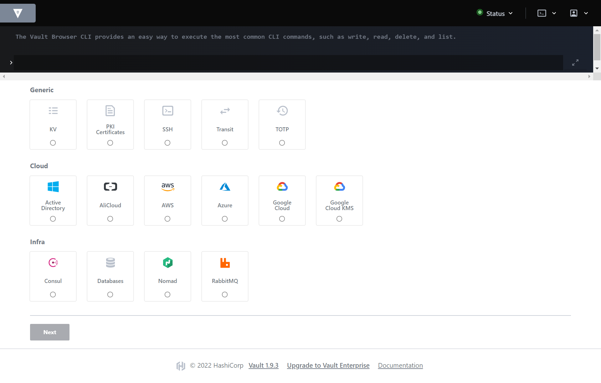
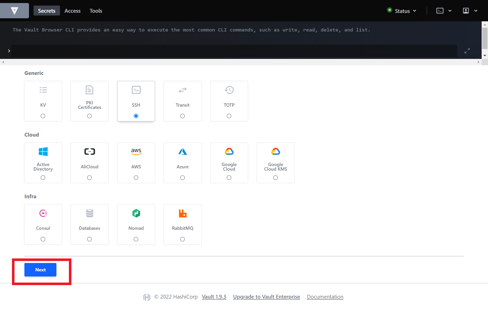
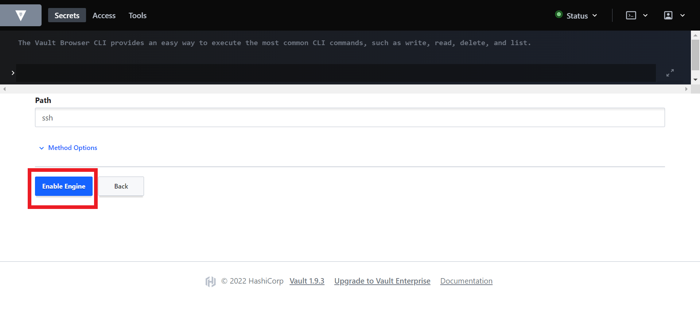
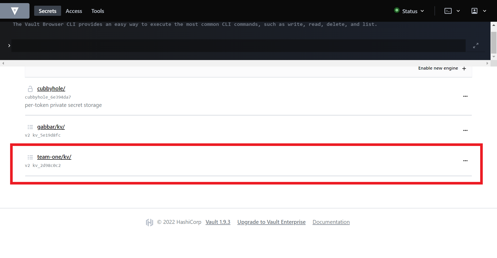
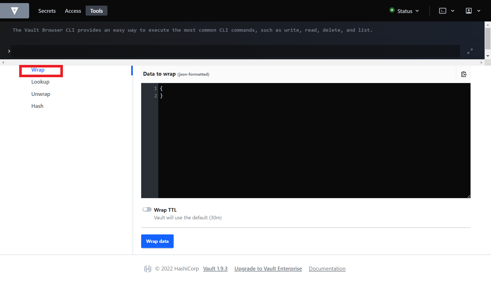
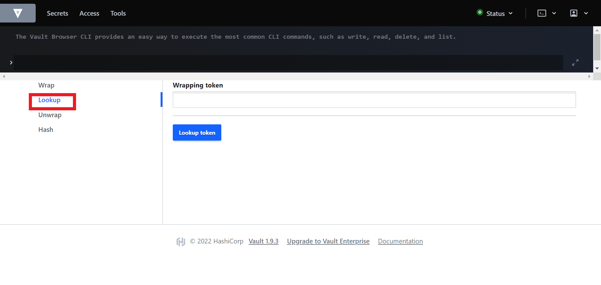
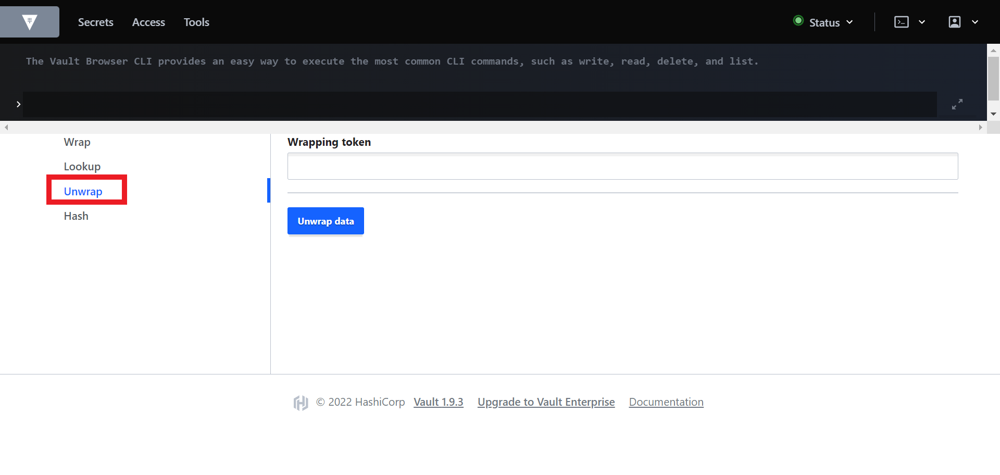
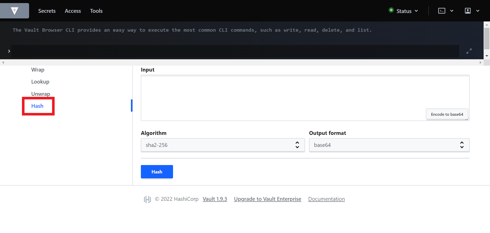

# 🐭 Vault 101

Due to their ephemeral nature, containerized applications are best designed as resource agnostic.

Keeping your application configurations separate from your container instances can be advantageous for improving its flexibility and reducing overall engineering overhead.

[Secrets](https://kubernetes.io/docs/concepts/configuration/secret/) are namespaced objects which contain sensitive data. These sensitive data can be passwords, keys, tokens, etc., and are created independently of your applications. They are used in your applications as environment variables or volumes. 

[Vault](https://www.vaultproject.io/docs) is an identity-based secret and encryption management system. It is an open-source tool which provides a secure, reliable way to store and distribute secrets, as well as encrypt data.

Vault uses the concept of `Secret Engines` to manage sensitive data. Secrets Engines are components that store, generate, or encrypt data. When provided with data, they take some action on it and depending on the kind of engine, return a result.

Examples of Secret Engines provided by vault include;

- **Generic Secret Engines**
    - KV  Secrets Engine for storing Key-Value pairs.
    - PKI Secrets Engine for getting certificates
    - SSH Secrets Engine for providing several ways to issue SSH credentials.
- **Cloud Secret Engines**
    - Active Directory Secrets Engine for rotating AD passwords and checking out service accounts.
    - AliCloud Secrets Engine for generating access tokens based on RAM policies, or STS credentials based on RAM roles.
    - AWS Secrets Engine for generating AWS access credentials dynamically based on IAM policies
    - Google Cloud and Google Key Management Service Secrets Engine for dynamically generating Google Cloud service account keys and OAuth tokens based on IAM policies
    - Azure Secrets Engine for dynamically generating Azure service principals along with role and group assignments.
- **Infra Secrets Engines**
    - Consul Secrets Engine for generating Consul API tokens dynamically based on Consul ACL policies.
    - Databases Secrets Engine generates database credentials dynamically based on configured roles. It supports a variety of databases including MongoDB, Cassandra, MySQL/MariaDB, etc.
    - RabbitMQ Secrets Engine for generating user credentials dynamically based on configured permissions and virtual hosts.
    
    > Each SAAP Instance comes with a fully managed instance of Vault Service. 
    
1. To access your Vault Service, from your `Forecastle` console, click on the `Vault` tile.

2. You will be brought to the `Vault` console. Here you can view a list of your secrets.

3. To enable a Secret Engine, Click on the `Enable new engine` tile at the right corner of your page.

4. You will be brought to the Secret Engine page.

5. Select the secret you wish to enable, and select `Next` 

6. Include your preferred path, then select `Enable Engine`

Additionally, you can manage data encryption using Vault’s encryption tool.

1. To manage data encryption, from the top left corner, select `Tools`. 

2. With Vault tools, you can `wrap` your secrets

2. Look up information about your secrets managed by Vault using the `Lookup` feature.

3. You can also `Unwrap` your managed secrets.

4. Finally, hash data using Vault’s `hash` feature.

