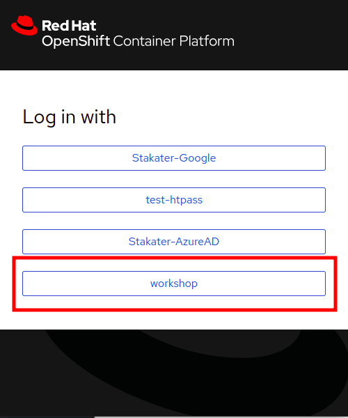

# 🐭 Vault 101

> [Vault](https://www.vaultproject.io/docs) is an identity-based secret and encryption management system. It is an open-source tool which provides a secure, reliable way to store and distribute secrets, as well as encrypt data.

Keeping your application configurations separate from your container instances can be advantageous for improving its flexibility and reducing overall engineering overhead.

[Secrets](https://kubernetes.io/docs/concepts/configuration/secret/) kubernetes objects which contain sensitive data. This sensitive data can be in the form of passwords, keys, tokens, etc. and maybe created independently of your applications and  used in your applications as environment variables or volumes.

Vault uses the concept of `Secret Engines` to manage sensitive data. Secrets Engines are components that store, generate, or encrypt data. When provided with data, they take some action on it and depending on the kind of engine, return a result.
    
   > SAAP comes with a fully managed instance of Vault. 
    
1. To access your Vault, from your [Forecastle](https://forecastle-stakater-forecastle.apps.devtest.vxdqgl7u.kubeapp.cloud) console, click on the `Vault` tile.

   

2. From the drop-down menu under `Method`, select `OIDC` and click on `Sign in with OIDC Provider` and select `workshop` identity Provider

   

  > Note: It can take a few minutes for your tenants resources to be provisioned in Vault, if you have errors please inform the workshop leads. The most likely solution will be to give it some more time so lets proceed!

3. You will be brought to the `Vault` console. Upon creation of your tenant, a folder belonging to your tenant for holding your secrets is created as well.

   

4. You can view a list of your secrets from your tenant secrets folder.

   
