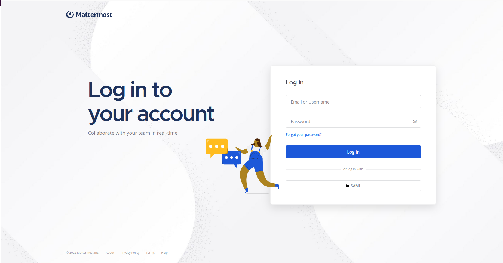
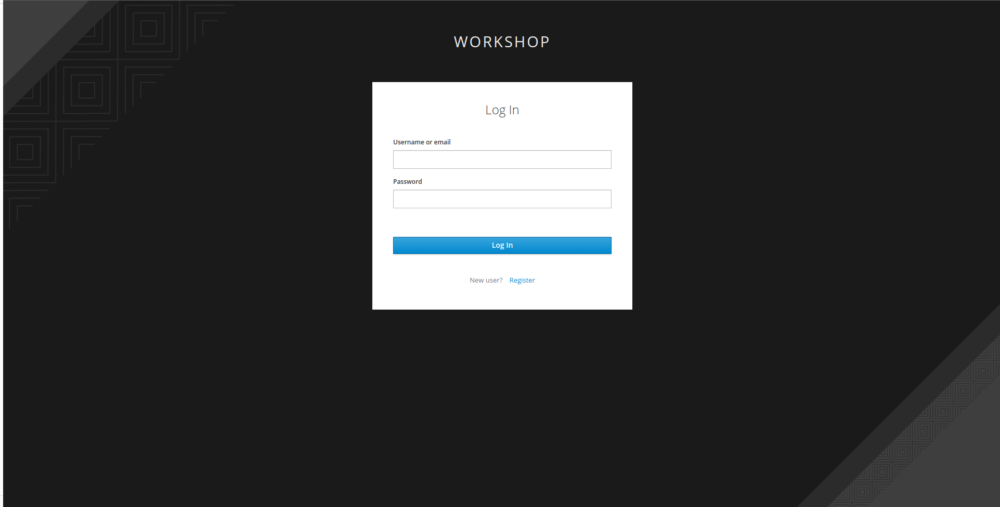
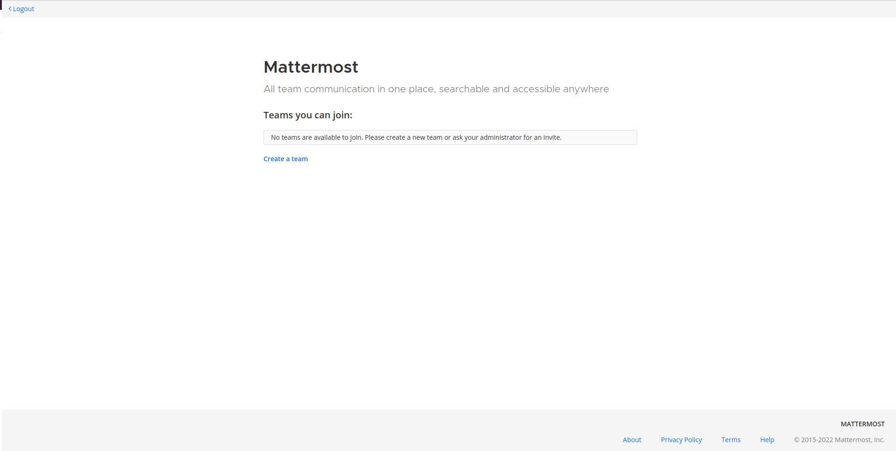
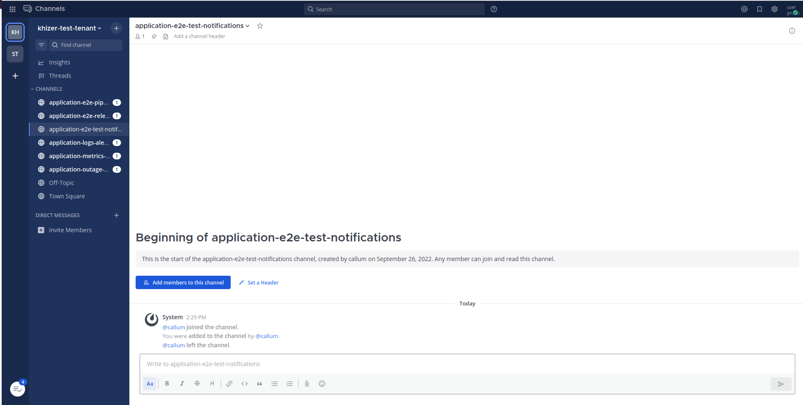

# 🐓 Mattermost 101

## Mattermost Config 

1. Open the Mattermost web page using the URL provided in Forecastle. Use the saml to log in to the Mattermost server. 

    

    ```bash
    https://stakater-mattermost-instance.apps.devtest.vxdqgl7u.kubeapp.cloud/
    ```

2. If you are not redirected directly, use your credentials created during the SAAP-101 part.

    

3. When you log in to the Mattermost for the first time, you aren't part of any team, so you can't access your message channels. You can see the `Logout` button in the top-left corner.
    

4. When your team and channels are created for you, the `Logout` button in the top-left corner will turn to `Back` button. You can click on this to access your teams and associated channels.

    

5. Every tenant will have a team with their notification channels. Only tenant members will be part of this team.

    

6. A common team is created for all the members, so that they can easily have across tenant members conversation.

    