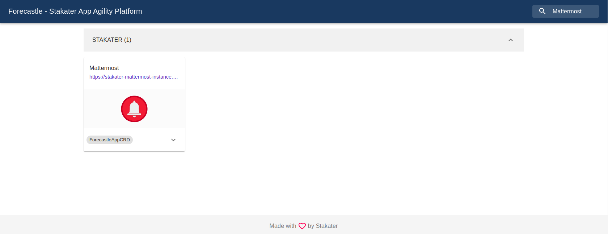

# 👥 Mattermost 101

[Mattermost](https://docs.mattermost.com/) is a secure, open source platform for communication, collaboration, and workflow orchestration across tools and teams. SAAP configures Mattermost teams for each tenant, so that tenant members can collaborate among themselves easily. Application alerts can be configured to be received in specific channels, so that no alert goes unchecked. 

1. Open the Mattermost web UI by selecting the `Mattermost` tile from your Forecastle Console.

   

2. Select the `saml` log in method to log in to the Mattermost server

    

3. If you are not redirected directly, use your credentials created during the SAAP-101 part.

    

4. When you log in to the Mattermost for the first time, you aren't part of any team, so you can't access your message channels. You can see the `Logout` button in the top-left corner.
    

5. We have automation running that will onboard your tenant to Mattermost, when your team and channels are created for you, the `Logout` button in the top-left corner will turn to `Back` button. You can click on this to access your teams and associated channels.

    

6. Every tenant will have a team with their notification channels. Only tenant members will be part of this team. Following channels will be created and can be configured to receive alerts from configured applications.
    - application-metrics-alerts
	- application-outage-alerts
	- application-e2e-release-notifications
	- application-e2e-test-notifications
	- application-e2e-pipeline-notifications
	- application-logs-alerts

    

7. A common team is created for all the members, so that they can easily have across tenant members conversation.

    
