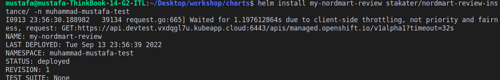
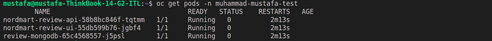
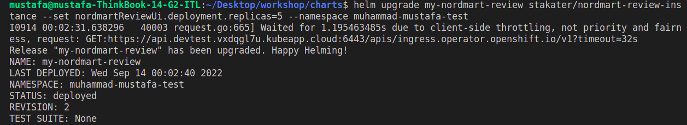
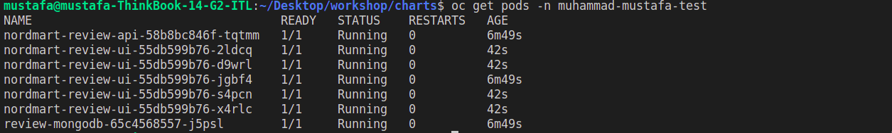
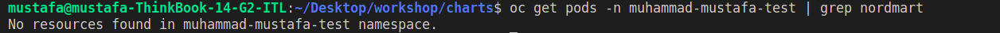

### Helm 101

> Helm is the package manager for Kubernetes. It provides a way to create templates for the Kubernetes YAML that defines our application. The Kubernetes resources such as `DeploymentConfig`, `Route` & `Service` can be processed by supplying `values` to the templates. In Helm land, there are a few ways to do this. A package containing the templates and their default values is called a `chart`. 

Let's deploy a simple application using Helm.

1. Helm charts are packaged and stored in repositories. They can be added as dependencies of other charts or used directly. Let's add a chart repository now. The chart repository stores the version history of our charts as well as the packaged tar file.

    ```bash#test
    helm repo add stakater https://stakater.github.io/stakater-charts
    ```

2. Let's install a chart from this repo. First search the repository to see what is available.

    ```bash#test
    helm search repo nordmart-review-instance
    ```

    Now install the latest version. Helm likes to give each install a release, for convenience we've set ours to `my`. This will add a prefix of `my-` to all the resources that are created.

    ```bash#test
    helm install my-nordmart-review stakater/nordmart-review-instance --namespace ${TENANT_NAME}-test
    ```
    


3. Open the application up in the browser to verify it's up and running. Here's a handy one-liner to get the address of the app

    ```bash#test
    echo https://$(oc get route/nordmart-review-ui -n ${TENANT_NAME}-test --template='{{.spec.host}}')
    ```
    Visit this link to view to following page :

    

4. You can overwrite the default <span style="color:blue;">[values](https://github.com/stakater/charts/blob/main/stakater/nordmart-review-instance/values.yaml)</span> in a chart from the command line. Let's upgrade our deployment to show this. We'll make a simple change to the values to scale up our app. By default, we only have 1 replica.

    ```bash#test
    oc get pods -n ${TENANT_NAME}-test
    ```

    

    By default, we only have one replica of our application. Let's use helm to set this to 5.

    ```bash#test
    helm upgrade my-nordmart-review stakater/nordmart-review-instance --set nordmartReviewUi.deployment.replicas=5 --namespace ${TENANT_NAME}-test
    ```
      

    Verify the deployment has scaled up to 5 replicas.

    ```bash#test
    oc get pods -n ${TENANT_NAME}-test
    ```
    
5. If you're done playing with the #amazing-todolist-app then let's tidy up our work by removing the chart. To do this, run helm uninstall to remove our release of the chart.

    ```bash#test
    helm uninstall my-nordmart-review --namespace ${TENANT_NAME}-test
    ```

    Verify the clean up

    ```bash#test
    oc get pods -n ${TENANT_NAME}-test | grep nordmart
    ```
    

6. For those who are really interested, this is the anatomy of our Helm chart. It can be <span style="color:blue;">[found here](https://github.com/stakater/charts/blob/main/stakater/nordmart-review-instance)</span>, but the basic structure is as follows:

    <div class="highlight" style="background: #f7f7f7">
    <pre><code class="language-bash">
    todolist/chart
    ├── Chart.yaml
    └── values.yaml
    </code></pre></div>

    where:
    * `Chart.yaml` - is the manifest of the chart. It defines the name, version and dependencies for our chart.
    * `values.yaml` - is the sensible defaults for our chart to work, it contains the variables that are passed to the templates. We can overwrite these values on the command line.

🪄🪄 Now, let's continue with even more exciting tools... !🪄🪄
