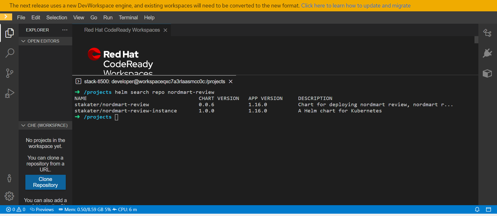
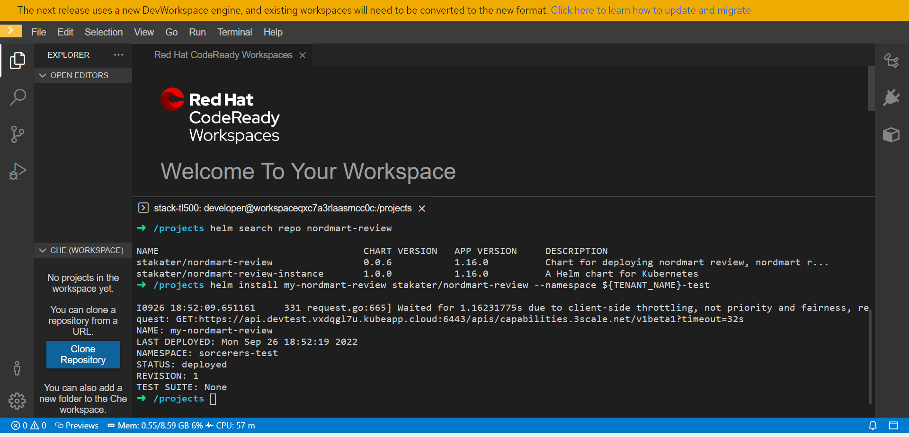
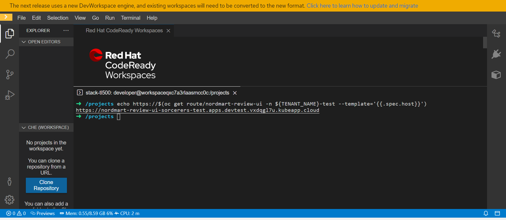
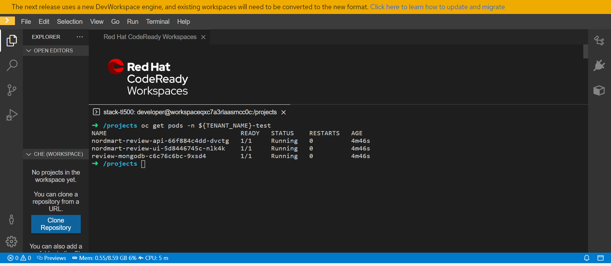
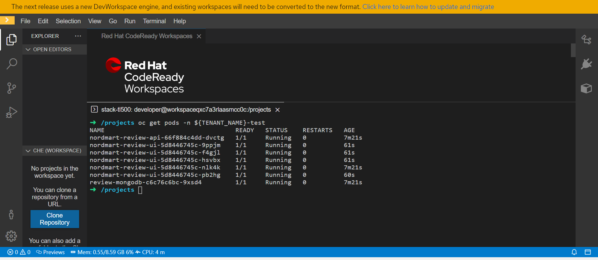

### Helm 101

> Helm is the package manager for Kubernetes. It provides a way to create templates for the Kubernetes YAML that define our applications. The Kubernetes resources such as `Deployments`, `Route` & `Service` can be processed by supplying `values` to the templates. In Helm land, there are a few ways to do this. A package containing the templates and their default values is called a `chart`. 

Let's deploy a simple application using Helm.

Helm charts are packaged and stored in repositories. They can be added as dependencies of other charts or used directly. Let's add a chart repository now. The chart repository stores the version history of our charts as well as the packaged tar file.

> Your CodeReady Workspace comes with the helm command line preinstalled.

1. From your CodeReady Workspace Terminal, add the `Stakater` repo using the following command.

    ```bash#test
    helm repo add stakater https://stakater.github.io/stakater-charts
    ```

   


2. Install a chart from this repo. Start by searching the repository to see what is available.

    ```bash#test
    helm search repo nordmart-review
    ```


   


3. Now install the latest version. Helm likes to give each install its own release, for convenience  we've set ours to `my`. This will add a prefix of `my-` to all the resources that are created.
     
    ```bash#test
    helm install my-nordmart-review stakater/nordmart-review --namespace ${TENANT_NAME}-test
    ```
   

3. Open the application up in the browser to verify it's up and running. Here's a handy one-liner to get the URL of the app.

    ```bash#test
    echo https://$(oc get route/nordmart-review-ui -n ${TENANT_NAME}-test --template='{{.spec.host}}')
    ```

    


4.   Visit the link provided to view your application.

    

5. You can overwrite the default <span style="color:blue;">[values](https://github.com/stakater/charts/blob/main/stakater/nordmart-review/values.yaml)</span> in a chart from the command line. You can upgrade your deployment. By default, your application has only 1 replica. You can view this using the following command.

    ```bash#test
    oc get pods -n ${TENANT_NAME}-test
    ```

    

    By default, there is one replica of your application. Let's use Helm to set this to 5.

    ```bash#test
    helm upgrade my-nordmart-review stakater/nordmart-review --set nordmartReviewUi.deployment.replicas=5 --namespace ${TENANT_NAME}-test
    ```
      

    Verify the deployment has scaled up to 5 replicas.

    ```bash#test
    oc get pods -n ${TENANT_NAME}-test
    ```
    


6. If you're done playing with the `Nordmart Review App`. You can tidy up your work by removing the chart. To do this, run `helm uninstall` to remove your release of the chart.

    ```bash#test
    helm uninstall my-nordmart-review --namespace ${TENANT_NAME}-test
    ```

    Verify the clean up

    ```bash#test
    oc get pods -n ${TENANT_NAME}-test | grep nordmart
    ```
    

6. You can view the anatomy of your Helm chart <span style="color:blue;">[found here](https://github.com/stakater/charts/blob/main/stakater/nordmart-review)</span>, but the basic structure is as follows:

    <div class="highlight" style="background: #f7f7f7">
    <pre><code class="language-bash">
    todolist/chart
    ├── Chart.yaml
    └── values.yaml
    </code></pre></div>

    where:
    * `Chart.yaml` - is the manifest of the chart. It defines the name, version and dependencies for our chart.
    * `values.yaml` - is the sensible defaults for our chart to work, it contains the variables that are passed to the templates. We can overwrite these values on the command line.

🪄🪄 Now, let's continue with even more exciting tools... !🪄🪄
