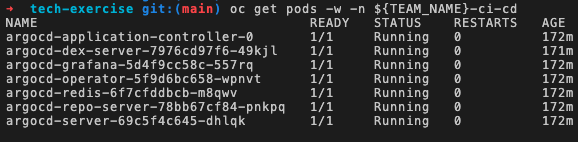
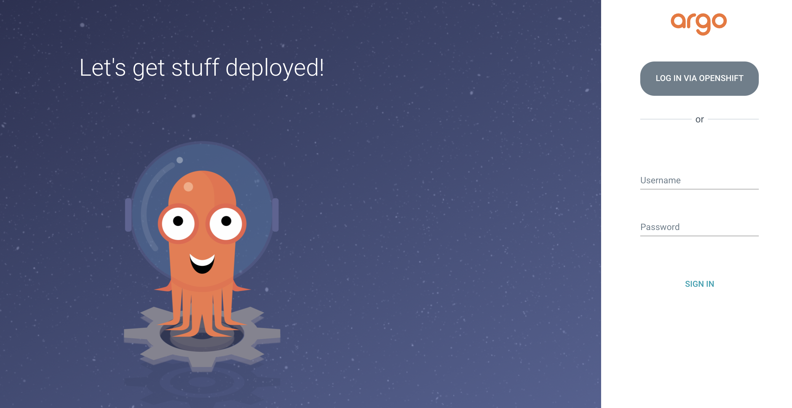
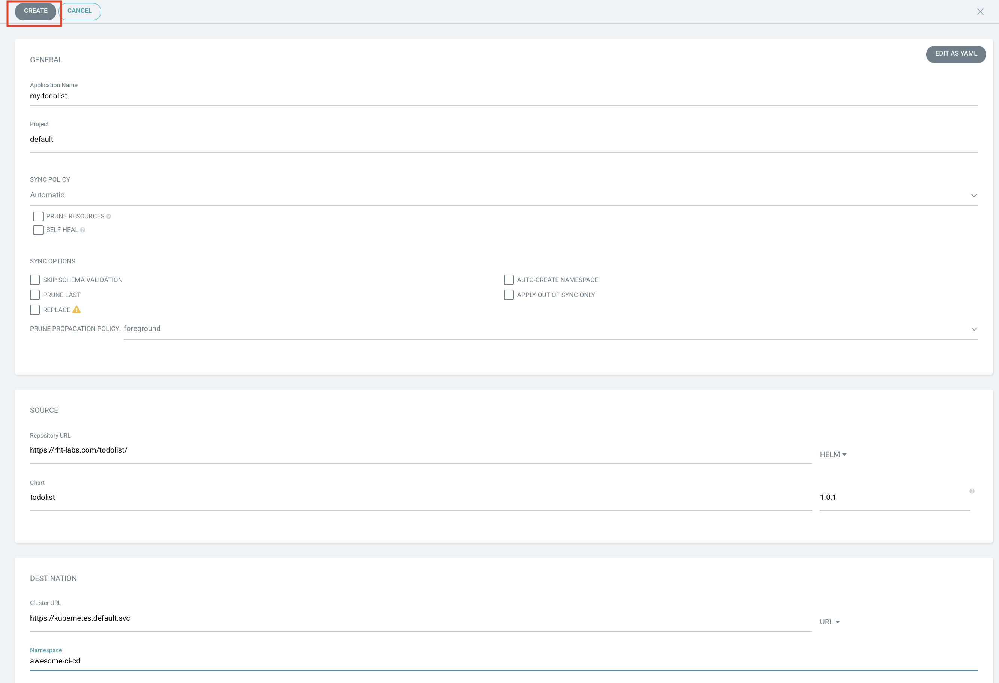
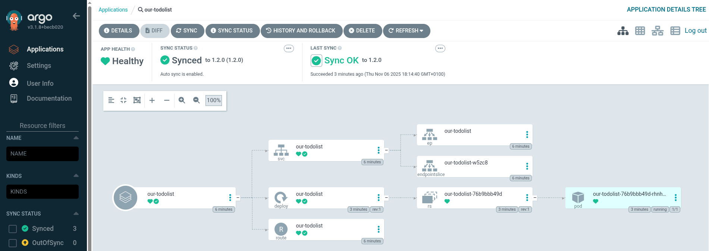

## 🐙 ArgoCD - GitOps Controller
GitOps can be seen as a developer-centric approach to Ops. It teaches developers good practices around taking ownership of code once it leaves their machines and the approach to deploying and monitoring this code once it's running.

When practicing GitOps ideally, every action should be idempotent. Every action or operation can be applied multiple times, producing the exact same result. This is a very useful property in many situations, as it means that an operation can be repeated or retried as often as necessary without causing unintended effects. Configuration should be created declaratively. That is to say, you write the configuration to describe the desired state of an application or set of apps.

To implement a GitOps approach to our Helm charts, all we need to do is connect a tool to the Git repository, which can be alerted or watch for changes coming through. When those changes arrive, this tool can assess the difference between what the current state is and what state is desired and apply the changes automatically for
us.

From ArgoCD's website, it is described as a tool that:

<div class="highlight" style="background: #f7f7f7">
<pre>
    automates the deployment of the desired application states in the specified target
    environments. Application deployments can track updates to branches, tags, or be pinned
    to a specific version of manifests at a Git commit.
</pre></div>

When something is seen as not matching the required state in Git, an application becomes out of sync. Depending on how you have implemented your GitOps, ArgoCD can then resync the changes to apply whatever is in Git immediately or fire a warning to initiate some other workflow. In the world of Continuous Delivery as implemented by ArgoCD, Git is the single source of truth, so we should always apply the changes as seen there.

### ArgoCD Basic Install
> ArgoCD is one of the most popular GitOps tools. It keeps the state of our OpenShift applications synchronized with our git repos. ArgoCD is a fancy-pants controller that reconciles what is stored in our git repo (desired state) against what is live in our cluster (actual state). We can configure ArgoCD to take actions based on these differences, such as auto sync the changes from git to the cluster or fire a notification to say things have gone out of whack.

1. To get started with ArgoCD, we've written a Helm Chart to deploy an instance of ArgoCD to the cluster. On your terminal (in the IDE), add the redhat-cop helm charts repository. This is a collection of charts curated by consultants in the field from their experience with customers. Pull requests are welcomed :P

    ```bash#test
    helm repo add redhat-cop https://redhat-cop.github.io/helm-charts
    ```

2. We are using the [Red Hat GitOps Operator](https://github.com/redhat-developer/gitops-operator) which was deployed as part of the cluster setup. Normally this step would be done as part of the Operator Install so its a bit more complicated than we would like. Because _we did not know_ your team names ahead of time 👻 we will need to update an environment variable on the Operator Subscription. This tells the Operator its OK to deploy a cluster scoped ArgoCD instance into your <TEAM_NAME>-ci-cd project. Run this shell script:

    <p class="tip">
    🐌 THIS IS NOT GITOPS - Until we work out a better way to automate this. 🐎 If you see "...." in your terminal after you copy this shell script, do not worry. Hit return and it will run as designed.
    </p>

    ```bash#test
    run()
    {
      NS=$(oc get subscriptions.operators.coreos.com/openshift-gitops-operator -n openshift-operators \
        -o jsonpath='{.spec.config.env[?(@.name=="ARGOCD_CLUSTER_CONFIG_NAMESPACES")].value}')
      opp=
      if [ -z $NS ]; then
        NS="${TEAM_NAME}-ci-cd"
        opp=add
      elif [[ "$NS" =~ .*"${TEAM_NAME}-ci-cd".* ]]; then
        echo "${TEAM_NAME}-ci-cd already added."
        return
      else
        NS="${TEAM_NAME}-ci-cd,${NS}"
        opp=replace
      fi
      oc -n openshift-operators patch subscriptions.operators.coreos.com/openshift-gitops-operator --type=json \
        -p '[{"op":"'$opp'","path":"/spec/config/env/1","value":{"name": "ARGOCD_CLUSTER_CONFIG_NAMESPACES", "value":"'${NS}'"}}]'
      echo "EnvVar set to: $(oc get subscriptions.operators.coreos.com/openshift-gitops-operator -n openshift-operators \
        -o jsonpath='{.spec.config.env[?(@.name=="ARGOCD_CLUSTER_CONFIG_NAMESPACES")].value}')"
    }
    run
    ```

    The output should look something like this with other teams appended as well:
    <div class="highlight" style="background: #f7f7f7">
    <pre><code class="language-bash">
      subscriptions.operators.coreos.com/openshift-gitops-operator patched
      EnvVar set to: <TEAM_NAME>-ci-cd,anotherteam-ci-cd
    </code></pre></div>

2. Let's perform a basic install of ArgoCD. Using most of the defaults defined on the chart is sufficient for our use case.

    We're are also going to configure ArgoCD to be allowed pull from our git repository using a secret 🔐.

    Configure our ArgoCD instance with a secret in our <TEAM_NAME>-ci-cd namespace by creating a small bit of yaml 😋:

    ```bash#test
    cat << EOF > /projects/tech-exercise/argocd-values.yaml
    ignoreHelmHooks: true
    operator: []
    namespaces:
      - ${TEAM_NAME}-ci-cd
    argocd_cr:
      initialRepositories: |
        - url: https://${GIT_SERVER}/${TEAM_NAME}/tech-exercise.git
          type: git
          passwordSecret:
            key: password
            name: git-auth
          usernameSecret:
            key: username
            name: git-auth
          insecure: true
EOF
    ```

    Then, deploy ArgoCD using helm and this piece of yaml:

    ```bash#test
    helm upgrade --install argocd \
      --namespace ${TEAM_NAME}-ci-cd \
      -f /projects/tech-exercise/argocd-values.yaml \
      redhat-cop/gitops-operator
    ```

    <p class="tip">
    ⛷️ <b>NOTE</b> ⛷️ - It's also worth noting we're allowing ArgoCD to run in a fairly permissive mode for these exercise, it can pull charts from anywhere. If you're interested in securing ArgoCD a bit more, checkout the <span style="color:blue;"><a href="/#/1-the-manual-menace/666-here-be-dragons?id=here-be-dragons">here-be-dragons</a></span> exercise at the end of this lab.
    </p>

3. If we check in OpenShift we should see the Operator pod coming to life and (eventually) the argocd-server, dex and other pods spin up. To do this, we are going to run a command with a 'watch' flag to continuousy monitor pod creation.

    ```bash
    oc get pods -w -n ${TEAM_NAME}-ci-cd
    ```

    

    *You must do Control+C to break the 'watch' mode to continue to the next step. Once all your pods are running*

4. When all the pods are up and running, we can login to the UI of ArgoCD. Get the route and open it in a new browser tab.

    ```bash#test
    echo https://$(oc get route argocd-server --template='{{ .spec.host }}' -n ${TEAM_NAME}-ci-cd)
    ```

    

5. Login to ArgoCD by clicking `Log in via OpenShift` and use the OpenShift credentials provided.


6. Select `Allow selected permissions` for the initial login.


7. You just logged into ArgoCD 👏👏👏! Lets deploy a sample application through the UI. In fact, let's get ArgoCD to deploy the `todolist` app you manually deployed previously. On ArgoCD - click `CREATE APPLICATION`. You should see see an empty form. Let's fill it out by setting the following:
   * On the "GENERAL" box
      * Application Name: `our-todolist`
      * Project: `default`
      * Sync Policy: `Automatic`
   * On the "SOURCE" box
      * Repository URL: `https://rht-labs.com/todolist/`
      * Select `Helm` from the right drop down menu
      * Chart: `todolist`
      * Version: `1.1.0`
   * On the "DESTINATION" box
      * Cluster URL: `https://kubernetes.default.svc`
      * Namespace: `<TEAM_NAME>-ci-cd`
   * On the "HELM" box
      * Values Files: `values.yaml`

    Your form should look like this:
    

8. After you hit create, you'll see `our-todolist` application is created and should start deploying in your `${TEAM_NAME}-ci-cd` namespace.


9. If you drill down into the application you will get ArgoCD's amazing view of all of the k8s resources that were generated by the chart


10. You can verify the application is running and behaving as expected by navigating to the url of the app, same way we did for the previous helm deploy.

    ```bash
    echo https://$(oc get route/our-todolist -n ${TEAM_NAME}-ci-cd --template='{{.spec.host}}')
    ```

🪄🪄 Magic! You've now deployed ArgoCD and got it to manually deploy an application for you. Next up, we'll make ArgoCD do some *REAL* GitOps 🪄🪄
