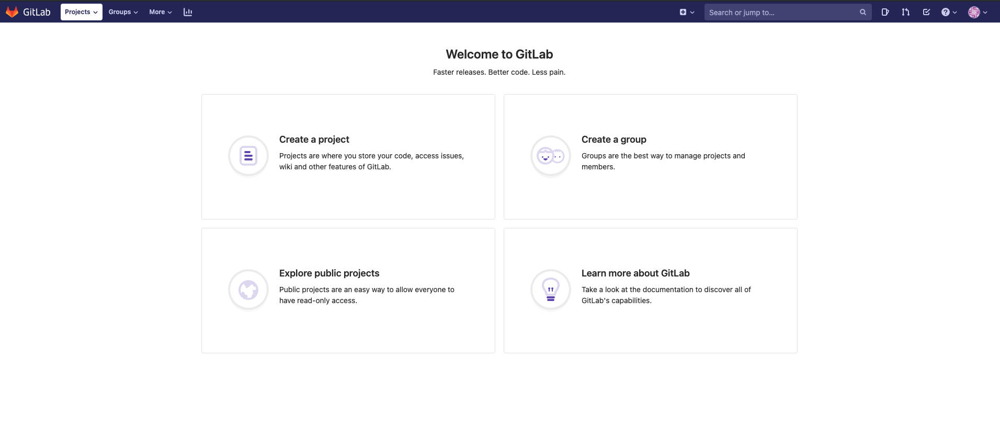
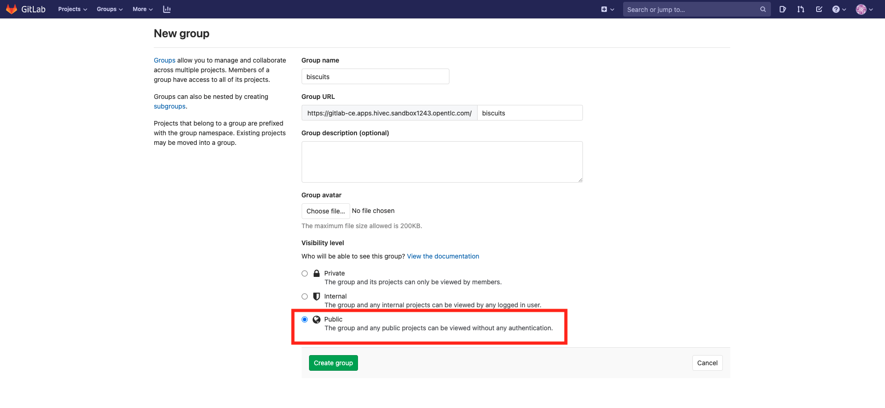
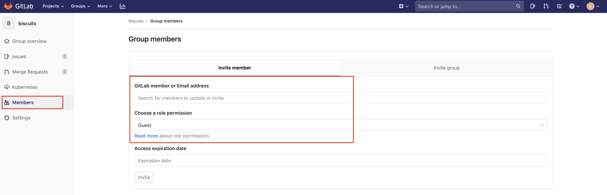
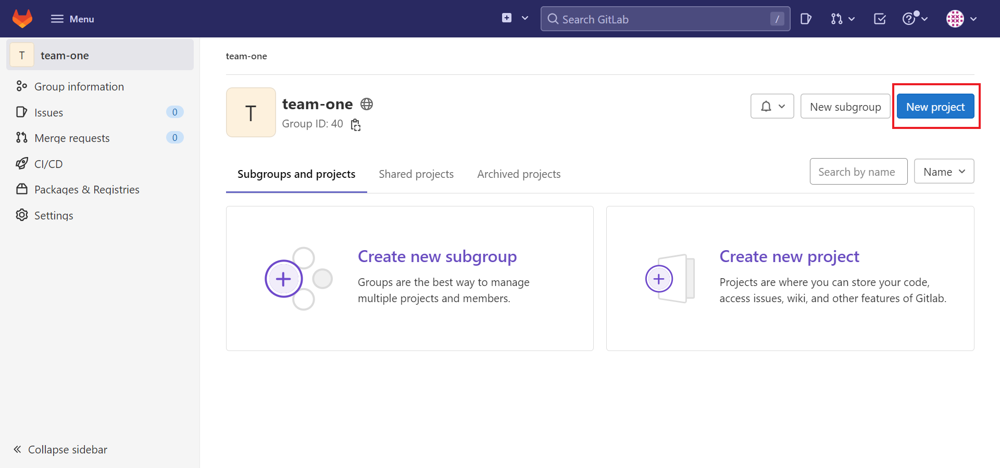
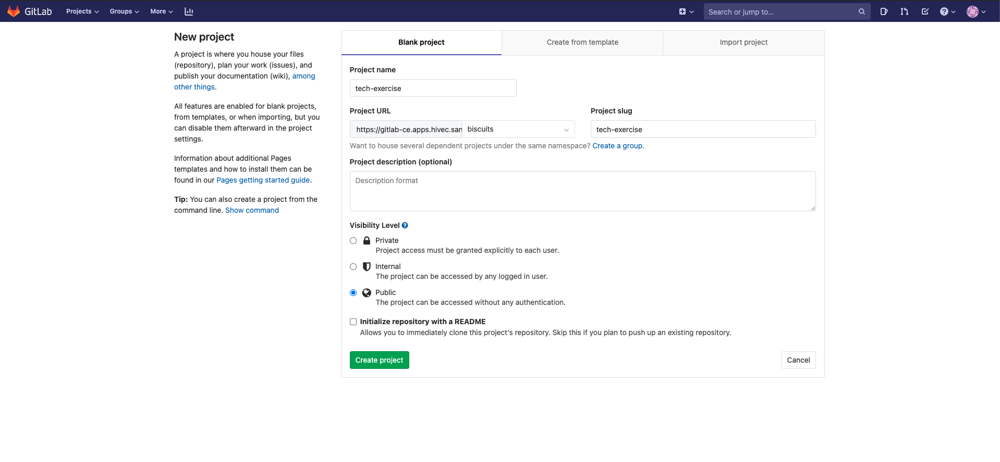
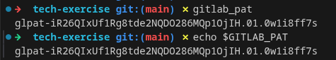
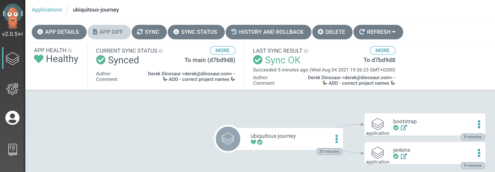

## 🔥🦄 Ubiquitous Journey

At Red Hat Open Innovation Labs, we have automated the bootstrap of Labs Residency CICD tooling to accelerate setup and onboarding. The code repository is called **Ubiquitous Journey** (🔥🦄). We have created a lite version of Ubiquitous Journey here and we will explore this repository and set up our technical foundation using it.

This repo is available on the Red Hat Labs GitHub organization – <span style="color:blue;">https://github.com/rht-labs/ubiquitous-journey.</span> Ubiquitous Journey allows us to plumb all of the pieces together in a developer friendly manner.

- **Extensible** - Our codebase is a *tool box* of code that we can evolve and easily extended to support new tools and methodologies.
- **Traceable** - We can easily see where changes have occurred and most importantly trace exactly what git tag/commit is in which environment.
- **Discoverable** - By making the source code easy to follow, with supporting and inline documentation, new team members can easily discover how application are built, tested and deployed.
- **Auditable** - Git logs and history are the single source of truth for building our software. We can create compliance reports and easily enhance the toolset to support more advanced techniques such as code signing and attestations for all our pipeline steps if needed.
- **Reusable** - Many parts of CICD are reusable. A good example are the reusable pipelines and tasks. Its not only the code however, solid foundational practices such as build once, tag and promote code through a lifecycle can be codified.
- **Flexible** - Product teams often want to use both standard tools and be able to experiment with new ones. The *tool box* mentality helps a lot, so as a team you can work with the tools you are familiar with. We will see this in action with Jenkins and Tekton.

All of these traits lead to one outcome - the ability to build and release quality code into multiple environments whenever we need to.

### Get GitLab Ready for GitOps
> In this exercise we'll setup our git project to store our code and configuration. We will then connect ArgoCD (our gitOps controller) to this git repository to enable the GitOps workflow. Tooling will be shared by all members of your team, so do this exercise as a mob please!
 
1. Log into GitLab with your credentials. GitLab URL:

    ```bash
    https://<GIT_SERVER>
    ```

    We need to create a group in GitLab as <TEAM_NAME>.  Click "Create a group" on the screen:
    

2. Put your TEAM_NAME (`<TEAM_NAME>`) as the group name, select **Public** for Visibility level, and hit Create group. This is so we can easily share code and view other teams' activity.


3. If you are working as a team, you must add your team members to this group. This will give them permissions to work on the projects created in this group. Select "Members" from the left panel and invite your team members via "Invite member" option. Make sure to choose "Maintainer" or "Owner" role permission. You can ignore this step if your are not working as a team.


4. Now lets create the git repository that we are going to use for <span style="color:purple;" >GIT</span>Ops purposes. The `tech-exercise` will serve as a mono-repo holding both our tooling configuration and the application definitions and some other stuff. In the real world, you may want to separate these into different repos! Anyways, hit `New project` button on the right hand side


5. On the new view, use `tech-exercise` as Project Name, select **Internal** for Visibility level, then hit Create project. Make sure the project is in the group you created previously and not the username's.


6. We are going to create a Gitlab Personal Access Token (PAT). The token is a more secure and reliable method for accessing Gitlab from our scripts later on. Note, that for reference's sake, you can also generate a PAT in Gitlab under User > Settings > Access Tokens in the Web UI. We use a helper script here to help automate that process. To generate the token, open a terminal if you have not got one open and run the following commands.

    Export your Gitlab username.

    ```bash
    export GITLAB_USER=<YOUR_GITLAB_USER>
    ```

    Export your Gitlab password.

    ```bash
    export GITLAB_PASSWORD=<YOUR_GITLAB_PASSWORD>
    ```

    <p class="tip">
    ⛷️ <b>TIP</b> ⛷️ - If your password includes special characters, try putting it in single quotes. ie: <strong>'A8y?Rpm!9+A3B/KG'</strong>
    </p>

    Generate your Gitlab PAT.

    ```bash
    gitlab_pat
    ```

    Echo the `GITLAB_PAT` environment variable.

    ```bash
    echo $GITLAB_PAT
    ```

    We can see the PAT printed out on the command line, it is also stored in an environment variable called `GITLAB_PAT`

    

7. Let's push our code to the GitLab server. Back in your CodeReady Workspace from the terminal

    ```bash#test
    cd /projects/tech-exercise
    git remote set-url origin https://${GIT_SERVER}/${TEAM_NAME}/tech-exercise.git
    ```

    Use the `GITLAB_PAT` from above when you are prompted for the password (this will be cached)

    ```bash#test
    cd /projects/tech-exercise
    git add .
    git commit -am "🐙 ADD - argocd values file 🐙"
    git push -u origin --all
    ```

    With our git project created and our configuration pushed to it - let's start our GitOps Journey 🧙‍♀️🦄!

    <p class="tip">
    ⛷️ <b>TIP</b> ⛷️ - If your credentials are cached incorrectly, you can try clearing the cache using: <strong>git credential-cache exit</strong>
    </p>

### Deploy Ubiquitous Journey 🔥🦄
> In this exercise, we'll create our first namespaces and tooling using a repeatable pattern - GitOps.

1. The Ubiquitous Journey (🔥🦄) is just another Helm Chart with a pretty neat pattern built in to create App of Apps in ArgoCD. Let's get right into it - in the your IDE, Open the `values.yaml` file in the root of the project. Update it to reference the git repo you just created and your team name. This values file is the default ones for the chart and will be applied to all of the instances of this chart we create. The Chart's templates are not like the previous chart we used (`services`, `deployments` & `routes`) but an ArgoCD application definition, just like the one we manually created in the previous exercise when we deployed an app in the UI of ArgoCD.

    ```yaml
    source: "https://<GIT_SERVER>/<TEAM_NAME>/tech-exercise.git"
    team: <TEAM_NAME>
    ```

    You can also run this bit of code to do the replacement if you are feeling uber lazy!

    ```bash#test
    yq eval -i '.team=env(TEAM_NAME)' /projects/tech-exercise/values.yaml
    yq eval ".source = \"https://$GIT_SERVER/$TEAM_NAME/tech-exercise.git\"" -i /projects/tech-exercise/values.yaml
    ```

2. The `values.yaml` file refers to the `ubiquitous-journey/values-tooling.yaml` which is where we store all the definitions of things we'll need for our CI/CD pipelines. The definitions for things like Jenkins, Nexus, Sonar etc will all live in here eventually, but let's start small with two objects. One for boostrapping the cluster with some namespaces and permissions. And another to deploy our good friend Jenkins. Update your `ubiquitous-journey/values-tooling.yaml` by changing your `\<TEAM_NAME\>` in the bootstrap section so it looks like this:

    ```bash
            - name: jenkins
              kind: ServiceAccount
              role: admin
              namespace: <TEAM_NAME>-ci-cd
          namespaces:
            - name: <TEAM_NAME>-ci-cd
              bindings: *binds
              operatorgroup: true
            - name: <TEAM_NAME>-dev
              bindings: *binds
              operatorgroup: true
            - name: <TEAM_NAME>-test
              bindings: *binds
              operatorgroup: true
            - name: <TEAM_NAME>-stage
              bindings: *binds
              operatorgroup: true
    ```

    You can also run this bit of code to do the replacement if you are feeling uber lazy!

    ```bash#test
    sed -i "s|TEAM_NAME|$TEAM_NAME|" /projects/tech-exercise/ubiquitous-journey/values-tooling.yaml
    ```

3. This is GITOPS - so in order to affect change, we now need to commit things! Let's get the configuration into git, before telling ArgoCD to sync the changes for us.

    ```bash#test
    cd /projects/tech-exercise/
    git add .
    git commit -m  "🦆 ADD - correct project names 🦆"
    git push
    ```

  <p class="warn">
    ⛷️ <b>NOTE</b> ⛷️ - Bootstrap step also provides the necessary rolebindings. That means now the other users in the same team can access <b><TEAM_NAME></b> environments.
  </p>

4. In order for ArgoCD to sync the changes from our git repository, we need to provide access  to it. We'll deploy a secret to cluster, for now *not done as code* but in the next lab we'll add the secret as code and store it encrypted in Git. In your terminal

    Add the Secret to the cluster:

    ```bash#test
    cat <<EOF | oc apply -n ${TEAM_NAME}-ci-cd -f -
      apiVersion: v1
      data:
        password: "$(echo -n ${GITLAB_PAT} | base64 -w0)"
        username: "$(echo -n ${GITLAB_USER} | base64 -w0)"
      kind: Secret
      type: kubernetes.io/basic-auth
      metadata:
        annotations:
          tekton.dev/git-0: https://${GIT_SERVER}
          sealedsecrets.bitnami.com/managed: "true"
        labels:
          credential.sync.jenkins.openshift.io: "true"
        name: git-auth
EOF
    ```

5. Install the tooling in Ubiquitous Journey (only bootstrap, and Jenkins at this stage..). Once the command is run, open the ArgoCD UI to show the resources being created. We've just deployed our first AppOfApps!

    ```bash#test
    cd /projects/tech-exercise
    helm upgrade --install uj --namespace ${TEAM_NAME}-ci-cd .
    ```

    

6. As ArgoCD sync's the resources we can see them in the cluster:

    ```bash#test
    oc get projects | grep ${TEAM_NAME}
    ```

    ```bash#test
    oc get pods -n ${TEAM_NAME}-ci-cd
    ```

🪄🪄 Magic! You've now deployed an app of apps to scaffold our tooling and projects in a repeatable and auditable way (via git!). Next up, we'll make extend the Ubiquitous Journey with some more tooling 🪄🪄
