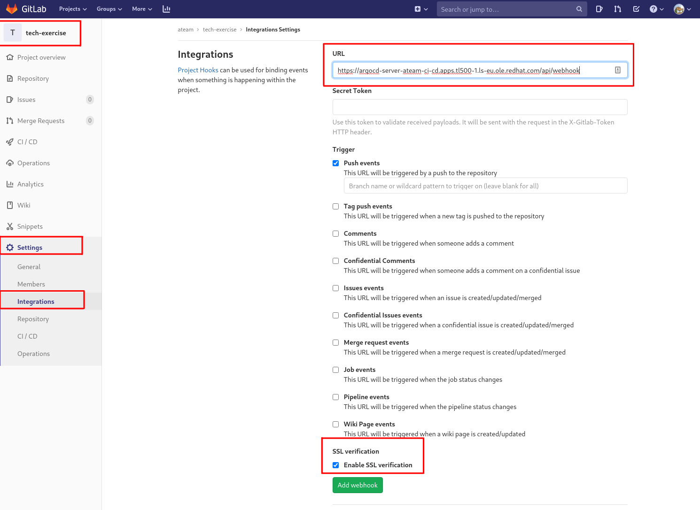
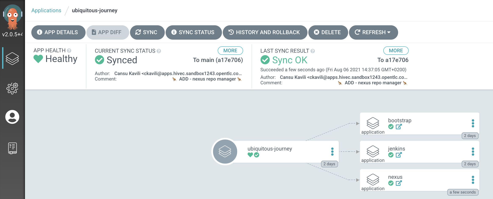

## Extend UJ with a another tool, eg Nexus 
Now, we have our projects, necessary rolebindings and Jenkins up and running. We also need a repository to manage and store our artifacts. Nexus is here to help! We can use Nexus helm chart to deploy it. And since this is GitOps, all we need to do is extend UJ! Because if it is not in Git, it's not REAL! ;)

<p class="warn">
    ⛷️ <b>NOTE</b> ⛷️ - If you switch to a different CodeReady Workspaces environment, please run below commands before going forward.
</p>

```bash
cd /projects/tech-exercise
git remote set-url origin https://<GIT_SERVER>/<TEAM_NAME>/tech-exercise.git
git pull
```


### Add ArgoCD Webhook from GitLab
> ArgoCD has a cycle time of about 3ish mins - this is too slow for us, so we can make ArgoCD sync our changes AS SOON AS things hit the git repo.

1. Let's add a webhook to connect ArgoCD to our `ubiquitous-journey` project. Get ArgoCD URL with following:

    ```bash#test
    echo https://$(oc get route argocd-server --template='{{ .spec.host }}'/api/webhook  -n ${TEAM_NAME}-ci-cd)
    ```

2. Go to `tech-exercise` git repository on GitLab. From left panel, go to `Settings > Integrations` and add the URL you just copied from your terminal to enable the WebHook. Now whenever a change is made in Git, ArgoCD will instantly reconcile and apply the differences between the current state in the cluster and the desired state in git 🪄. Click `Add webhook`.

    


### Add Nexus to our tool box
> In this exercise we'll add Sonatype's Nexus repository manager to our tooling - this tool will be used to host our application binaries and helm charts!

1. Update your `ubiquitous-journey/values-tooling.yaml` to include Nexus with some sensible defaults. In this example we're just pointing our ArgoCD config to a helm chart. Add the following into the file under the `# Nexus` placeholder

    ```yaml
      # Nexus
      - name: nexus
        enabled: true
        source: https://redhat-cop.github.io/helm-charts
        chart_name: sonatype-nexus
        source_ref: "1.1.10"
        values:
          includeRHRepositories: false
          service:
            name: nexus
    ```

    You can also run this bit of code to do the replacement if you are feeling uber lazy!

    ```bash#test
    if [[ $(yq e '.applications[] | select(.name=="nexus") | length' /projects/tech-exercise/ubiquitous-journey/values-tooling.yaml) < 1 ]]; then
        yq e '.applications += {"name": "nexus","enabled": true,"source": "https://redhat-cop.github.io/helm-charts","chart_name": "sonatype-nexus","source_ref": "1.1.10","values":{"includeRHRepositories": false,"service": {"name": "nexus"}}}' -i /projects/tech-exercise/ubiquitous-journey/values-tooling.yaml
    fi
    ```

2. Now push the changes into your git repository for it to be automatically rolled out by ArgoCD!

    ```bash#test
    cd /projects/tech-exercise
    git add .
    git commit -m  "🦘 ADD - nexus repo manager 🦘"
    git push 
    ```

3. ArgoCD will detect the change in `ubiquitous-journey/values-tooling.yaml` and deploy Nexus on our behalf in order to match what is in git also in the cluster. You can see it also in ArgoCD UI.


4. With the Webhook in place, it should only take a few seconds for things to become available. But you can verify it is all working by opening the Nexus URL in a new tab (admin / admin123 is the default credential):

    ```bash#test
    echo https://$(oc get route nexus --template='{{ .spec.host }}' -n ${TEAM_NAME}-ci-cd)
    ```

    
