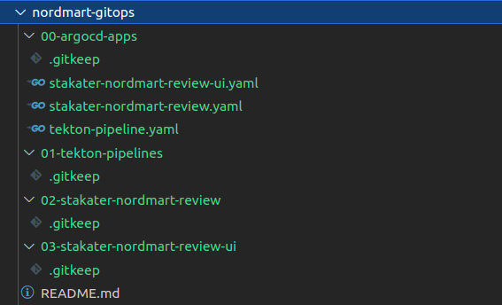

# Setup GitOps Repository Structure :rocket: :rocket:

This section is focused on creating a gitops structure for your tenant that will contains application helm charts, tekton pipelines and their respective argocd applications.

We will create the following types of folders in our gitops repo you ve made in section:

1. **For Each Application**
This folder will contain application helm chart which will be updated with newly built image whenever main of application repo is updated. 
2. **For Tekton Manifests**
This folder will contain the pipeline to be run for application.
3. **For ArgoCD Apps**
The folder contains argocd applications for all applications & pipelines.  

Lets get started,

1. Lets clone our gitops repo that we created in the previous section 1b.

        # git clone https://gitlab.com/<group-name>/<gitops-repo>
        git clone https://gitlab.com/workshop-exercise/nordmart-gitops

2. Now lets create argocd apps folder that will point to our application & pipelines directory and make sure that resource manifest inside these are deployed and synced in the cluster

        # mkdir <argocd-apps-dir-name>
        mkdir 00-argocd-apps
        touch 00-argocd-apps/.gitkeep

3. Lets create a tekton pipelines folder and it will contain our manifests for pipeline for our nordmart review and nordmart review ui applications.

        # mkdir <tekton-manifests-dir-name>
        mkdir 01-tekton-pipelines
        touch 01-tekton-pipelines/.gitkeep

4. Add folder for our apps we cloned in previous section 1b. Run following commands:

        # cd <gitops-repo-name>
        cd nordmart-gitops

        # mkdir <app-name>
        mkdir 02-stakater-nordmart-review-ui
        touch 02-stakater-nordmart-review-ui/.gitkeep

        mkdir 03-stakater-nordmart-review
        touch 03-stakater-nordmart-review/.gitkeep

5. For each folder present at root level (application folders,tekton-pipeline) , create an argocd application inside this folder using the template given below. This will create an application inside argocd which will make sure the manifests in these folder are deployed and synced inside our cluster. 

    Following is the argocd app template:

        apiVersion: argoproj.io/v1alpha1
        kind: Application
        metadata:
        name: <YOUR_TENANT_NAME>-<FOLDER_NAME>
        namespace: openshift-gitops
        spec:
        destination:
            namespace: <YOUR_TENANT_NAME>
            server: 'https://kubernetes.default.svc'
        project: <YOUR_TENANT_NAME>
        source:
            path: <FOLDER_IN_GITOPS_REPO>
            repoURL: <GITOPS_REPO_URL>
            targetRevision: HEAD
        syncPolicy:
            automated:
            prune: true
            selfHeal: true

    Using the above template, we will create 3 new files with our two nordmart applications and 1 tekton pipeline application.

    Create an argocd app `/00-argocd-apps/stakater-nordmart-review-ui.yaml` for our stakater-nordmart-review-ui application inside argocdcd-apps folder:

        apiVersion: argoproj.io/v1alpha1
        kind: Application
        metadata:
        name: workshop-exercise-stakater-nordmart-review-ui
        namespace: openshift-gitops
        spec:
        destination:
            namespace: workshop
            server: 'https://kubernetes.default.svc'
        project: workshop-exercise
        source:
            path: 02-stakater-nordmart-review-ui
            repoURL: https://gitlab.com/workshop-exercise/nordmart-gitops
            targetRevision: HEAD
        syncPolicy:
            automated:
            prune: true
            selfHeal: true

    Create an argocd app `/00-argocd-apps/stakater-nordmart-review.yaml` for our stakater-nordmart-review application inside argocdcd-apps folder:

        apiVersion: argoproj.io/v1alpha1
        kind: Application
        metadata:
        name: workshop-exercise-stakater-nordmart-review
        namespace: openshift-gitops
        spec:
        destination:
            namespace: workshop
            server: 'https://kubernetes.default.svc'
        project: workshop-exercise
        source:
            path: 03-stakater-nordmart-review
            repoURL: https://gitlab.com/workshop-exercise/nordmart-gitops
            targetRevision: HEAD
        syncPolicy:
            automated:
            prune: true
            selfHeal: true

    Create an argocd app `/00-argocd-apps/tekton-pipelines.yaml` for tekton pipelines inside argocdcd-apps folder:

        apiVersion: argoproj.io/v1alpha1
        kind: Application
        metadata:
        name: workshop-exercise-tekton-pipeline
        namespace: openshift-gitops
        spec:
        destination:
            namespace: workshop
            server: 'https://kubernetes.default.svc'
        project: workshop-exercise
        source:
            path: 01-tekton-pipelines
            repoURL: https://gitlab.com/workshop-exercise/nordmart-gitops
            targetRevision: HEAD
        syncPolicy:
            automated:
            prune: true
            selfHeal: true

    Argocd apps folder contains three files with the above manifests specified.     

    

6. Finally push these changes to the remote

        git push origin main
        or
        git push origin master
