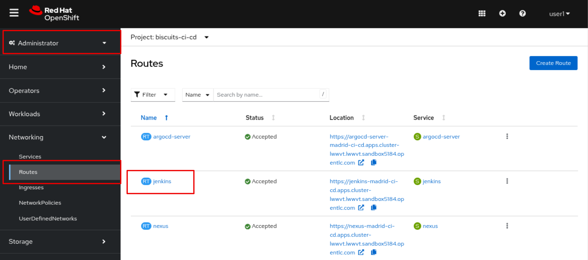
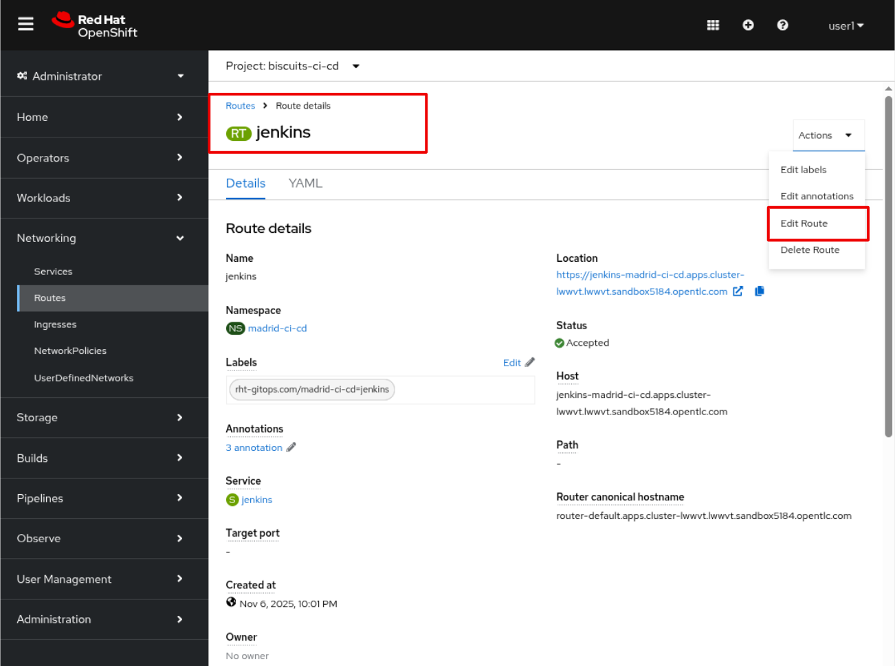
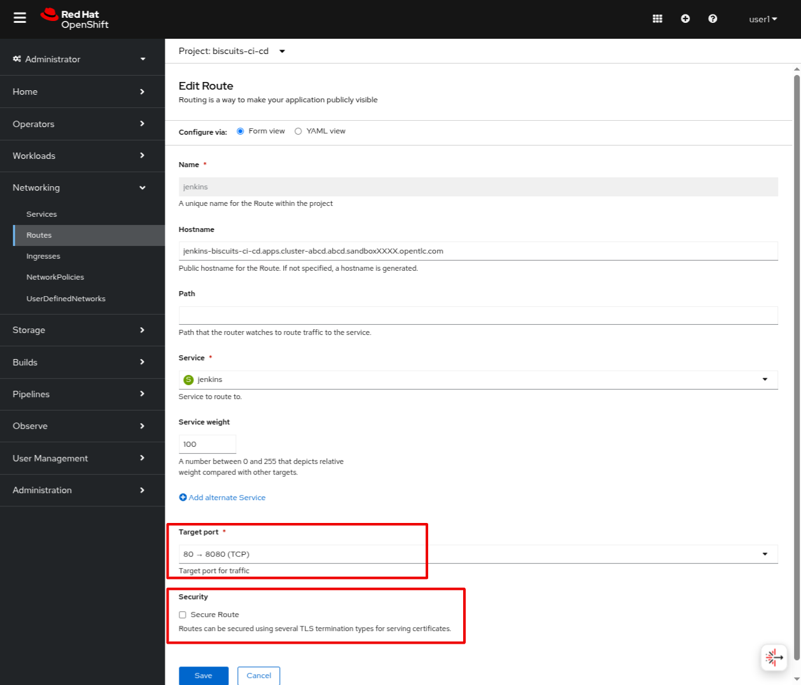
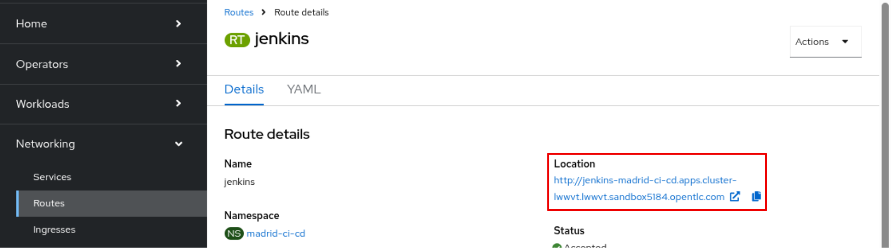
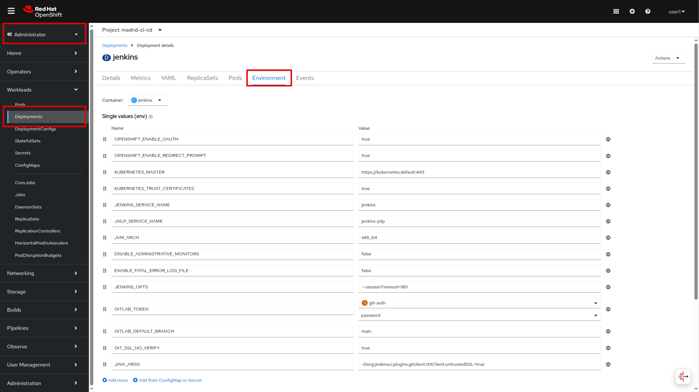
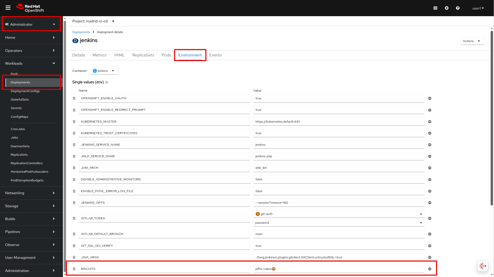

## This is GitOps 💪

> GitOps is a simple process of managing all of your systems, environments, and applications via Git. **Git represents the single source of truth** for all your applications, your tooling, and even your clusters' configuration. Changes to any of these things can be pull requested and discussed before an automated process applies them! 
> 
> Let's try it out - In this exercise we'll make a manual change in the OpenShift UI and have it overwritten - GOOO GOOOO GITOPS 💪

<p class="warn">
    ⛷️ <b>NOTE</b> ⛷️ - If you switch to a different Dev Space Workspaces environment, please run the commands below before going forward.
</p>

```bash
cd /projects/tech-exercise
git remote set-url origin https://${GIT_SERVER}/${TEAM_NAME}/tech-exercise.git
git pull
```

### Reverting manual changes 

In OpenShift, the `Route` resource is used to expose a service to the internet. Routes can accept `http` or `https` traffic. For security reasons, it is a best practice to use `https` for all routes. The `jenkins` route is configured to only accept `https` traffic and redirect `http` traffic to `https`.

Let's suppose that someone wants to change the `jenkins` route to accept `http` traffic. Let's see how we are protected from this change by GitOps.

1. In OpenShift UI, go to your `<TEAM_NAME>-ci-cd` project. Navigate to `Workloads > Routes > jenkins`.

  _Note: if you are in the Developer view, you can switch to the Administrator view from upper left side_


2. Click on the `jenkins` route and click on the `Edit` button.


3. Select the only `Target Port` from the dropdown menu and disable the `Secure Route` checkbox. Click on the `Save` button.


4. Great! You can see that the `jenkins` route is now accepting `http` traffic.


5. If you wait a few seconds (or if like me you're lazy, you could refresh the page) you'll say to yourself *WHERE IS THE HTTP TRAFFIC CONFIGURATION GONE*!?!😱😱😱

That's right, it's been overwritten by ArgoCD which has taken the configuration from git and applied it on top. The insecure traffic configuration was **not** in git so it was removed. If we want to persist the change, we can of course add it to our git repo!


### Making changes to the Git repository

Let's now make a change to the Git repository to persist the change. As we don't want to enable insecure traffic for the `jenkins` route, let's add a new environment variable to the `jenkins` pods.


1. First, let's access the `jenkins` deployment. On the `Workloads` tab, click on the `jenkins` deployment and then click on the `Environment` tab. Add a new variable. There is no environment variable with the name `BISCUITS` so we can add it.


2. Open the `ubiquitous-journey/values-tooling.yaml` file and add a new environment variable to the `values` property of the Jenkins definition as shown below.

    ```yaml
              - name: BISCUITS
                value: 'jaffa-cakes🍪'
    ```

    It should look something like this now in your `ubiquitous-journey/values-tooling.yaml`
    <div class="highlight" style="background: #f7f7f7">
    <pre><code class="language-yaml">
    # more yaml ...
          deployment:
            env_vars:
              - name: GITLAB_DEFAULT_BRANCH
                value: 'main'
              - name: GITLAB_HOST
                value: ''
              - name: GITLAB_GROUP_NAME
                value: ''
              - name: BISCUITS
                value: 'jaffa-cakes🍪'
    # more yaml ...
    </code></pre></div>

    You can also run this bit of code to do the replacement if you are feeling uber lazy!

    ```bash#test
    if [[ $(yq e '.applications.[].values.deployment.env_vars[] | select(.name=="BISCUITS") | length' /projects/tech-exercise/ubiquitous-journey/values-tooling.yaml) < 1 ]]; then
        yq e '.applications.[1].values.deployment.env_vars += {"name": "BISCUITS", "value": "jaffa-cakes🍪"}' -i /projects/tech-exercise/ubiquitous-journey/values-tooling.yaml
    fi
    ```

3. Git commit that change and open the ArgoCD UI to see the new variable synchronized.

    ```bash#test
    cd /projects/tech-exercise
    git add .
    git commit -m  "🍪 ADD - Jenkins environment variable 🍪"
    git push
    ```

    

4. In OpenShift, we should now see the variable is present in the `jenkins` deployment!


</br>

🪄🪄 You've just experienced how great and powerful the GitOps is! Let's advance to see how we utilize it in our application development! 🪄🪄
