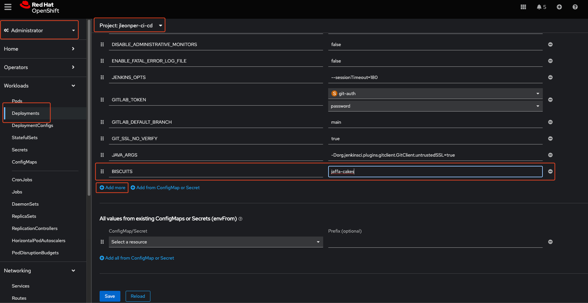
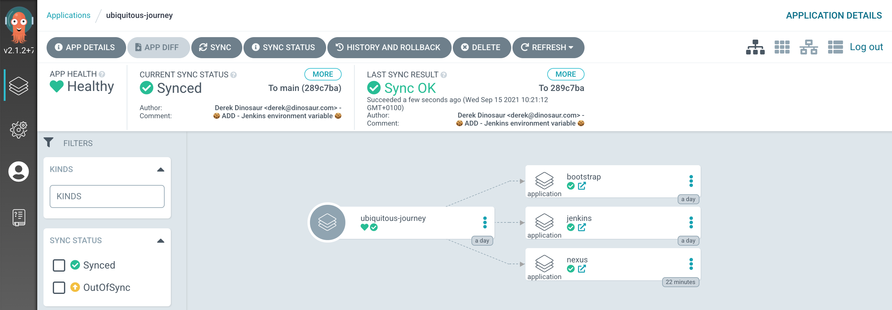
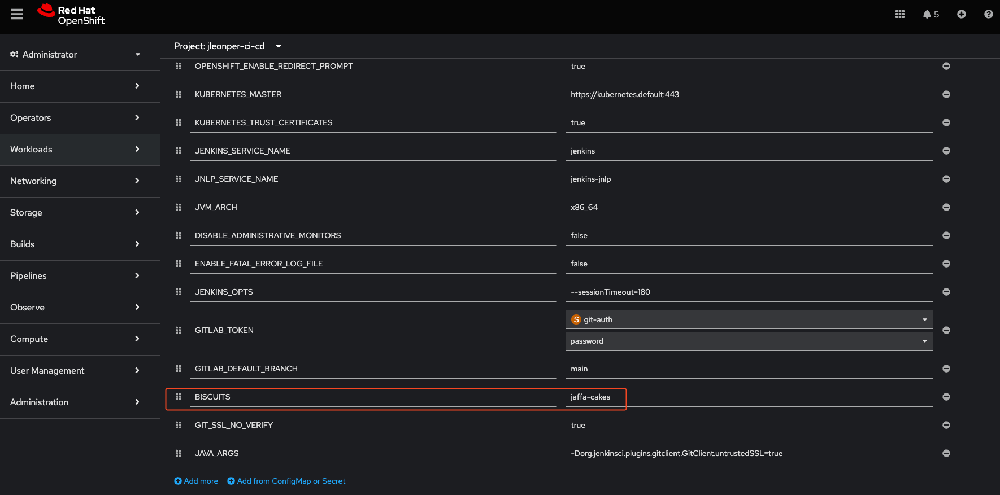

## Validate our GitOps
> GitOps is a simple process of managing all of your systems, environments, and applications via Git. Git represents the single source of truth for all your applications, your tooling, and even your clusters configuration. Changes to any of these things can be pull requested and discussed before an automated process applies them! Let's try it out - In this exercise we'll make a manual change in the OpenShift UI and have it overwritten - GOOO GOOOO GITOPS 💪

<p class="warn">
    ⛷️ <b>NOTE</b> ⛷️ - If you switch to a different CodeReady Workspaces environment, please run below commands before going forward.
</p>

```bash
cd /projects/tech-exercise
git remote set-url origin https://${GIT_SERVER}/${TEAM_NAME}/tech-exercise.git
git pull
```

1. In OpenShift UI, go to your `<TEAM_NAME>-ci-cd` project. Navigate to `Workloads > DeploymentConfigs > jenkins`.
 
2. On the `Environment` tab, add a new variable. For example, click `➕ Add more` and on the text box put in something new or random for example `BISCUITS` with a value of `jaffa-cakes`. Hit save!
  
  _Note: if you are in Developer view, you can switch to Administrator view from upper left side_


    If you wait a few seconds (or if like me you're lazy, you could refresh the page) you'll say to yourself *WHERE IS THE BISCUITS VARIABLE GONE*!?!😱😱😱

    That's right, they've been over written by ArgoCD who's taken the configuration in git and applied it on top. The `BISCUITS` variable was **not** in git so it was removed. If we want to persist the variable, we can of course add it to out git repo!

3. Open the `ubiquitous-journey/values-tooling.yaml` file and add a new environment variable to the `values` property of the Jenkins definition as shown below.

    ```yaml
              - name: BISCUITS
                value: 'jaffa-cakes🍪'
    ```

    It should look something like this now in your `ubiquitous-journey/values-tooling.yaml`
    <div class="highlight" style="background: #f7f7f7">
    <pre><code class="language-yaml">
    # more yaml ...
          deployment:
            env_vars:
              - name: GITLAB_DEFAULT_BRANCH
                value: 'main'
              - name: GITLAB_HOST
                value: ''
              - name: GITLAB_GROUP_NAME
                value: ''
              - name: BISCUITS
                value: 'jaffa-cakes🍪'
    # more yaml ...
    </code></pre></div>

    You can also run this bit of code to do the replacement if you are feeling uber lazy!

    ```bash#test
    if [[ $(yq e '.applications.[].values.deployment.env_vars[] | select(.name=="BISCUITS") | length' /projects/tech-exercise/ubiquitous-journey/values-tooling.yaml) < 1 ]]; then
        yq e '.applications.[1].values.deployment.env_vars += {"name": "BISCUITS", "value": "jaffa-cakes"}' -i /projects/tech-exercise/ubiquitous-journey/values-tooling.yaml
    fi
    ```

3. Git commit that change and open the ArgoCD UI to see the new variable synchronized.

    ```bash#test
    cd /projects/tech-exercise
    git add .
    git commit -m  "🍪 ADD - Jenkins environment variable 🍪"
    git push 
    ```

    

5. In OpenShift, we should now see the variable is persisted!


</br>

🪄🪄 You've just experienced how great and powerful the GitOps is! Let's advance to see how we utilize it in our application development! 🪄🪄