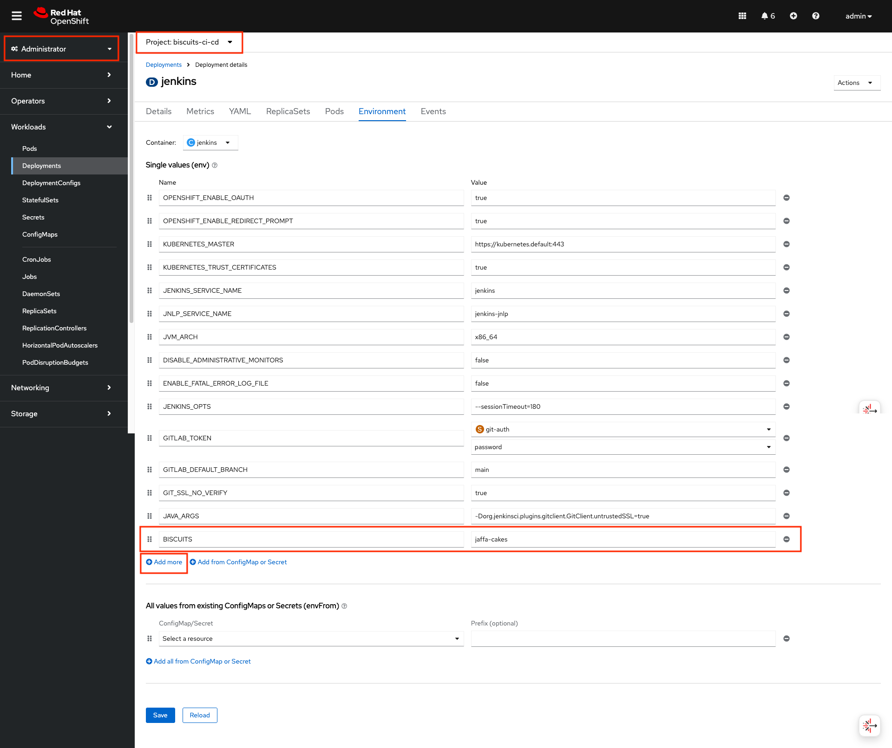
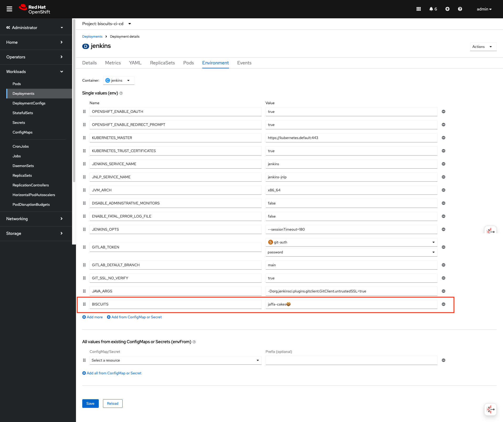

### 5. Validate our GitOps
> GitOps is a simple process of managing all of your systems, environments, and applications via Git. Git represents the single source of truth for all your applications, your tooling, and even your clusters configuration. Changes to any of these things can be pull requested and discussed before an automated process applies them!

Let's try it out - Make a change in the OpenShift UI and have it overwritten - GOOO GOOOO GITOPS 💪 

1. In OpenShift UI, go to your `<TEAM_NAME>-ci-cd` project. Navigate to `Workloads > DeploymentConfigs > jenkins`.  On the `Environment` tab, add a new variable. For example, click `➕ Add more` and on the text box put in something new or random for example `BISCUITS` with a value of `jaffa-cakes`. Hit save!

Then, refresh the page and *WHERE IS THE BISCUITS*!?!
That's right, they've been over written by ArgoCD who's taken the configuration in git and applied it on top. The `BISCUITS` variable was not in git so it was removed. If we want to persist the variable, we can of course add it to out git repo!

2. Open the `ubiquitous-journey/values-tooling.yaml` file and add a new environment variable to the values of Jenkins as shown below
```yaml
             - name: BISCUITS
               value: 'jaffa-cakes🍪'
```
It should look something like this now in your `ubiquitous-journey/values-tooling.yaml`
<pre>
# more yaml ...

      deployment:
        env_vars:
          - name: ARGOCD_CONFIG_REPO
            value: ''
          - name: GITLAB_HOST
            value: ''
          - name: GITLAB_GROUP_NAME
            value: ''
          - name: BISCUITS
            value: 'jaffa-cakes🍪'

# more yaml ... 
</pre>

3. Git commit that change and open the ArgoCD UI to see the new variable syncrhonised.
```bash
git add .
git commit -m  "🍪 ADD - Jenkins environment variable 🍪" 
git push 
```


4. In OpenShift, we should now see the variable is persisted!


You've just experienced how great and powerful the GitOps is! Let's advance to see how we utilize it in our application development!