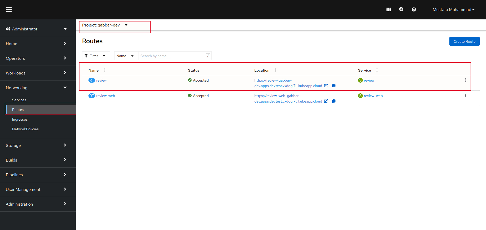

## Deploy Stakater Nordmart Review

### Architecture

Nordmart Review product is composed of three components:

1. `stakater-nordmart-review`: A spring boot based REST API
2. `stakater-nordmart-review-ui`: A react based frontend to managing reviews
3. `mongodb`: A database to hold reviews

### Lets get started 

We will first setup the stakater-nordmart-review repository and deploy it on our cluster via Helm chart.

## Stakater-Nordmart-Review
1. Clone the `stakater-nordmart-review` repository that you imported from github to your GitLab account.

        # git clone https://<GITLAB_SERVER>/<YOUR_GITLAB_GROUP>/<YOUR_REPO_NAME>
        git clone https://gitlab.apps.devtest.vxdqgl7u.kubeapp.cloud/workshop-exercise/stakater-nordmart-review

        # cd <YOUR_REPO_NAME>
        cd stakater-nordmart-review

2. Open values.yaml file in the editor and change the **application.deployment.image.repository** and **application.deployment.image.tag** keys in yaml
    > **NOTE:**  We have already built an image for the application and pushed it to nexus image repository.  

    repository: <NEXUS_URL>/stakater-nordmart-review
    tag: latest

    

    
    

3. Lets use Helm to install our `stakater-nordmart-review` application to the cluster. Run following command in `stakater-nordmart-review` directory.

        helm install <TENANT_NAME> deploy/ -n <TENANT_NAME>-test --dependency-update

    > **NOTE**: Make sure you are logged into the openshift cluster via cli.

    > Thanks to **tenant operator** this **<TENANT_NAME>-test** project is already available to us in the cluster where we can deploy this application

4. Login to OpenShift UI, Select your project  **<TENANT_NAME>-test** and Navigate to Pods under Workloads in left side bar. 

    

    
    

    You will see a pod with prefix **review**. This is application.applicationName in our values.yaml

5. Helm application chart also created the following required resources.
    > Some of these are available via the left sidebar and some can be viewed using API explorer

    - ServiceAccount
    - ConfigMap
    - PersistentVolumeClaim
    - Service
    - Deployment
    - AlertmanagerConfig
    - EndpointMonitor
    - GrafanaDashboard
    - PrometheusRule
    - Route
    - Service
    - SealedSecret
    - ServiceMonitor

6. Navigate to Routes under Networking in left sidebar. Our application is available via this route location. 

    

    
    

7. Lets send a `curl` request to this endpoint and see the response.
    - **Get Review**

            # Get Review
            curl <ROUTE_LOCATION>:8080/api/review/329199

            # Response 
            {
                "headers": {
                    "Cache-Control": [
                    "no-cache"
                    ]
                },
                "body": [
                    {
                    "id": "6311008e00aeb66032db19d2",
                    "productId": "329199",
                    "customerName": "Tolvan+Tolvansson - Callum",
                    "rating": 3,
                    "reviewText": "I+think+this+sticker+is+ok",
                    "dateTime": "2022-09-01T18:57:18.556+00:00"
                    },
                    {
                    "id": "6311008e00aeb66032db19d3",
                    "productId": "329199",
                    "customerName": "Darth+Vader",
                    "rating": 5,
                    "reviewText": "Best+ever!+I+always+use+on+the+walls+of+the+death+star",
                    "dateTime": "2022-09-01T18:57:18.556+00:00"
                    },
                    {
                    "id": "6311008e00aeb66032db19d4",
                    "productId": "329199",
                    "customerName": "Stormtrooper0032",
                    "rating": 5,
                    "reviewText": "My+boss+forced+me+to+put+5+stars",
                    "dateTime": "2022-09-01T18:57:18.556+00:00"
                    }
                ],
                "statusCode": "OK",
                "statusCodeValue": 200
            }
    - **Add a Review**

            # Add a Review with Username: bumblebee, ProductId: 329199, Review Rating: 5 and Comment: great 
            # curl -X POST '<ROUTE_LOCATION>:8080/api/review/329199/<TENANT_NAME>/5/great'

            curl -X POST '<ROUTE_LOCATION>:8080/api/review/329199/bumblebee/5/great'

            # Response 
            {
                "headers": {},
                "body": {
                    "id": "6319eab100aeb66032db19db",
                    "productId": "329199",
                    "customerName": "bumblebee",
                    "rating": 5,
                    "reviewText": "good-product-10-out-of-10",
                    "dateTime": "2022-09-08T13:14:25.655+00:00"
                },
                "statusCode": "OK",
                "statusCodeValue": 200
            }
