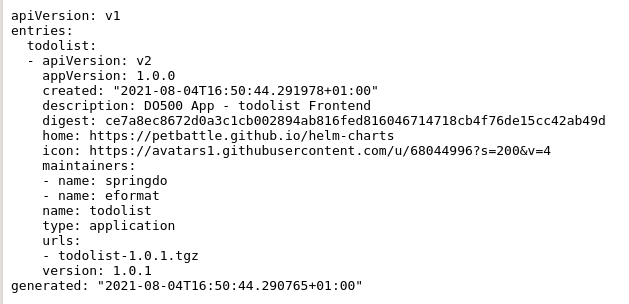

## Here be dragons!


### Extend 🔥🦄
- Add $SOMETHING from the redhat-cop/helm-charts repo to the UJ eg Hoverfly, Zalenium or something else
[todo links to example charts]

### Helm in more detail

There is a bit of hidden magic from the `helm repo add` and `helm install` commands in [the-basics](1-the-manual-menace/1-the-basics) exercise. A hosted helm repository holds your packaged up Charts and an `index.yaml` file.

For the `todolist` application we deploy you can take a look at the file by browsing <span style="color:blue;">[here](https://rht-labs.com/todolist/index.yaml).<span>



This lists the versions and details that the helm repository contains. So when you `helm repo add` it adds the repo url to your operating system dependent config file. This from `man helm`:

```bash
| Operating System | Cache Path                | Configuration Path             | Data Path               |
|------------------|---------------------------|--------------------------------|-------------------------|
| Linux            | $HOME/.cache/helm         | $HOME/.config/helm             | $HOME/.local/share/helm |
| macOS            | $HOME/Library/Caches/helm | $HOME/Library/Preferences/helm | $HOME/Library/helm      |
| Windows          | %TEMP%\helm               | %APPDATA%\helm                 | %APPDATA%\helm          |
```

In OpenShift you can create `HelmChartRepository` objects that populate the WebUI, read more about that <span style="color:blue;">[here](https://docs.openshift.com/container-platform/4.9/applications/working_with_helm_charts/configuring-custom-helm-chart-repositories.html).</span>

When installing the helm chart into your namespace, the helm command line actually uploads your full chart, stores it in a secret that the Helm Controller in your OpenShift cluster can act upon.

<div class="highlight" style="background: #f7f7f7">
<pre><code class="language-bash">
$ oc get secrets -l owner=helm
NAME                           TYPE                 DATA   AGE
sh.helm.release.v1.argocd.v1   helm.sh/release.v1   1      3d
sh.helm.release.v1.argocd.v2   helm.sh/release.v1   1      3d
sh.helm.release.v1.my.v1       helm.sh/release.v1   1      7m39s
sh.helm.release.v1.uj.v1       helm.sh/release.v1   1      2d23h
sh.helm.release.v1.uj.v2       helm.sh/release.v1   1      2d23h
</code></pre></div>

### Environment
- use the learnings from above to create a `uat` environment from code.

### Make ArgoCD more secure

`FIXME` - write about these topics with some examples.

- Using ArgoCD RBAC, Projects
- Using Red Hat GitOps Operator + Keycloak RBAC
- Parent/Child argocd's
- Restricting service accounts, least privilege.

### ArgoCD - Add Repositories at runtime

Post deployment, ArgoCD manages Repositories in a ConfigMap ```oc get cm argocd-cm -o yaml```

We can add `Git|Helm` repositories via `ssh|https`.

Lets add our GitLab repo.

```bash
export GITLAB_USER=<your gitlab user>
export GITLAB_PAT=<your gitlab pat token>
```

Lets put our git credentials via a Kubernetes secret for now. **We will fix this with a Sealed Secrets in a later exercise**

```bash
cat <<EOF | oc apply -f -
apiVersion: v1
data:
  password: "$(echo -n ${GITLAB_PAT} | base64 -w0)"
  username: "$(echo -n ${GITLAB_USER} | base64 -w0)"
kind: Secret
type: kubernetes.io/basic-auth
metadata:
  annotations:
    tekton.dev/git-0: https://${GIT_SERVER}
    sealedsecrets.bitnami.com/managed: "true"
  labels:
    credential.sync.jenkins.openshift.io: "true"
  name: git-auth
EOF
```

Patch the repository list, be sure to use your `GITLAB_URL`

```bash
oc -n ${TEAM_NAME}-ci-cd patch cm argocd-cm --patch "
data:
  repositories: |
    - name: ubiquitous-journey
      url: https://github.com/rht-labs/ubiquitous-journey.git
    - name: redhat-cop
      type: helm
      url: https://redhat-cop.github.io/helm-charts
    - url: https://${GIT_SERVER}/${TEAM_NAME}/tech-exercise.git
      type: git
      insecure: false
      insecureIgnoreHostKey: true
      passwordSecret:
        key: password
        name: git-auth
      usernameSecret:
        key: username
        name: git-auth
"
```

### ArgoCD - Add Repositories at install time

**Going the Extra Mile**

We can also add repositories at install time, be sure to use your `GITLAB_URL`.

```bash
export GITLAB_USER=<your gitlab user>
export GITLAB_PAT=<your gitlab pat token>
```

Lets our git creds via a secret (**UJ this**)

```bash
cat <<EOF | oc apply -n ${TEAM_NAME}-ci-cd -f -
apiVersion: v1
data:
  password: "$(echo -n ${GITLAB_PAT} | base64 -w0)"
  username: "$(echo -n ${GITLAB_USER} | base64 -w0)"
kind: Secret
type: kubernetes.io/basic-auth
metadata:
  annotations:
    tekton.dev/git-0: https://${GIT_SERVER}
    sealedsecrets.bitnami.com/managed: "true"
  labels:
    credential.sync.jenkins.openshift.io: "true"
  name: git-auth
EOF
```

Create our configuration, be sure to use your `GITLAB_URL`.

```bash
cat <<'EOF' > /tmp/initial-repos.yaml
- name: ubiquitous-journey
  url: https://github.com/rht-labs/ubiquitous-journey.git
- name: redhat-cop
  type: helm
  url: https://redhat-cop.github.io/helm-charts
- name: tl500-git
  url: https://${GIT_SERVER}/${TEAM_NAME}/tech-exercise.git
  type: git
  insecure: true
  insecureIgnoreHostKey: true
  passwordSecret:
    name: git-auth
    key: password
  usernameSecret:
    name: git-auth
    key: username
EOF

cat <<'EOF' > /tmp/initial-creds.yaml
- name: git-auth
  passwordSecret:
    name: git-auth
    key: password
  usernameSecret:
    name: git-auth
    key: username
  type: git
  url: https://${GIT_SERVER}
EOF
```

Reinstall ArgoCD using new initial settings:

```bash
helm upgrade --install argocd \
  --namespace ${TEAM_NAME}-ci-cd \
  --set namespace=${TEAM_NAME}-ci-cd \
  --set argocd_cr.applicationInstanceLabelKey=rht-labs.com/${TEAM_NAME} \
  --set argocd_cr.initialRepositories="$(cat /tmp/initial-repos.yaml)" \
  --set argocd_cr.repositoryCredentials="$(cat /tmp/initial-creds.yaml)" \
  redhat-cop/argocd-operator
```
