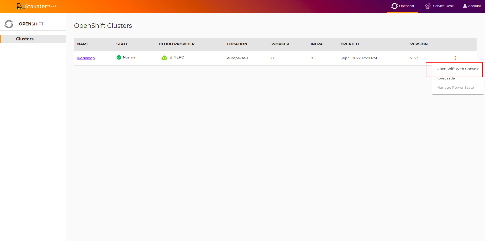
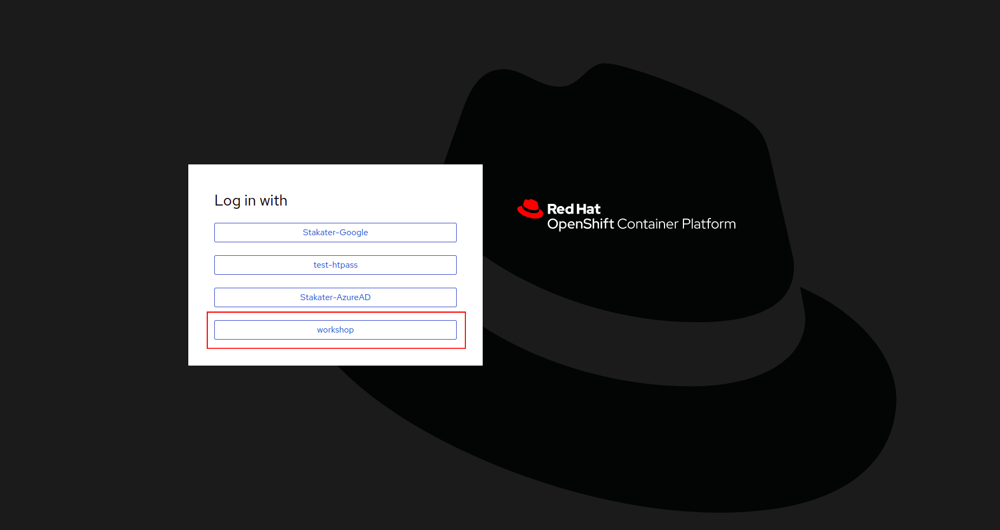
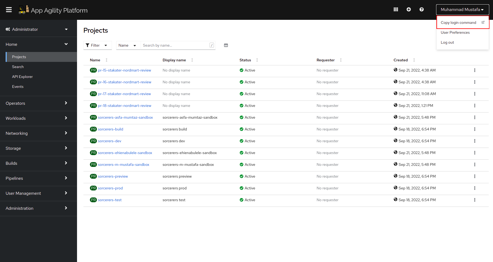
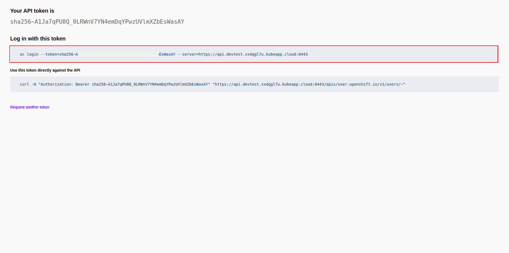
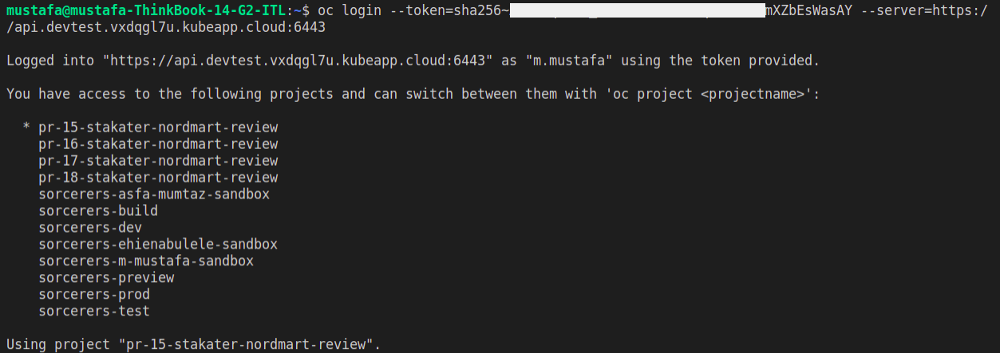

## 🌞 Setting Up Your Account

[SAAP - Stakater App Agility Platform](https://docs.cloud.stakater.com/content/sre/introduction/introduction.html) is Kubernetes based fully managed DevSecOps platform on cloud of your choice for teams so, they can focus on their product!

SAAP enables developers to control and configure the entire cloud development loop in order to ship software faster!

> SAAP Login  `https://managedopenshiftfrontend-stakater-managed-openshift-apps.apps.stage.2cc6dtsv.kubeapp.cloud/`

### Stakater Cloud

1. To set up your workshop environment, go to SAAP Login Page and enter `workshop` as your enterprise domain name.

   
 
 
 
   You will be brought to your workshop log in page.
   
   
 
 
 
2. To create a new account, click on `Register` and insert your details in the fields provided. 
 
 
   
 

   And click on `Register` to create your account.

   

3. Enter your username/email and password, and click `LOG IN` to log in to your workshop account.
 
 
   
 
 
   You will be brought to your `Cluster Management` page where you can view your workshop cluster.

   

4. Click on drop down toggle in workshop cluster and select openshift console. 
     

5. Login using `workshop`. You ll be redirected to openshift console

     

6. Hover over right dropdown toggle on topbar and select `Copy Login Command`. Login using `workshop`.
   

7. Copy the highlighted command and run it inside your terminal to log into the openshift cluster using CLI. 
   

   Output similar to below image will be displayed. Its okay if you dont have any projects !! We'll make some.
   

 

  

  
  
 
 
 
 
