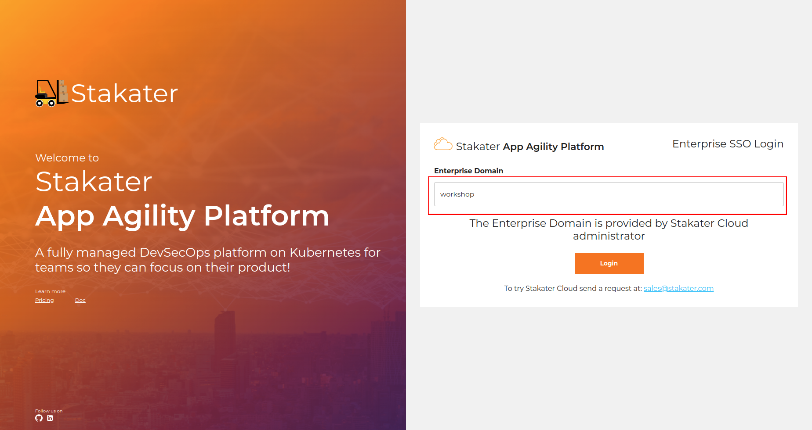
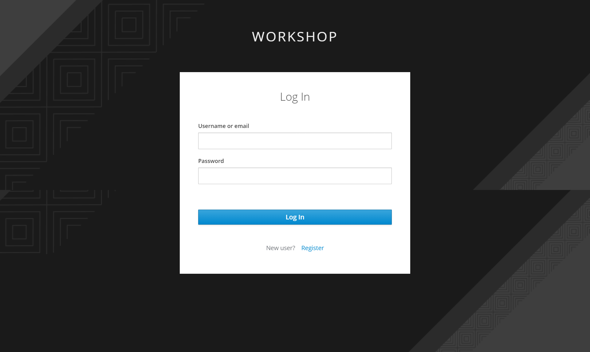
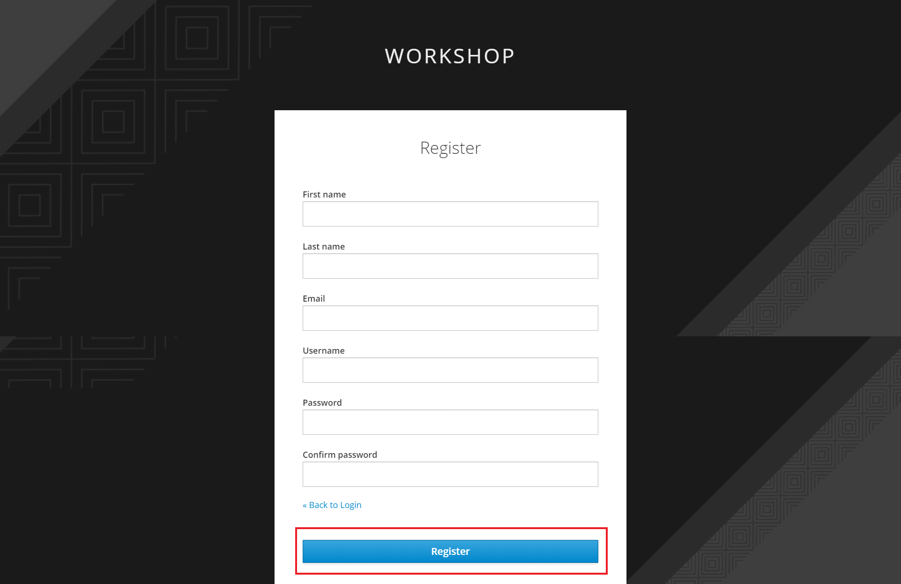
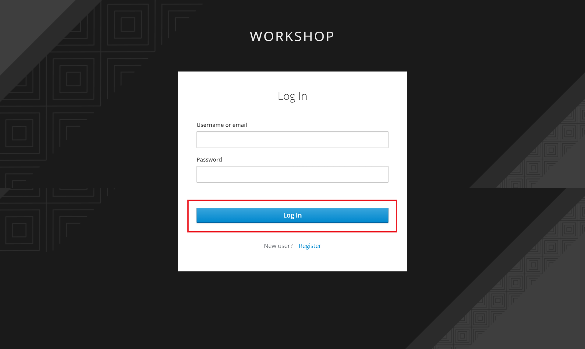

## 🌞 Setting Up Your Account

### Stakater Cloud

1. To set up your workshop environment, go to **insert link** and enter `workshop` as your enterprise domain name.

   
 
 
 
You will be brought to your workshop log in page.
  
 
   
 
 
 
2. To create a new account, click on `Register` and insert your details in the fields provided. 
 
 
   
 

And click on `Register` to create your account.

   

3.  Enter your username/email and password, and click `LOG IN` to log in to your workshop account.
 
 
   
 
 
 You will be brought to your `Cluster Management` page where you can view your workshop cluster.

   

  

  
  
 
 
 
 
