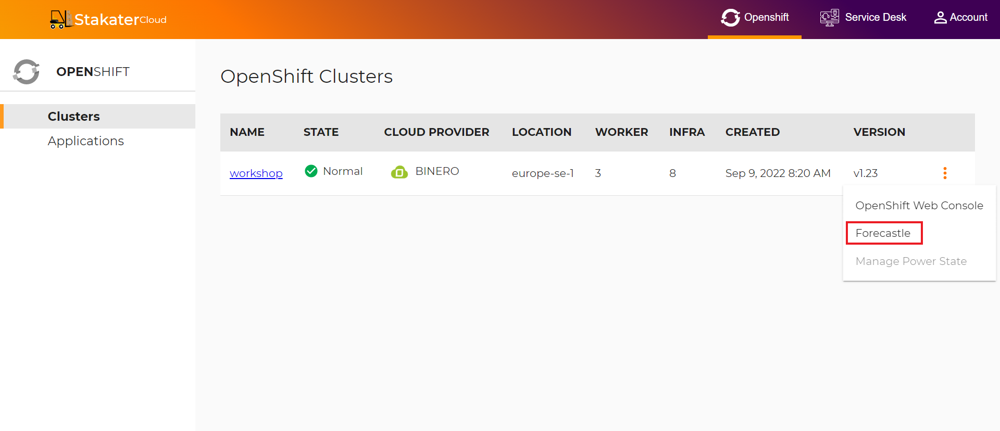
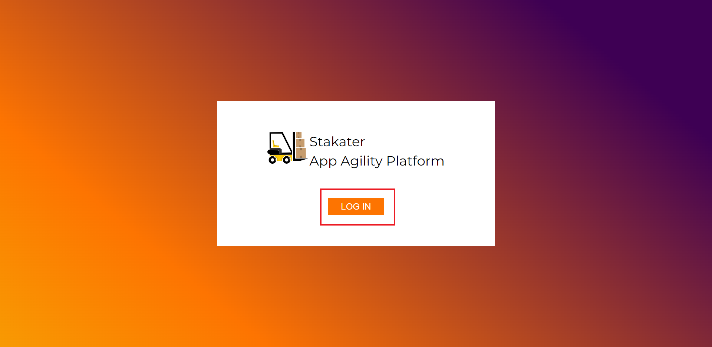
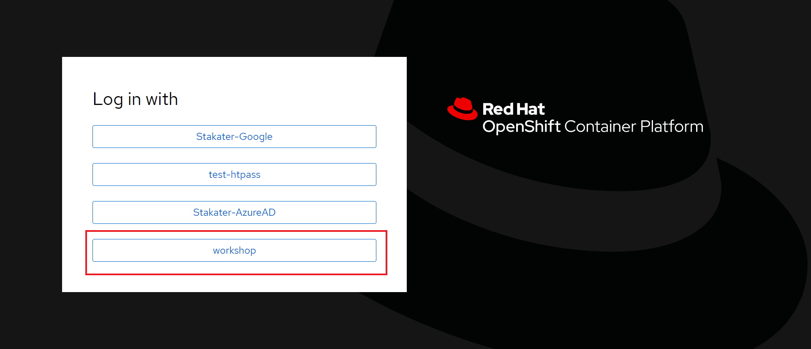
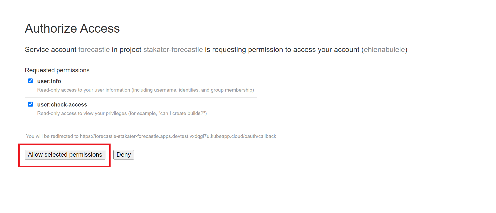
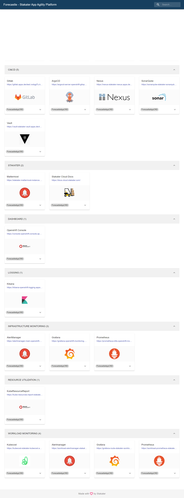

# 🍄 Accessing Your Developer Console via Forecastle

> Stakater [Forecastle](https://github.com/stakater/Forecastle) provides a central control plane for accessing all your tools and applications in your cluster. It also dynamically discovers new applications and installed tools, giving you the much needed convenience to develop and manage your applications.

1. To access the Forecastle developer console, click on the menu button beside your cluster.

2. You will be brought to the `Forecastle` login page. Click on `LOG IN` 

3. Log In with your `workshop` single sign-on.

> Forecastle needs a few permissions to operate unperturbed in your cluster. 

4. Click on `Allow selected permissions` to enable the required permissions.

You will now be brought to the Forecastle console, where you can view all your tools and applications from an easy, accessible plane.

