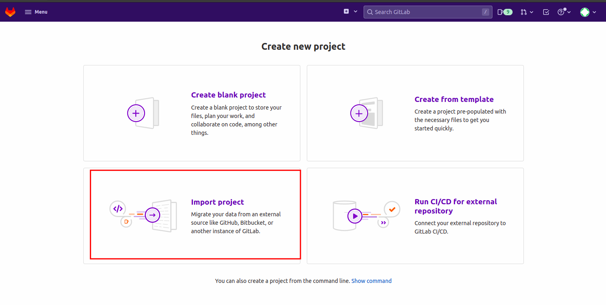

# Getting GitLab Ready for GitOps
> In this section we will get GitLab ready for our exercise. We will then import a couple of projects and prepare them for deployment to the cluster.

## Importing Nordmart Review

  > In this section, we will import some existing projects that we are tasked with deploying on our tenant namespaces in the cluster.

  > Nordmart Review is part of Stakater's fictitious e-commerce platform that we will deploy for the workshop.  

1. Select `Menu` > `Projects` > `Create new project`. This will redirect you to the following screen. Select `Import Project`.

   

2. Now select the `Repository by URL` option and paste in the following repository URL:

    ```
    https://github.com/stakater-lab/stakater-nordmart-review.git
    ```

3. Change the `Project name` to `stakater-nordmart-review` > select your GitLab group to complete the `Project URL` and check the `Visibility Level` is `Public` then click `Create project`

   > Make sure you mark the repository as public and choose the group you previously created as the group name so we can easily find your work and help with any debugging. 
    
   > Make sure that Project Name is lower case and spaces are replaced with '-' so our automation doesn't break ;).  

   > Remember we are only making public repos with no branch protection or merge approval flows for sake of simplicity during the workshop, these are very important settings that always should be used where appropriate. 

   

3. Once you have imported the repository select the `.tronador.yaml` file from the repository root  

   

4. Edit the file via the `Open in Web IDE` and replace the existing tenant named `gabbar` with your tenant name and `Commit the changes to main`.   

   


## Importing Nordmart Review UI 


1. Select `Menu` > `Projects` > `Create new project`. This will redirect you to the following screen. Select `Import Project`.

   

2. Now select the `Repository by URL` option and paste in the following repository URL:

    ```
    https://github.com/stakater-lab/stakater-nordmart-review-ui.git
    ```

3. Change the `Project name` to `stakater-nordmart-review-ui` > select your GitLab group to complete the `Project URL` and check the `Visibility Level` is `Public` then click `Create project`

   > Make sure you mark the repository as public and choose the group you previously created as the group name so we can easily find your work and help with any debugging. 
    
   > Make sure that Project Name is lower case and spaces are replaced with '-' so our automation doesn't break ;).  

   > Remember we are only making public repos with no branch protection or merge approval flows for sake of simplicity during the workshop, these are very important settings that always should be used where appropriate. 

    

3. Once you have imported the repository select the `.tronador.yaml` file from the repository root.  
  
4. Edit the file via the `Open in Web IDE` and replace the existing tenant named `gabbar` with your tenant name and `Commit the changes to main`. 
