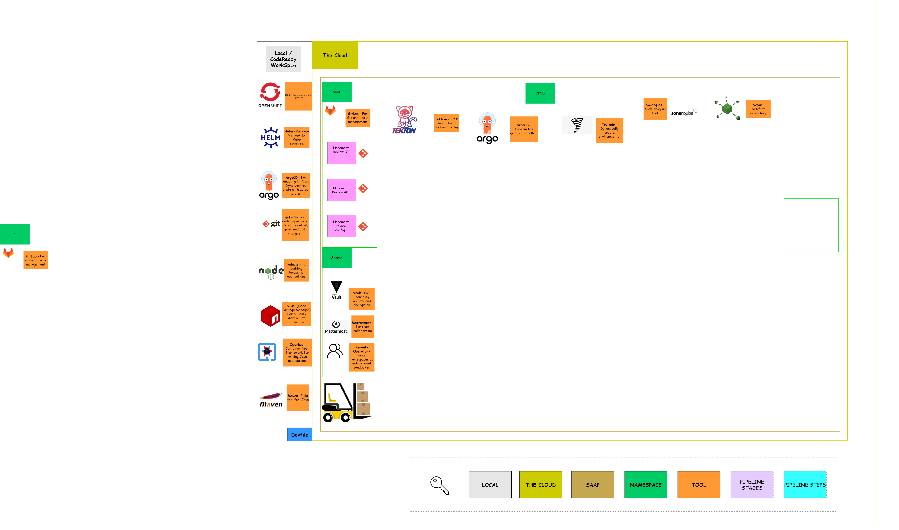

# Exercise 1 - The Manual Menace
> A GitOps approach to perform and automate deployments.
## 👨‍🍳 Exercise Intro

In this exercise, we will use GitOps to set up our working environment. We will create Tenants with Tenant Operator and  set up dynamic environments `dev`, `test`, `preview` and `stage` in your SAAP Instance with Tronador.  We will also explore the tools like ArgoCD, Tekton, Helm and Nexus to enable CI/CD/CT in the next exercise. We will learn how tools such as CodeReady Workspaces and Mattermost enable collaboration with developers, and how we can store our secrets safely with Vault and access them using External Secrets. In order to do all this, we'll use a popular approach called _GitOps_

## 🖼️ Big Picture

## 🔮 Learning Outcomes

* Understand the benefits gained from GitOps approach
* Deploy Helm charts manually
* Drive tool installations through GitOps
* Dynamically provision with Tronador environments 
* Improve collaboration with your team using CodeReady Workspaces and Mattermost
* Understand the importance of managing your secrets externally
* Self Hosting your repository with Nexus
* How to create and manage tenants with Tenant Operator

## 🔨 Tools used in this exercise

* [Helm](https://helm.sh/) - Helps us to define, install, and upgrade Kubernetes application.
* [ArgoCD](https://argoproj.github.io/argo-cd/) - A controller which continuously monitors application and compare the current state against the desired
* [Nexus](https://www.sonatype.com/nexus-repository-sonatype) - Repository manager for storing lots of application types. Can also host `npm` and `Docker` registries.
* [Tekton](https://tekton.dev/) - Tekton is a powerful and flexible open-source framework for creating CI/CD systems, allowing developers to build, test, and deploy across cloud providers and on-premise systems.
* [Vault](https://www.vaultproject.io/) - Secure, store and tightly control access to tokens, passwords, certificates, encryption keys for protecting secrets and other sensitive data using a UI, CLI, or HTTP API.
* [External Secret](https://external-secrets.io/) - Kubernetes operator that integrates external secret management systems like AWS Secrets Manager, HashiCorp Vault, Google Secrets Manager, Azure Key Vault and many more. The operator reads information from external APIs and automatically injects the values into a Kubernetes Secret.
* [GitLab](https://about.gitlab.com/) - GitLab helps you automate the builds, integration, and verification of your code
* [Tenant Operator](https://docs.cloud.stakater.com/content/sre/tenant-operator/overview.html) - uses namespaces as independent sandboxes, where tenant applications can run independently of each other
* [Nexus](https://www.sonatype.com/products/nexus-repository) - Manage binaries and build artifacts across your
software supply chain.
* [Mattermost](https://mattermost.com/) - an open source platform for developer collaboration
* [Forecastle](https://github.com/stakater/Forecastle) - Forecastle is a control panel which dynamically discovers and provides a launchpad to access applications deployed on Kubernetes
* [CodeReady Workspaces](https://www.redhat.com/en/technologies/jboss-middleware/codeready-workspaces) - CodeReady Workspaces provides developer workspaces with everything needed to a code, build, test, run, and debug applications
* [Tronador](https://github.com/stakater/tronador) - Trondador enables teams to have separate isolated testing environments per project easily in declarative way and enables multiple teams to collaborate on complex application stacks respecting their own revisions.
## Here are some useful repository links you will require for this exercise 

| Repository Name              | URL                                                                                            |
|------------------------------|-----------------------------------------------------------------------------------------------------|
| SAAP Login                   | https://managedopenshiftfrontend-stakater-managed-openshift-apps.apps.stage.2cc6dtsv.kubeapp.cloud/ |
| Workshop Infra Repo          | https://gitlab.apps.devtest.vxdqgl7u.kubeapp.cloud/stakater/workshop-infra-gitops-config/           |
| Stakater Nordmart Review     | https://github.com/stakater-lab/stakater-nordmart-review/                                           |
|  Stakater Nordmart Review UI | https://github.com/stakater-lab/stakater-nordmart-review-ui/                                        |
| Nordmart Apps GitOps Config  | https://github.com/stakater-lab/nordmart-apps-gitops-config/                               |
