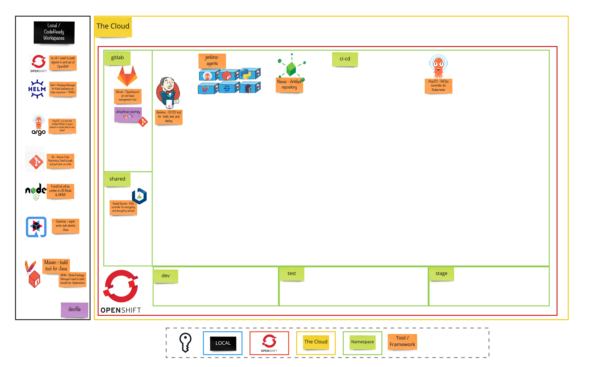

# Exercise 1 - The Manual Menace
> A GitOps approach to perform and automate deployments.
## 👨‍🍳 Exercise Intro
In this exercise, we will use GitOps to set up our working environment. We will set up Git projects, create `dev`, `test` and `stage` projects in OpenShift, and deploy tools like Jenkins and Nexus to enable CI/CD in the next exercise. In order to do that, we'll utilize a very popular approach: _GitOps_

## 🖼️ Big Picture

## 🔮 Learning Outcomes
* Understand the benefits gained from GitOps approach
* Deploy helm charts manually
* Drive tool installations through GitOps

## 🔨 Tools used in this exercise
* [Helm](https://helm.sh/) - Helps us to define, install, and upgrade Kubernetes application.
* [ArgoCD](https://argoproj.github.io/argo-cd/) - A controller which continuously monitors application and compare the current state against the desired
* [Nexus](https://www.sonatype.com/nexus-repository-sonatype) - Repository manager for storing lots of application types. Can also host `npm` and `Docker` registries.
* [Jenkins](https://jenkins.io/) - OpenSource Build automation server. Highly customisable with plugins.
