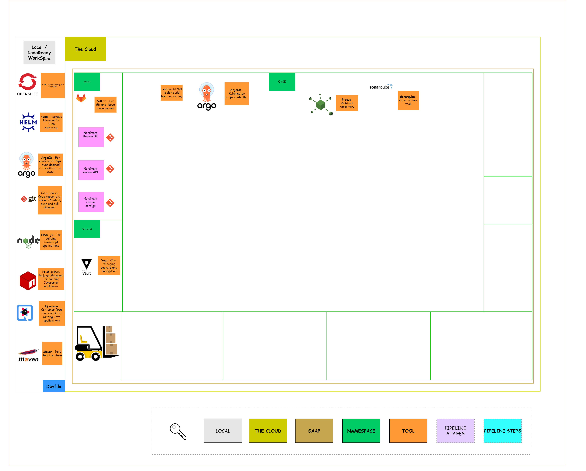

# Exercise 1 - The Manual Menace
> A GitOps approach to perform and automate deployments.
## 👨‍🍳 Exercise Intro

In this exercise, we will use GitOps to set up our working environment. We will set up Git projects, create `dev`, `test` and `stage` projects in OpenShift, and explore the tools like ArgoCD, Tekton and Nexus to enable CI/CD/CT in the next exercise. In order to do that, we'll use a popular approach called _GitOps_

## 🖼️ Big Picture

## 🔮 Learning Outcomes

* Understand the benefits gained from GitOps approach
* Deploy helm charts manually
* Drive tool installations through GitOps

## 🔨 Tools used in this exercise

* [Helm](https://helm.sh/) - Helps us to define, install, and upgrade Kubernetes application.
* [ArgoCD](https://argoproj.github.io/argo-cd/) - A controller which continuously monitors application and compare the current state against the desired
* [Nexus](https://www.sonatype.com/nexus-repository-sonatype) - Repository manager for storing lots of application types. Can also host `npm` and `Docker` registries.
* [Tekton](https://tekton.dev/) - Tekton is a powerful and flexible open-source framework for creating CI/CD systems, allowing developers to build, test, and deploy across cloud providers and on-premise systems.
* [Vault](https://www.vaultproject.io/) - Secure, store and tightly control access to tokens, passwords, certificates, encryption keys for protecting secrets and other sensitive data using a UI, CLI, or HTTP API.
* [External Secret](https://external-secrets.io/) - Kubernetes operator that integrates external secret management systems like AWS Secrets Manager, HashiCorp Vault, Google Secrets Manager, Azure Key Vault and many more. The operator reads information from external APIs and automatically injects the values into a Kubernetes Secret.

## :link: Here are some usefull repository links you will require for this exercise 

| Repository Name              | URL                                                                                            |
|------------------------------|-----------------------------------------------------------------------------------------------------|
| SAAP Login                   | https://managedopenshiftfrontend-stakater-managed-openshift-apps.apps.stage.2cc6dtsv.kubeapp.cloud/ |
| Workshop Infra Repo          | https://gitlab.apps.devtest.vxdqgl7u.kubeapp.cloud/stakater/workshop-infra-gitops-config/           |
| Stakater Nordmart Review     | https://github.com/stakater-lab/stakater-nordmart-review/                                           |
|  Stakater Nordmart Review UI | https://github.com/stakater-lab/stakater-nordmart-review-ui/                                        |
| Nordmart Apps Gitops Config  | https://github.com/stakater-lab/nordmart-apps-gitops-config/                               |
