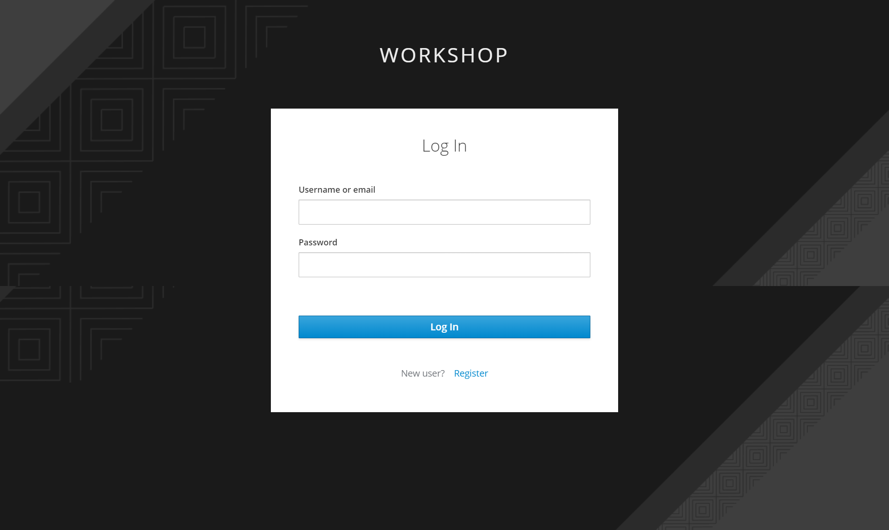
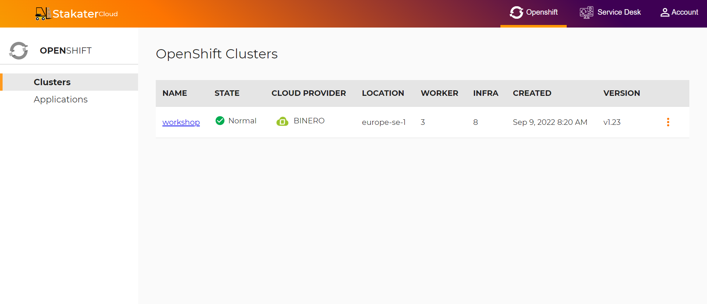
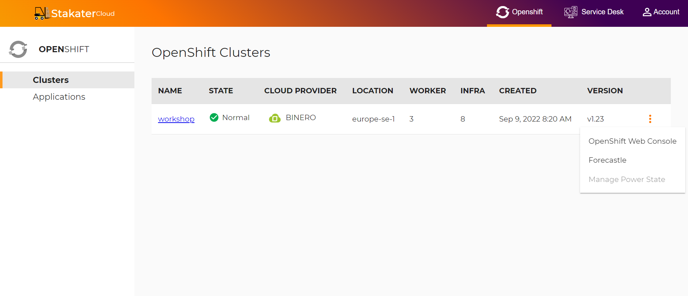
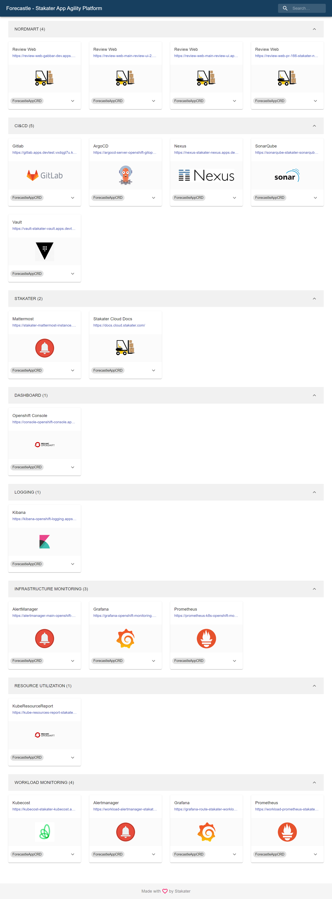

## 🐌 Setting Up Your Account

### Stakater Cloud

To set up your workshop environment, go to **insert link** and enter `workshop` as your enterprise domain name.

 
 
 
 
 You will be brought to your workshop log in page. Enter your username/email and password, to log in.
 
 
 
 
 
 
 
 If you do not already have an account, click on `Register`. Insert your details in the field provided to create your account.
 
 
 
 
 
 
 
 You will be brought to your `Cluster Management` page where you can view your workshop cluster.

## Accessing Your Developer Console via Forecastle

To access your applications and developer tools via the web console, Stakater provides two options; `OpenShift Console` and `Forecastle`.

Forecastle provides a central control plane for accessing all your tools and applications in your cluster. It also dynamically discovers new applications and installed tools, giving you the much needed convenience to develop and manage your applications.

To access the Forecastle developer console, click on the menu button beside your cluster.

You will be brought to the `Forecastle` login page. Click on `LOG IN` 

Log In with your `workshop` single sign-on.

Forecastle needs a few permissions to operate unperturbed in your cluster. Click on `Allow selected permissions` to enable the required permissions.

You will now be brought to the Forecastle console, where you can view all your tools and applications from an easy and accessible plane.

## Accessing Your Developer Console with OpenShift Console

Additionally, if you prefer the OpenShift Web Console, you can login by clicking on the menu button beside your cluster, and then clicking on `OpenShift Web Console`.

Log in with your Stakater `Workshop` single sign-on.

You can now access your cluster via the OpenShift Web Console.

  

  
  
 
 
 
 
