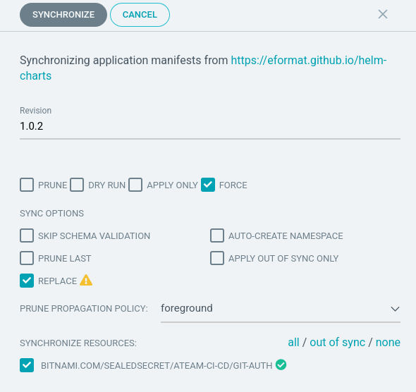

# Sealed Secrets
Blah blah blah - soemthing about SS and why we use it....
public repos with private secrets
devops is hard, secure devops is harder....

these secrets are used by our pipeline in the next exercise.

Lets start by sealing our token for accessing git.
```bash
export GITLAB_USER=<your gitlab user>
export GITLAB_PASSWORD=<your gitlab password>
```

Run this command. This will generate a kube secret in `tmp`
```bash
cat << EOF > /tmp/git-auth.yaml
apiVersion: v1
data:
  password: "$(printf ${GITLAB_PASSWORD} | base64 -w0)"
  username: "$(printf ${GITLAB_USER} | base64 -w0)"
kind: Secret
metadata:
  annotaion:
    tekton.dev/git-0: https://gitlab-ce
  labels:
    credential.sync.jenkins.openshift.io: "true"
  name: git-auth
EOF
```

with the non-sealed secret local, let's seal up. 
tell people what kubeseal is
```bash
# use kubeseal to seal the secret
kubeseal < /tmp/git-auth.yaml > /tmp/sealed-git-auth.yaml \
    -n ${TEAM_NAME}-ci-cd \
    --controller-namespace do500-shared \
    --controller-name sealed-secrets \
    -o yaml
```
```bash
# verify its results
cat /tmp/sealed-git-auth.yaml 
```

We should now see the secret is sealed, so it is safe for us to store in our repository. It should look something a bit like this, but with longer password and username output.
<pre>
apiVersion: bitnami.com/v1alpha1
kind: SealedSecret
metadata:
  creationTimestamp: null
  name: git-auth
  namespace: biscuits-ci-cd
spec:
  encryptedData:
    password: AgAj3JQj+EP23pnzu...
    username: AgAtnYz8U0AqIIaqYrj...
...
</pre>

We want to grab the results of this sealing activity, in particular the `encryptedData`

```bash
cat /tmp/sealed-git-auth.yaml | grep -E 'username|password'
```
<pre>
    password: AgAj3JQj+EP23pnzu...
    username: AgAtnYz8U0AqIIaqYrj...
</pre>

In `ubiquitous-journey/values-tooling.yaml` edit the entry in the values section of the `# Sealed Secrets`. Copy the output of `username` and `password` from the previous command and update the values. Make sure you indent the data correctly. Now set the `enabled` flag to `true`.
```yaml
...
  # Sealed Secrets
  - name: sealed-secrets
    <strong>enabled: false</strong>
    source: https://redhat-cop.github.io/helm-charts
    chart_name: helper-sealed-secrets
    source_ref: "1.0.2"
    values:
      secrets:
        - name: git-auth
          type: kubernetes.io/basic-auth
          annotations:
            tekton.dev/git-0: http://gitlab-ce.do500-gitlab.svc.cluster.local
          labels:
            credential.sync.jenkins.openshift.io: "true"
          data:
            username: <YOUR_SEALED_SECRET_USERNAME>
            password: <YOUR_SEALED_SECRET_PASSWORD>
```

Now that we update the file, we need to push the changes to our repository for ArgoCD to detect the update. Because it is GitOps :)

```bash
git add ubiquitous-journey/values-tooling.yaml
git commit -m "🕵🏻‍♂️ Sealed secret of Git user creds is added 🔎"
git push
```

🪄 Log in to ArgoCD - you should now see the SealedSecret unsealed as a regular k8s secret

You should notice that the `git-auth` secrets fails to sync:

> :warning: HEALTH DETAILS - failed update: Resource "git-auth" already exists and is not managed by SealedSecret

Thats because we already created a `git-auth` secret manually in Excercise.1. Lets remove it now:
```bash
oc -n ${TEAM_NAME}-ci-cd delete secret/git-auth
```

You may need to force sync your secret in argocd to get it to apply:




🪄 Log in to Jenkins -> Configuration -> Credentials to view git-auth credential is there.
