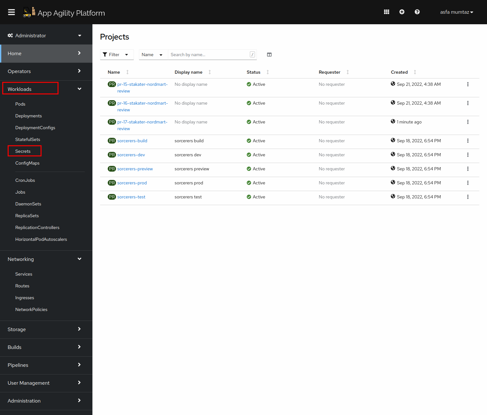
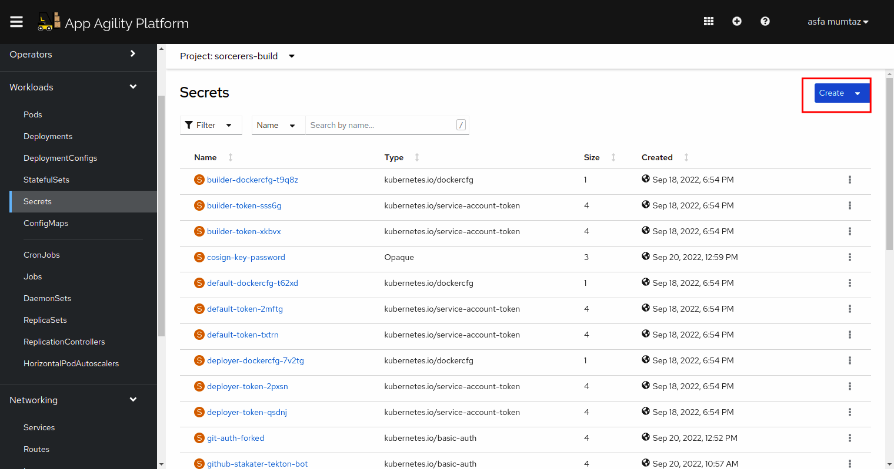

## Adding Secrets
#####TODO added external secret
When we say GitOps, we say _"if it's not in Git, it's NOT REAL"_ but how are we going to store our sensitive data like credentials in Git repositories, where many people can access?! Sure, Kubernetes provides a way to manage secrets using the `Secret` resource.

To run our pipelines, we need to provide a secret to our tasks. This secret will contain the token for gitlab. Let's add this secret through the console.


###  Secrets in action

1. Head over to the console and open `Secrets` from workloads section.

   
    
2. First make sure that you are in the <TENANT_NAME>-build project and then select create secret. From the dropdown that appears, select from YAML.

   
    
3. Paste in the following YAML.
    
    ````
   kind: Secret
   apiVersion: v1
   metadata:
     name: gitlab-pat
     namespace: <TENANT_NAME>-build
     annotations:
       tekton.dev/git-0: 'https://gitlab.apps.devtest.vxdqgl7u.kubeapp.cloud'
   stringData:
     email: <YOUR_EMAIL>
     password: <YOUR_PASSWORD>
     token: <YOUR_GITLAB_TOKEN>
     username: <YOUR_USERNAME>
   type: kubernetes.io/basic-auth

   ````
  Make sure you do not change the secret name.

4. Hit create. 

 🪄🪄 Congratulations. You've added the secret! 🪄🪄
 
#### TODO: Add vault and external secret