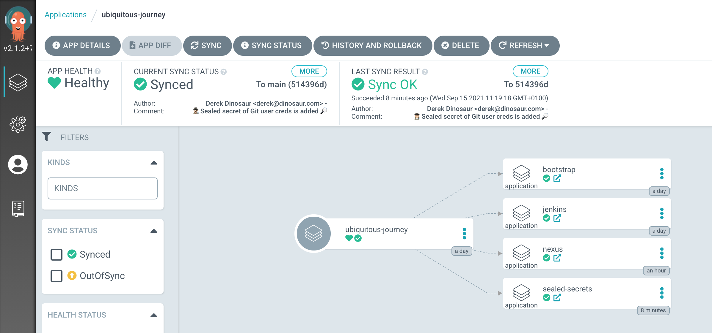
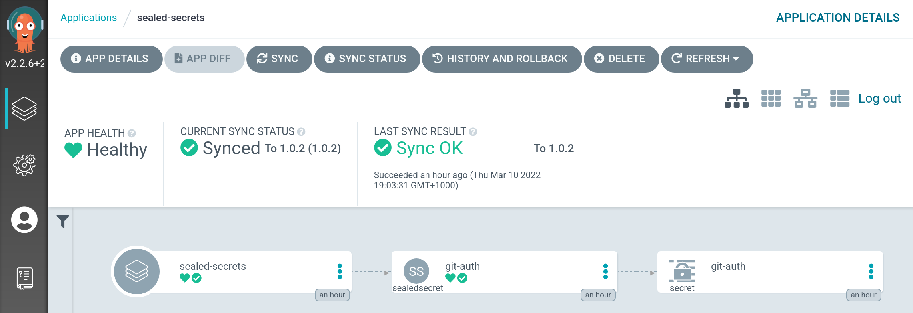
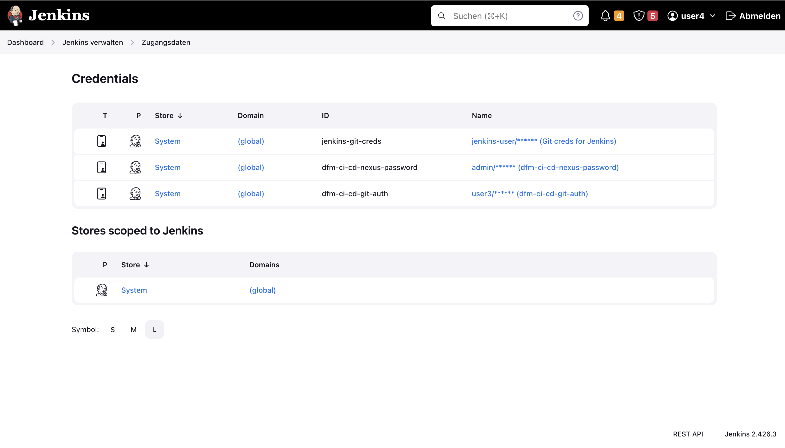

## Sealed Secrets

When we say GitOps, we say _"if it's not in Git, it's NOT REAL"_ but how are we going to store our sensitive data like credentials in Git repositories, where many people can access?! Sure, Kubernetes provides a way to manage secrets, but the problem is that it stores the sensitive information as a base64 string - anyone can decode the base64 string! Therefore, we cannot store `Secret` manifest files openly. We use an open-source tool called Sealed Secrets to address this problem.

Sealed Secrets allows us to _seal_ Kubernetes secrets by using a utility called `kubeseal`. The `SealedSecrets` are Kubernetes resources that contain encrypted `Secret` object that only the controller can decrypt. Therefore, a `SealedSecret` is safe to store even in a public repository.

<p class="warn">
    ⛷️ <b>NOTE</b> ⛷️ - If you switch to a different CodeReady Workspaces environment, please run below commands before going forward.
</p>

```bash
cd /projects/tech-exercise
git remote set-url origin https://${GIT_SERVER}/${TEAM_NAME}/tech-exercise.git
git pull
```

### Sealed Secrets in action

1. The observant among you will have noticed that in the previous exercise we created a secret for git and added it to the cluster WITHOUT putting it in git...😳 Lets start by fixing this and sealing our Git credentials so they can be safely checked in to the code. First, we'll create the secret in a tmp directory. Make sure you have your gitlab user and PAT from the previous exercise set in your environment

    ```bash
    echo ${GITLAB_USER}
    echo ${GITLAB_PAT}
    ```

2. Run this command to generate a Kubernetes secret object in `/tmp` with the right labels needed for Tekton and Jenkins later.

    ```bash#test
    cat << EOF > /tmp/git-auth.yaml
    kind: Secret
    apiVersion: v1
    data:
      username: "$(echo -n ${GITLAB_USER} | base64 -w0)"
      password: "$(echo -n ${GITLAB_PAT} | base64 -w0)"
    type: kubernetes.io/basic-auth
    metadata:
      annotations:
        tekton.dev/git-0: https://${GIT_SERVER}
        sealedsecrets.bitnami.com/managed: "true"
      labels:
        credential.sync.jenkins.openshift.io: "true"
      name: git-auth
EOF
    ```

3. Use `kubeseal` command line to seal the secret definition. This will encrypt it using a certificate stored in the controller running inside the cluster. This has already been deployed for you as only one instance can exist per cluster.

    <p class="warn">
        ⛷️ <b>NOTE</b> ⛷️ - If you get an error "Error: cannot get sealed secret service: Unauthorized" from running the Kubeseal command, just re-login to OpenShift and run the command again. 
    </p>

    ```bash
    oc login --server=https://api.${CLUSTER_DOMAIN##apps.}:6443 -u <USER_NAME> -p <PASSWORD>
    ```

    ```bash#test
    kubeseal < /tmp/git-auth.yaml > /tmp/sealed-git-auth.yaml \
        -n ${TEAM_NAME}-ci-cd \
        --controller-namespace tl500-shared \
        --controller-name sealed-secrets \
        -o yaml
    ```

4. Verify that secret is sealed:

    ```bash#test
    cat /tmp/sealed-git-auth.yaml 
    ```

    We should now see the secret is sealed, so it is safe for us to store in our repository. It should look something a bit like this, but with longer password and username output.

    <div class="highlight" style="background: #f7f7f7">
    <pre><code class="language-yaml">
    apiVersion: bitnami.com/v1alpha1
    kind: SealedSecret
    metadata:
      creationTimestamp: null
      name: git-auth
      namespace: biscuits-ci-cd
    spec:
      encryptedData:
        username: AgAtnYz8U0AqIIaqYrj...
        password: AgAj3JQj+EP23pnzu...
    ...
    </code></pre></div>

5. We want to grab the results of this sealing activity, in particular the `encryptedData` so we can add it to git. We have already written a <span style="color:blue;">[helper helm chart](https://github.com/redhat-cop/helm-charts/tree/master/charts/helper-sealed-secrets)</span> that can be used to add sealed secrets to our cluster in repeatable way. We'll provide the `encryptedData` values to this chart in the next step.

    ```bash#test
    cat /tmp/sealed-git-auth.yaml | grep -E 'username|password'
    ```

    <div class="highlight" style="background: #f7f7f7">
    <pre><code class="language-yaml">
        username: AgAtnYz8U0AqIIaqYrj...
        password: AgAj3JQj+EP23pnzu...
    </code></pre></div>

6. In `ubiquitous-journey/values-tooling.yaml` add an entry for this helper chart under `# Sealed Secrets`. Copy the output of `username` and `password` from the previous command and update the values accordingly. **Make sure you indent the data correctly**.

    ```yaml
      # Sealed Secrets
      - name: sealed-secrets
        enabled: true
        source: https://redhat-cop.github.io/helm-charts
        chart_name: helper-sealed-secrets
        source_ref: "1.0.3"
        values:
          secrets:
            # Additional secrets will be added to this list along the exercises.
            - name: git-auth
              type: kubernetes.io/basic-auth
              annotations:
                tekton.dev/git-0: https://<GIT_SERVER>
              labels:
                credential.sync.jenkins.openshift.io: "true"
              data:
                username: <YOUR_SEALED_SECRET_USERNAME>
                password: <YOUR_SEALED_SECRET_PASSWORD>
    ```

    You can also run this bit of code to do the replacement if you are feeling uber lazy!

    ```bash#test
    if [[ $(yq e '.applications[] | select(.name=="sealed-secrets") | length' /projects/tech-exercise/ubiquitous-journey/values-tooling.yaml) < 1 ]]; then
        yq e '.applications += {"name": "sealed-secrets","enabled": true,"source": "https://redhat-cop.github.io/helm-charts","chart_name": "helper-sealed-secrets","source_ref": "1.0.3","values": {"secrets": [{"name": "git-auth","type": "kubernetes.io/basic-auth","annotations": {"tekton.dev/git-0": "https://GIT_SERVER","sealedsecrets.bitnami.com/managed": "true"},"labels": {"credential.sync.jenkins.openshift.io": "true"},"data": {"username": "SEALED_SECRET_USERNAME","password": "SEALED_SECRET_PASSWORD"}}]}}' -i /projects/tech-exercise/ubiquitous-journey/values-tooling.yaml
        SEALED_SECRET_USERNAME=$(yq e '.spec.encryptedData.username' /tmp/sealed-git-auth.yaml)
        SEALED_SECRET_PASSWORD=$(yq e '.spec.encryptedData.password' /tmp/sealed-git-auth.yaml)
        sed -i "s|GIT_SERVER|$GIT_SERVER|" /projects/tech-exercise/ubiquitous-journey/values-tooling.yaml
        sed -i "s|SEALED_SECRET_USERNAME|$SEALED_SECRET_USERNAME|" /projects/tech-exercise/ubiquitous-journey/values-tooling.yaml
        sed -i "s|SEALED_SECRET_PASSWORD|$SEALED_SECRET_PASSWORD|" /projects/tech-exercise/ubiquitous-journey/values-tooling.yaml
    fi
    ```

7. Now that we update the file, we need to push the changes to our repository for ArgoCD to detect the update. Because it is GitOps :)

    ```bash#test
    cd /projects/tech-exercise
    git add ubiquitous-journey/values-tooling.yaml
    git commit -m "🕵🏻‍♂️ Sealed secret of Git user creds is added 🔎"
    git push
    ```

    🪄 🪄 Log in to ArgoCD - you should now see the SealedSecret chart in ArgoCD UI. It is unsealed as a regular k8s secret 🪄 🪄
    

8. If you drill into the `SealedSecret` on ArgoCD's UI - you should see the `git-auth` secret has synced automatically:

    

9. You can also verify it's been synced to Jenkins now by opening `Jenkins -> Manage Jenkins -> Manage Credentials` to view `<TEAM_NAME>-ci-cd-git-auth`

    ```bash#test
    echo https://$(oc get route jenkins --template='{{ .spec.host }}' -n ${TEAM_NAME}-ci-cd)
    ```

    
