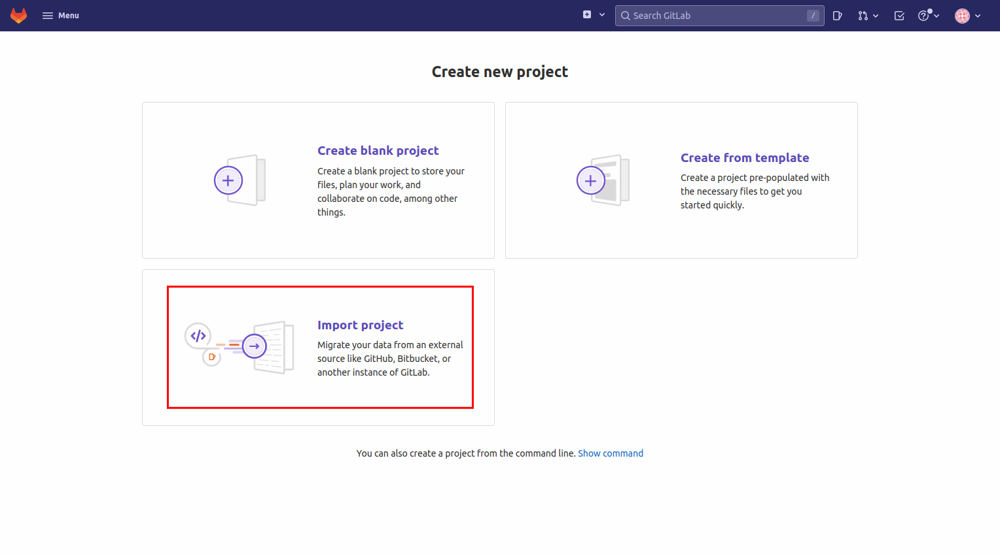
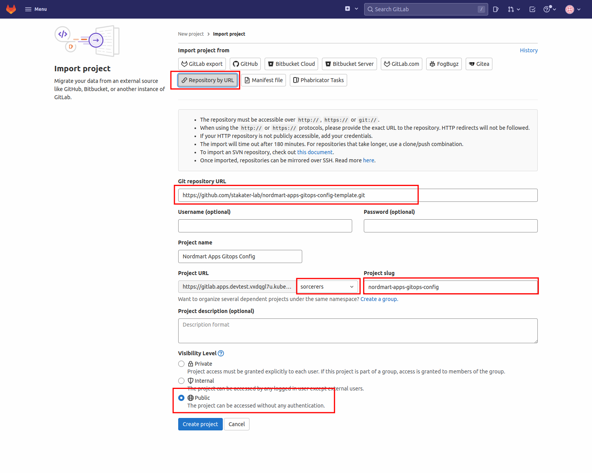
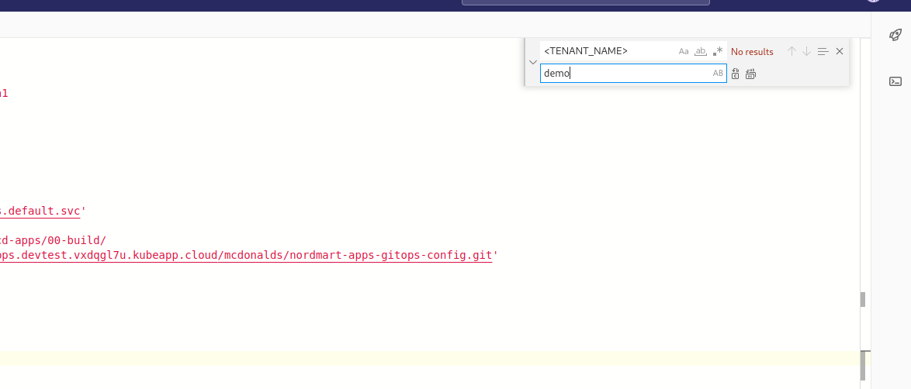
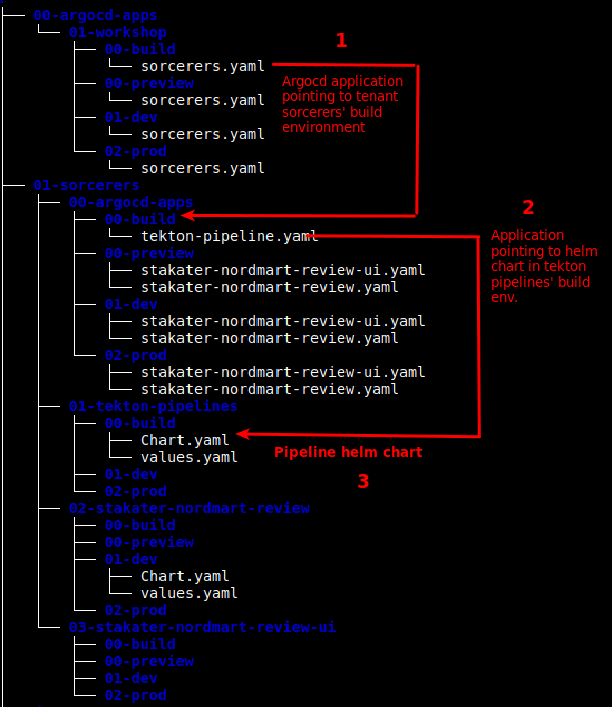
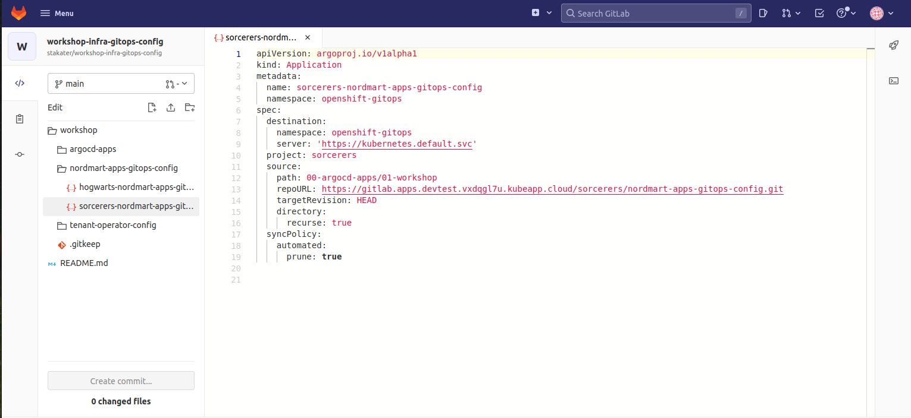
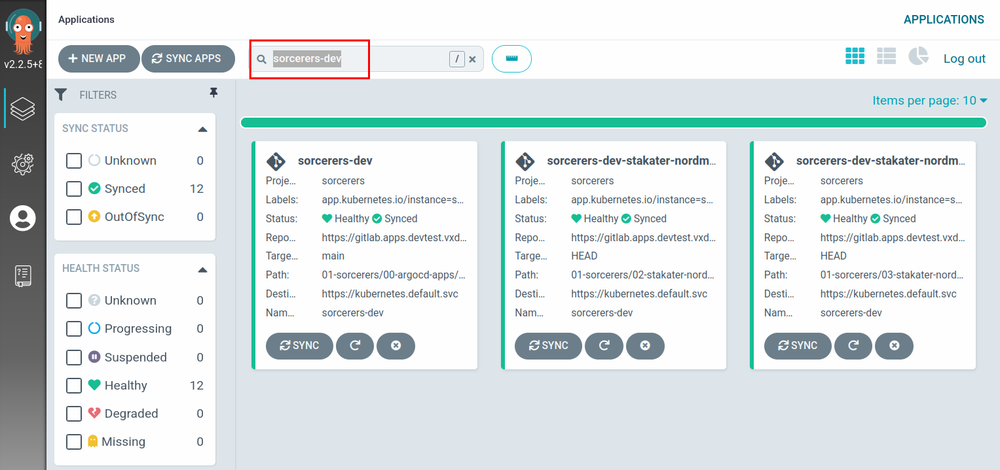

## Deploy App of Apps

We need a way to bundle up all of our applications and deploy them into each environment. The Nordmart application has its own Git repository and Helm chart, making it easier to code and deploy independently of other apps.

A developer can get the same experience and end result installing an application chart using `helm install` as our fully automated pipeline. This is important from a usability perspective. Argo CD has great support for all sorts of packaging formats that suit Kubernetes deployments, `Kustomize`, `Helm`, as well as just raw YAML files. Because Helm is a template language, we can mutate the Helm chart templates and their generated Kubernetes objects with various values allowing us to configure them with configuration per environment.

We deploy each of our applications using an Argo CD `application` definition. We use one Argo CD `application` definition for every environment in which we wish to deploy the application. We make use of Argo CD `app of apps` pattern to bundle all of these up; some might call this an application suite or a system! In Nordmart we generate the app-of-apps definitions using a Helm chart.

### The apps of apps structure

> In this exercise we'll deploy `nordmart-review`. We'll deploy Nordmart to dev environment. And then get the build environment ready for deploying our pipelines

1. Head over to the below URL.

   ```https://github.com/stakater-lab/nordmart-apps-gitops-config.git```
    
This is the template that we will use to create our own apps-of-apps repository.
 

2. Copy the clone URL.

   ```https://github.com/stakater-lab/nordmart-apps-gitops-config.git```
 

3. Back in GitLab navigate to `Menu` > `Projects` > `Create new project` > Select `Import project`

   


4. Select `import repository from URL` and paste in the URL that you copied in step 2. 

5. Make the repository public. Add `nordmart-apps-gitops-config` as the repository name. 

   > Make sure you mark the repository as public and choose the group you previously created as the group name.

   > Make sure that Project Name is lower case and doesn't contain spaces. Use '-' instead.

   

Now we need to make some updates to the contents of these template based repos

6. Navigate to the `nordmart-apps-gitops-config` project in your GitLab group and select `Web IDE`

7. Select the `README.md` and click your mouse inside the text body of the editor then Click `F1` on your keyboard to open the `command pallet` 

8. Search for `file finder` and select it > search for `<TENANT_NAME>` > work through the found files to rename them.

9. Now work down though the folder and file structure replacing the `<TENANT_NAME>` with your actual tenant name.  

  This is easier if you open `command pallet` again by clicking `F1` and then opening `Replace` to have a Find and Replace tool.

   

  Use `ctrl + alt + Enter` to replace all instances of `<TENANT_NAME>` to your actual tenant name if you prefer keyboard.


### Apps of Apps structure

Now that we have renamed all the values and files that needed to changed, let's look at the structure of this repository.

  

1. At the root level, we have a `00-argocd-apps` folder and a `01-<TENANT_NAME>`folder

2. Inside the `00-argocd-apps` folder there will be another `01-workshop` folder which represents the cluster name.

3. Inside the workshop folder, you will see multiple environments.

4. The environment folders contain ArgoCD applications that point to the particular tenant's environment.

5. In each tenant environment folder, we will have ArgoCD applications for all the applications we want to deploy in a particular environment. These apps will eventually point to a Helm chart.


### Deploying Nordmart


> Now we need to add a chart in the dev environment for deploying our application.

1. Navigate to `01-TENANT_NAME` > `02-stakater-nordmart-review` > `01-dev`.

2. We need to add the Helm chart for the Nordmart review service here. Create a file named `Chart.yaml` here and paste in the following content.

```
apiVersion: v2
dependencies:
  - name: stakater-nordmart-review
    repository: https://nexus-helm-stakater-nexus.apps.devtest.vxdqgl7u.kubeapp.cloud/repository/helm-charts/
    version: 1.0.35
description: A Helm chart for Kubernetes
name: stakater-nordmart-review
version: 1.0.35

```

3. Now create a `values.yaml` file and add the below content. 

```
stakater-nordmart-review:
  application:
    deployment:
      image:
        repository: nexus-docker-stakater-nexus.apps.devtest.vxdqgl7u.kubeapp.cloud/stakater-nordmart-review
        tag: 1.0.35

```
4. Once the above files are added, `Commit` the changes, and push to the repository.

  > We are not done yet. We need to somehow connect this repository to an ArgoCD application directly watched by the cluster. 

5. Head over to [workshop-infra-gitops-config](https://gitlab.apps.devtest.vxdqgl7u.kubeapp.cloud/stakater/workshop-infra-gitops-config)

  ```https://gitlab.apps.devtest.vxdqgl7u.kubeapp.cloud/stakater/workshop-infra-gitops-config```

  > We know that this repository is being watched by the cluster. So we will add an ArgoCD application here and point it to our `nordmart-apps-gitops-config`

6. From `stakater/workshop-infra-gitops-config` click `Edit fork in Web IDE` then Navigate to `workshop` > `nordmart-apps-gitops-config`.
 
7. Add a file here named `<TENANT_NAME>-nordmart-apps-gitops-config.yaml` with the following content:

```
apiVersion: argoproj.io/v1alpha1
kind: Application
metadata:
  name: <TENANT_NAME>-nordmart-apps-gitops-config
  namespace: openshift-gitops
spec:
  destination:
    namespace: openshift-gitops
    server: 'https://kubernetes.default.svc'
  project: <TENANT_NAME>
  source:
    path: 00-argocd-apps/01-workshop
    repoURL: https://gitlab.apps.devtest.vxdqgl7u.kubeapp.cloud/<TENANT_NAME>/nordmart-apps-gitops-config.git
    targetRevision: HEAD
    directory:
      recurse: true
  syncPolicy:
    automated:
      prune: true

```
  > Note: Be sure to replace all instances of `<TENANT_NAME>` with your tenant name in above file.



8. Now head over to ArgoCD and search for `<TENANT_NAME>-dev`.


   


9. Open up the app and press `sync`. Once sync finishes, everything should have a synced, `green` status. 


   
