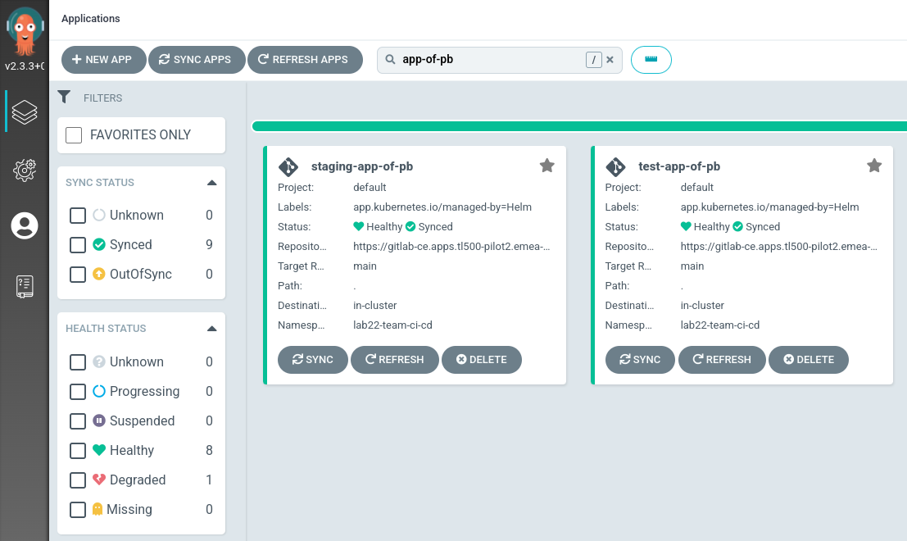
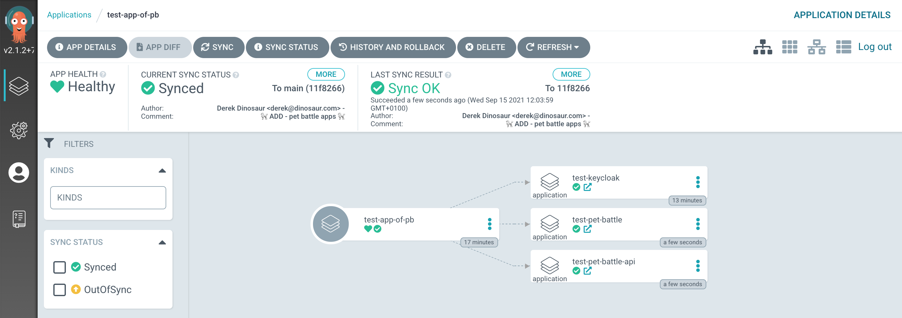
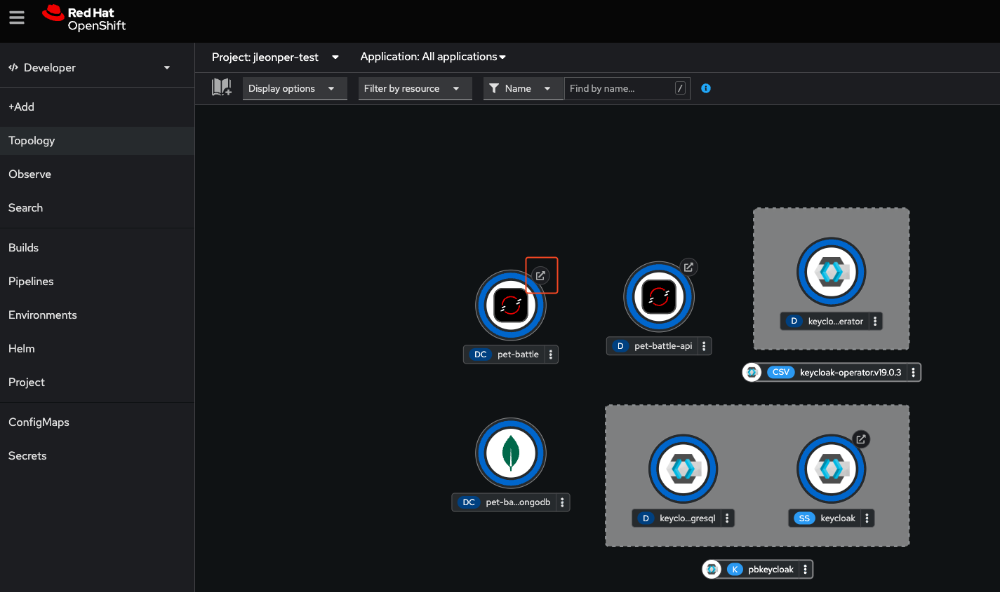
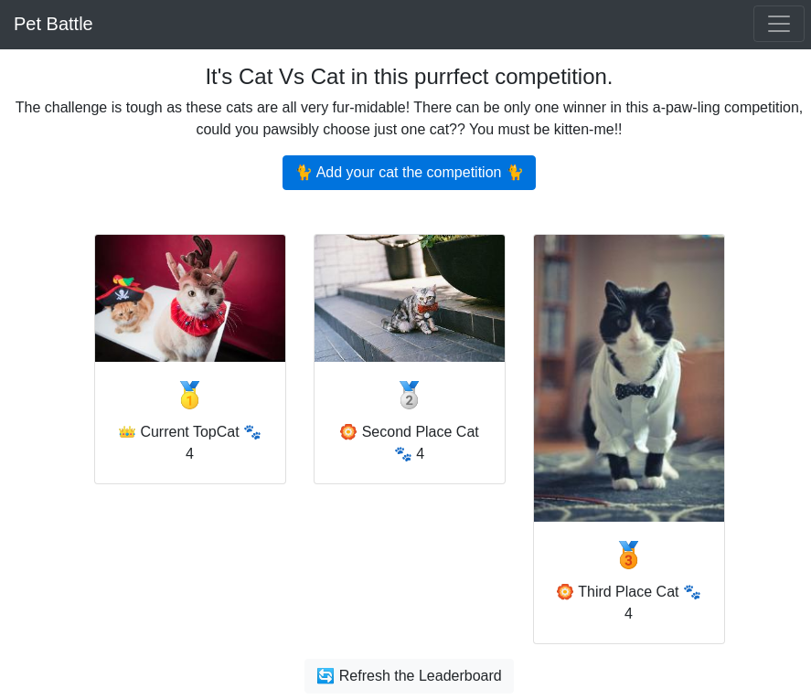

## Deploy App of Apps

We need a way to bundle up all of our applications and deploy them into each environment. Each PetBattle application has its own Git repository and Helm chart, making it easier to code and deploy independently from other apps.

A developer can get the same experience and end result installing an application chart using `helm install` as our fully automated pipeline. This is important from a useability perspective. Argo CD has great support for all sorts of packaging formats that suit Kubernetes deployments, `Kustomize`, `Helm`, as well as just raw YAML files. Because Helm is a template language, we can mutate the Helm chart templates and their generated Kubernetes objects with various values allowing us to configure them with configuration per environment.

We deploy each of our applications using an Argo CD `application` definition. We use one Argo CD `application` definition for every environment in which we wish to deploy the application. We make use of Argo CD `app of apps pattern` to bundle all of these all up; some might call this an application suite or a system! In PetBattle we generate the app-of-apps definitions using a Helm chart.

### Deploying Pet Battle - Keycloak

> In this exercise we'll deploy PetBattle and a supporting piece of tech it uses (Keycloak) using the same pattern. We'll deploy PetBattle to two environments - `test` and `stage` by configuring the values files in `pet-battle/stage/values.yaml` && `pet-battle/test/values.yaml`

1. In your IDE - open `tech-exercises/values.yaml` file at the root of this project and **swap** `enabled: false` to `enabled: true` as shown below for each of the app-of-pb definitions:

    <div class="highlight" style="background: #f7f7f7">
    <pre><code class="language-yaml">
      # Test app of app
      - name: test-app-of-pb
        enabled: true
        source_path: "."
        helm_values:
          - pet-battle/test/values.yaml
      # Staging App of Apps
      - name: staging-app-of-pb
        enabled: true
        source_path: "."
        helm_values:
          - pet-battle/stage/values.yaml
    </code></pre></div>

    You can also run this bit of code to do the replacement if you are feeling uber lazy!

    ```bash#test
    yq e '(.applications[] | (select(.name=="test-app-of-pb").enabled)) |=true' -i /projects/tech-exercise/values.yaml
    yq e '(.applications[] | (select(.name=="staging-app-of-pb").enabled)) |=true' -i /projects/tech-exercise/values.yaml
    ```

2. Our app is made up of N apps. We define the list of apps we want to deploy in the `applications` property in our `pet-battle/test/values.yaml`. Let's add a keycloak service to this list by appending to it as follows. This will take the helm-chart from the repo and apply the additional configuration to it from the `values` section. *Please make sure your text is aligned with the existing placeholder comments.*

    ```yaml
      # Keycloak
      keycloak:
        name: keycloak
        enabled: true
        source: https://github.com/petbattle/pet-battle-infra
        source_ref: main
        source_path: keycloak
        values:
          app_domain: <CLUSTER_DOMAIN>
    ```

    You can also run this bit of code to do the replacement if you are feeling uber lazy!

    ```bash#test
    if [[ $(yq e '.applications[] | select(.name=="keycloak") | length' /projects/tech-exercise/pet-battle/test/values.yaml) < 1 ]]; then
        yq e '.applications.keycloak = {"name": "keycloak","enabled": true,"source": "https://github.com/petbattle/pet-battle-infra","source_ref": "main","source_path": "keycloak","values": {"app_domain": "CLUSTER_DOMAIN"}}' -i /projects/tech-exercise/pet-battle/test/values.yaml
        sed -i "s|CLUSTER_DOMAIN|$CLUSTER_DOMAIN|" /projects/tech-exercise/pet-battle/test/values.yaml
    fi
    ```

3. Let's get this deployed of course - it's not real unless its in git!

    ```bash#test
    cd /projects/tech-exercise
    git add .
    git commit -m  "🐰 ADD - app-of-apps and keycloak to test 🐰"
    git push 
    ```

4. With the values enabled, and the first application listed in the test environment - let's tell ArgoCD to start picking up changes to these environments. To do this, simply update the helm chart we installed at the beginning of the first exercise:

    ```bash#test
    cd /projects/tech-exercise
    helm upgrade --install uj --namespace ${TEAM_NAME}-ci-cd .
    ```

5. In ArgoCD at this point we should see things start to get a bit more busy:


### Deploying Pet Battle

> Now that the infra for PetBattle is up and running, let's deploy PetBattle itself. Each environment folder (test / stage) contains the configuration for the corresponding projects in OpenShift. All we need to do is extend or edit the list of `applications` for the changes to be synced to the cluster. We can also separate test environment config from staging or even prod using this method.

1. In your IDE, open up the `pet-battle/test/values.yaml` file and copy the following:

    ```yaml
      # Pet Battle Apps
      pet-battle-api:
        name: pet-battle-api
        enabled: true
        source: https://petbattle.github.io/helm-charts  # http://nexus:8081/repository/helm-charts
        chart_name: pet-battle-api
        source_ref: 1.2.1 # helm chart version
        values:
          image_name: pet-battle-api
          image_version: latest # container image version
          hpa:
            enabled: false

      pet-battle:
        name: pet-battle
        enabled: true
        source: https://petbattle.github.io/helm-charts  # http://nexus:8081/repository/helm-charts 
        chart_name: pet-battle
        source_ref: 1.0.6 # helm chart version
        values:
          image_version: latest # container image version
    ```

    You can also run this bit of code to do the replacement if you are feeling uber lazy!

    ```bash#test
    if [[ $(yq e '.applications[] | select(.name=="pet-battle-api") | length' /projects/tech-exercise/pet-battle/test/values.yaml) < 1 ]]; then
        yq e '.applications.pet-battle-api = {"name": "pet-battle-api","enabled": true,"source": "https://petbattle.github.io/helm-charts","chart_name": "pet-battle-api","source_ref": "1.2.1","values": {"image_name": "pet-battle-api","image_version": "latest", "hpa": {"enabled": false}}}' -i /projects/tech-exercise/pet-battle/test/values.yaml
    fi
    if [[ $(yq e '.applications[] | select(.name=="pet-battle") | length' /projects/tech-exercise/pet-battle/test/values.yaml) < 1 ]]; then
        yq e '.applications.pet-battle = {"name": "pet-battle","enabled": true,"source": "https://petbattle.github.io/helm-charts","chart_name": "pet-battle","source_ref": "1.0.6","values": {"image_version": "latest"}}' -i /projects/tech-exercise/pet-battle/test/values.yaml
    fi
    sed -i '/^$/d' /projects/tech-exercise/pet-battle/test/values.yaml
    sed -i '/^# Keycloak/d' /projects/tech-exercise/pet-battle/test/values.yaml
    sed -i '/^# Pet Battle Apps/d' /projects/tech-exercise/pet-battle/test/values.yaml
    ```

2. The front end needs to have some configuration applied to it. This could be packaged up in the helm chart or baked into the image - BUT we should really apply configuration as *code*. We should build our apps once so they can be initialized in many environments with configuration supplied at runtime. For the Frontend, this means supplying the information to where the API live. We use ArgoCD to manage our application deployments, so hence we should update the values supplied to this chart as such.

    ```bash#test
    export JSON="'"'{
            "catsUrl": "https://pet-battle-api-'${TEAM_NAME}'-test.'${CLUSTER_DOMAIN}'",
            "tournamentsUrl": "https://pet-battle-tournament-'${TEAM_NAME}'-test.'${CLUSTER_DOMAIN}'",
            "matomoUrl": "https://matomo-'${TEAM_NAME}'-ci-cd.'${CLUSTER_DOMAIN}'/",
            "keycloak": {
              "url": "https://keycloak-'${TEAM_NAME}'-test.'${CLUSTER_DOMAIN}'/auth/",
              "realm": "pbrealm",
              "clientId": "pbclient",
              "redirectUri": "http://localhost:4200/tournament",
              "enableLogging": true
            }
          }'"'"
    yq e '.applications.pet-battle.values.config_map = env(JSON) | .applications.pet-battle.values.config_map style="single"' -i /projects/tech-exercise/pet-battle/test/values.yaml
    ```

3. The `pet-battle/test/values.yaml` file should now look something like this (but with your team name and domain)

    <div class="highlight" style="background: #f7f7f7">
    <pre><code class="language-yaml">
      pet-battle:
        name: pet-battle
        enabled: true
        source: https://petbattle.github.io/helm-charts  # http://nexus:8081/repository/helm-charts 
        chart_name: pet-battle
        source_ref: 1.0.6 # helm chart version
        values:
          image_version: latest # container image version
          config_map: '{
            "catsUrl": "https://pet-battle-api-<TEAM_NAME>-test.<CLUSTER_DOMAIN>",
            "tournamentsUrl": "https://pet-battle-tournament-<TEAM_NAME>-test.<CLUSTER_DOMAIN>",
            "matomoUrl": "https://matomo-<TEAM_NAME>-ci-cd.<CLUSTER_DOMAIN>/",
            "keycloak": {
              "url": "https://keycloak-<TEAM_NAME>-test.<CLUSTER_DOMAIN>/auth/",
              "realm": "pbrealm",
              "clientId": "pbclient",
              "redirectUri": "http://localhost:4200/tournament",
              "enableLogging": true
            }
          }'
    </code></pre></div>

4. Repeat the same thing for `pet-battle/stage/values.yaml` file (update the `<TEAM_NAME>-test` to be `<TEAM_NAME>-stage` for the Frontend configuration) in order to deploy the staging environment, and push your changes to the repo. _It's not real unless it's in git_

    ```bash#test
    cd /projects/tech-exercise
    git add .
    git commit -m  "🐩 ADD - pet battle apps 🐩"
    git push 
    ```

5. You should see the two Pet Battle apps for `test` and `stage` deployed in ArgoCD and if you drill into one eg `test-app-of-pb` you'll see each of the three components of PetBattle:


6. Finally - let's see if the whole thing in working. Some pods - like keycloak - may take a little while to become ready. Go to `OpenShift -> Developer View -> Topology` and select your `<TEAM_NAME>-test` project.
    </br>
    🪄 🪄 You should be able to see the Pet Battle Applications running. 🪄 🪄

    

    </br>
    😻😻 Select the Pet Battle URL link highlighted above and you should see ... 😻😻

    
