### Tekton Pipeline

> Tekton (OpenShift Pipelines) is the new kid on the block in the CI/CD space. It's grown rapidly in popularity as it's Kubernetes Native way of running CI/CD.  

Tekton is deployed as an operator in our cluster and allows users to define in YAML Pipeline and Task definitions. <span style="color:blue;">[Tekton Hub](https://hub.tekton.dev/)</span> is a repository for sharing these YAML resources among the community, giving great reusability to standard workflows.  
  
Tekton is made up of number of YAML files each with a different purpose such as `Task` and `Pipeline`. These are then wrapped together in another YAML file called a `PipelineRun` which represents an instance of a `Pipeline` and a `Workspace` to create an instance of a `Pipeline`.  

  > Given below is an example of a pipeline.


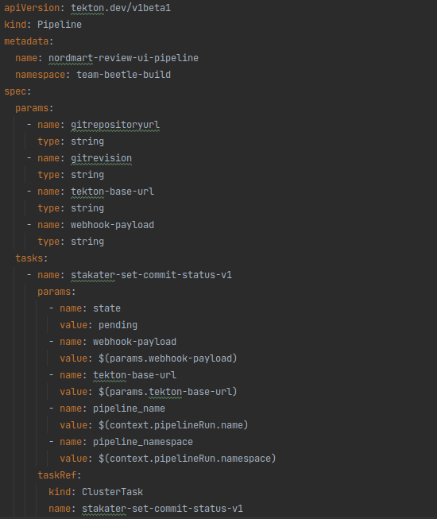

In this snippet of the pipeline used in this exercise, we define:

* `params` are the inputs to the run of the `pipeline`. For example, the git revision to build.
* `tasks` is where we define the meat of the pipeline, the actions that happen at each step of our pipeline. Tasks can be `ClusterTasks` or `Tasks`. `ClusterTasks` are just global tasks shared across all projects. `Tasks`, much like `Pipelines`, are also supplied parameters and workspaces if required.
* `workspace` - A pipeline defines a workspace to show how storage will be shared through its Task. For instance, a task A might clone a git repo to a workspace, and task B might use the same workspace and edit code in the local clone.
## Deploying the Tekton Objects

  > The Tekton pipeline definitions are not stored with the application codebase because we centralize and share a dynamic Pipeline to avoid duplicated code and effort.

### Tekton Pipeline Chart
We will use stakater's `pipeline-charts` Helm chart to deploy the Tekton resources. The chart contains templates for all required Tekton resources such as `pipeline`, `task`, `eventlistener`, `triggers`, etc.  

We will fill in the values for these resources and deploy a functioning pipeline with most of the complexity extracted away using our Tekton pipeline chart.  

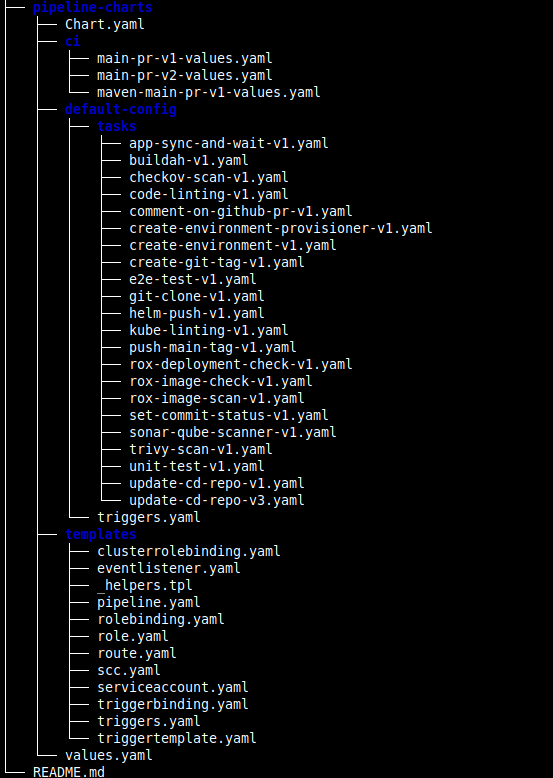


The above chart contains all necessary resources needed to build and run a Tekton pipeline. Some of the key things to note above are:
* `eventlistener` -  listens to incoming events like a push to a branch.
* `trigger` - the `eventlistener` specifies a trigger which in turn specifies:
   * `interceptor` - it receives data from the event
   * `triggerbinding` - extracts values from the event interceptor
   * `triggertemplate` - defines `pipeline` run resource template in its definition which in turn references the pipeline

  > **Note**: We do not need to define interceptor and trigger templates in every trigger while using stakater Tekton pipeline chart.

* `pipeline` -  this is the pipeline definition, it wires together all the items above (workspaces, tasks & secrets etc) into a useful & reusable set of activities.
* `tasks` - these are the building blocks of Tekton. They are the custom resources that take parameters and run steps on the shell of a provided image. They can produce results and share workspaces with other tasks.

### SAAP pre-configured cluster tasks:
  
  > SAAP is shipped with many ready-to-use Tekton cluster tasks. Let's take a look at some of the tasks that we will be using to construct a basic pipeline.

1. Navigate to the `OpenShift Console` using `Forecastle`. Select `Pipelines` > `Tasks` in sidebar. Select the `ClusterTasks` tab and search `stakater`. Here you will see all the tasks shipped with SAAP.

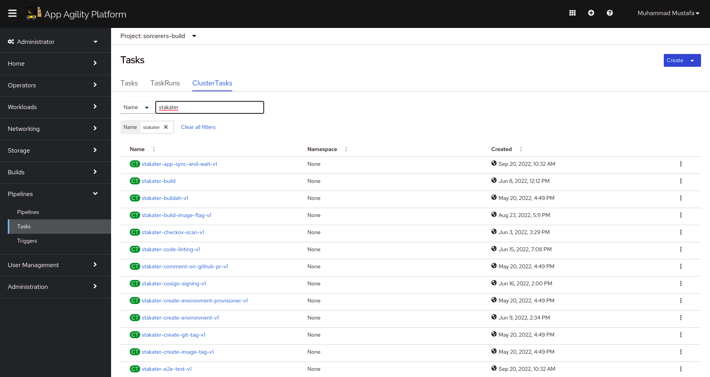

#### 1 - `git-clone` 🤖🤖🤖

This task clones the repository/code on which pipeline is to executed in the `workspace`

**Parameters:**
The task takes in the following Tekton parameters:
* `url` - this is the URL to clone the repository from. We extract this URL from the payload received by the interceptor
* `revision` - this is the revision or 'branch' of the repository

#### 2 - `stakater-create-git-tag-v1` 🏷

This task creates the tag for our repository. For push to main branch, it uses git semantic versioning to increment the tag. While for pull requests, it creates a new tag using the commit hash.

**Parameters:**
The task takes in the following parameters:
* `gitrevision` - head SHA in case of PR and 'master/main' in case of merge to main/master
* `oldcommit` - hash of the previous commit
* `prnumber`- this represents the pr number. It is set to 'NA' in case of merge to main

Below is the code snipped from the task:

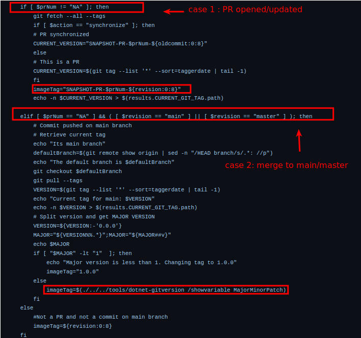


#### 3 - `stakater-buildah-v1` 🏗

The task contains a small buildah script that builds image using the source code and pushes it to nexus repository.

The task takes parameter needed to build and push the image as parameters, such as the image repository, image tag, and dockerfile, etc


**Build script:**

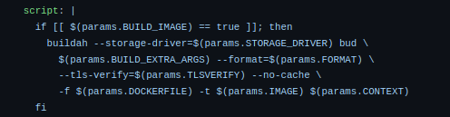

**Push script:**

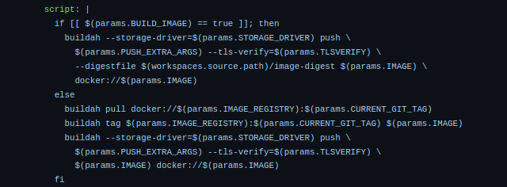

#### 4 - `stakater-helm-push-v1` 🅿

The `helm-push` task packages the application Helm chart, creates the tag for chart, and finally pushes it to the chart repository.

The repo path, chart repository URL, pull request number, git revision, and git tag are taken as parameters

#### 5 - `stakater-update-cd-repo-v3` ⚙️

When the pipeline is triggered by merge on default branch, this task is responsible for updating the image and chart version for the application in the GitOps repo.
The GitOps repo in our case is the `nordmart-apps-gitops-config` repo.
In case the pipeline is triggered by a PR, this task creates a Environment Provisioner CR for dynamic test environment.

#### 6 - `stakater-push-main-tag-v1` 📤

The task updates the tag in git repository when change is pushed to main/master.

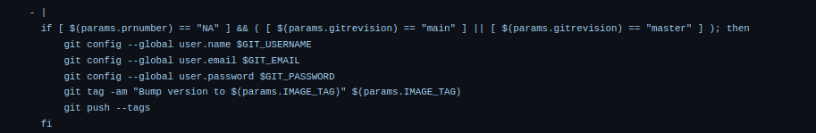


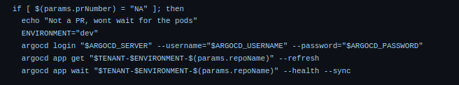

#### 7 - `stakater-create-environment-v1`

In the Tronador 101 section, we mentioned that we will later add a task to our pipelines that will provision dynamic test environments for our merge/pull request.
The `stakater-create-environment-v1` is that.

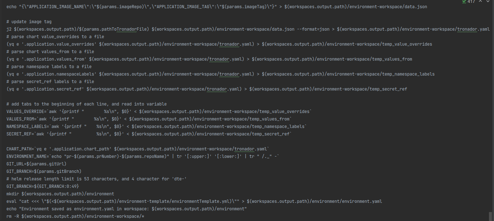

### Deploying a working pipeline

  > It's finally time to get our hands dirty. Let's use the `tekton-pipeline-chart` and the above tasks to create a working pipeline.

Firstly, we will be populating the values file for the Tekton pipeline Chart to create our pipeline.

1. Open up the `<TENANT-NAME>/nordmart-apps-gitops-config` repository in your GitLab.


2. Navigate to `01-TENANT-NAME` >  `01-tekton-pipelines` > `00-build` folder.


3. Inside the `00-build` folder that you just created, add the following `Chart.yaml`

   ```yaml
   apiVersion: v2
   dependencies:
     - name: pipeline-charts
       repository: https://stakater.github.io/stakater-charts  
       version: 0.0.35
   description: Helm chart for Tekton Pipelines
   name: stakater-main-pr-v1
   version: 0.0.1
   ```
  > This `Chart.yaml` uses the pipeline chart as a dependency.

4. Now let's fill in the values file for our chart. Create a `values.yaml` in the same folder and add the following values:
   ```yaml
   pipeline-charts:
      name: stakater-main-pr-v1
      workspaces:
      - name: source
        volumeClaimTemplate:
          accessModes: ReadWriteOnce
          resourcesRequestsStorage: 1Gi
      pipelines:
        tasks:
          - defaultTaskName: git-clone
          - defaultTaskName: stakater-create-git-tag-v1
          - defaultTaskName: stakater-buildah-v1
            name: build-and-push
            params:
              - name: BUILD_IMAGE
                value: "true"
          - defaultTaskName: stakater-helm-push-v1
          - defaultTaskName: stakater-create-environment-v1
          - defaultTaskName: stakater-gitlab-update-cd-repo-v1
            params:
              - name: gitlab_group
          - defaultTaskName: stakater-push-main-tag-v1
      triggertemplate:
           serviceAccountName: stakater-workshop-tekton-builder
           pipelineRunNamePrefix: $(tt.params.repoName)-$(tt.params.prnumberBranch)
           params:
             - name: repoName
             - name: prnumberBranch
               default: "main"
      eventlistener:
        serviceAccountName: stakater-workshop-tekton-builder
        triggers:               
          - name: gitlab-mergerequest-create
            bindings:
              - ref: stakater-gitlab-merge-request-v1
              - name: oldcommit
                value: "NA"
              - name: newcommit
                value: $(body.object_attributes.last_commit.id)
          - name: gitlab-mergerequest-synchronize
            bindings:
              - ref: stakater-gitlab-merge-request-v1
              - name: oldcommit
                value: $(body.object_attributes.oldrev)
              - name: newcommit
                value: $(body.object_attributes.last_commit.id)
          - name: gitlab-push
            bindings:
              - name: newcommit
                value: $(body.after)
              - name: oldcommit
                value: $(body.before)
              - ref: stakater-gitlab-push-v1
      rbac:
        enabled: false
      serviceAccount:
        name: stakater-workshop-tekton-builder
        create: false
   ```

Here we have defined a basic pipeline which clones the repository when it is triggered, builds its image and Helm chart, and finally updates the version of application.


5. Commit the changes and wait for our Tekton pipelines to deploy out in ArgoCD. Head over to ArgoCD and search for Application `<TENANT_NAME>-build-tekton-pipelines`
   

  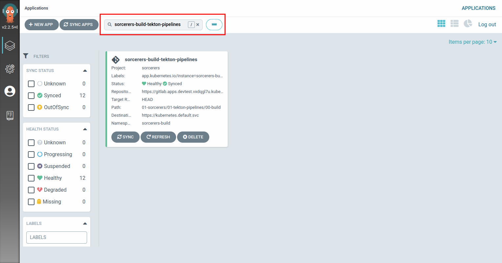

If you open up the application by clicking on it, you should see a similar screen

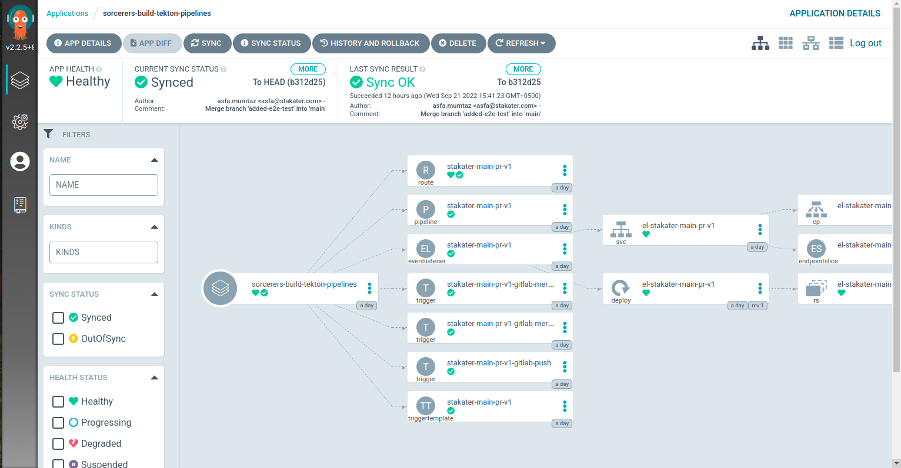

6. Let's see our pipeline definition in the SAAP console now. Select `<TENANT_NAME>-build` namespace in the console. Now in the `Pipelines` section, click `pipelines`. You should be able to see the pipeline that you just created using the chart.


With our pipelines definitions synchronized to the cluster (thanks Argo CD 🐙👏) and our codebase forked, we can now add the webhook to GitLab `nordmart-review` and `nordmart-review-ui` projects. 

7. Grab the URL we're going to invoke to trigger the pipeline by checking the event listener route in `<TENANT_NAME>-build` project

   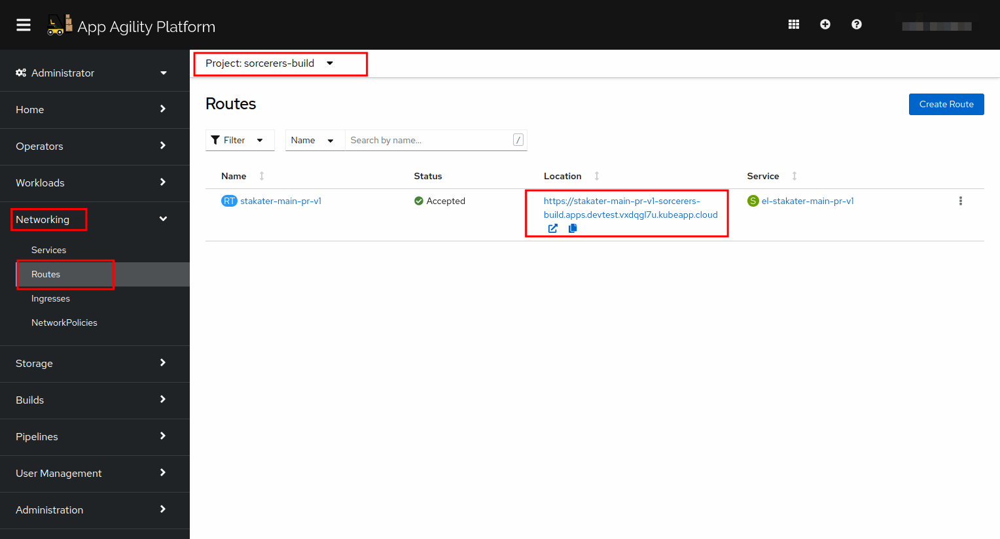

8. Once you have the URL, over on GitLab go to `nordmart-review` > `Settings` > `Webhook` to add the webhook:

   * Add the URL we obtained through the last step in the URL box
   * select `Push Events`, leave the branch empty for now
   * Select `Merge request events`
   * select `SSL Verification`
   * Click `Add webhook` button.


   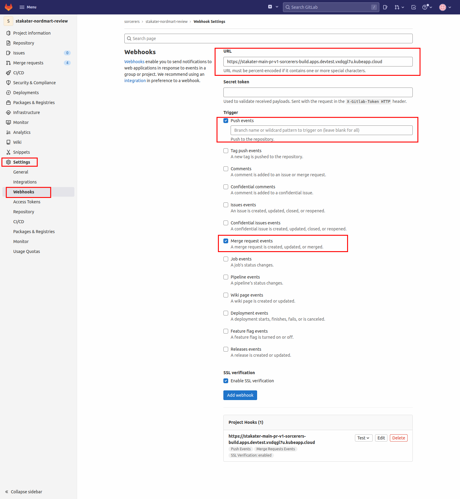

9. Repeat the process for `<TENANT_NAME>/stakater-nordmart-review-ui`. Go to `<TENANT_NAME>/stakater-nordmart-review-ui` project and add the webhook there through the same process.

With all these components in place - now it's time to trigger pipeline via webhook by checking in some code for Nordmart review.

10. Let's make a simple change to the application. Edit `pom.xml` by adding some new lines in the file. Commit directly to the `main` branch.

11. Navigate to the OpenShift Console ...


🪄 Observe Pipeline running by browsing to `OpenShift UI` > `Pipelines` from left pane > `Pipelines` in your `<TENANT_NAME>-build` project:

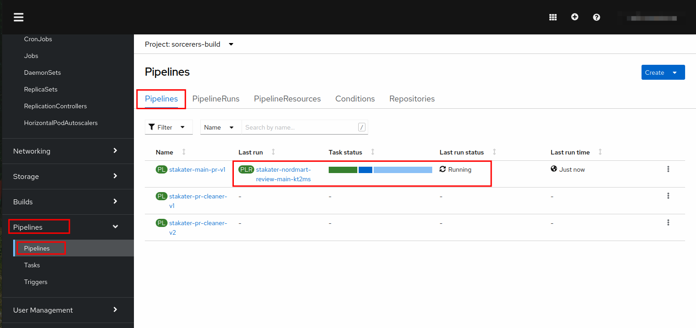

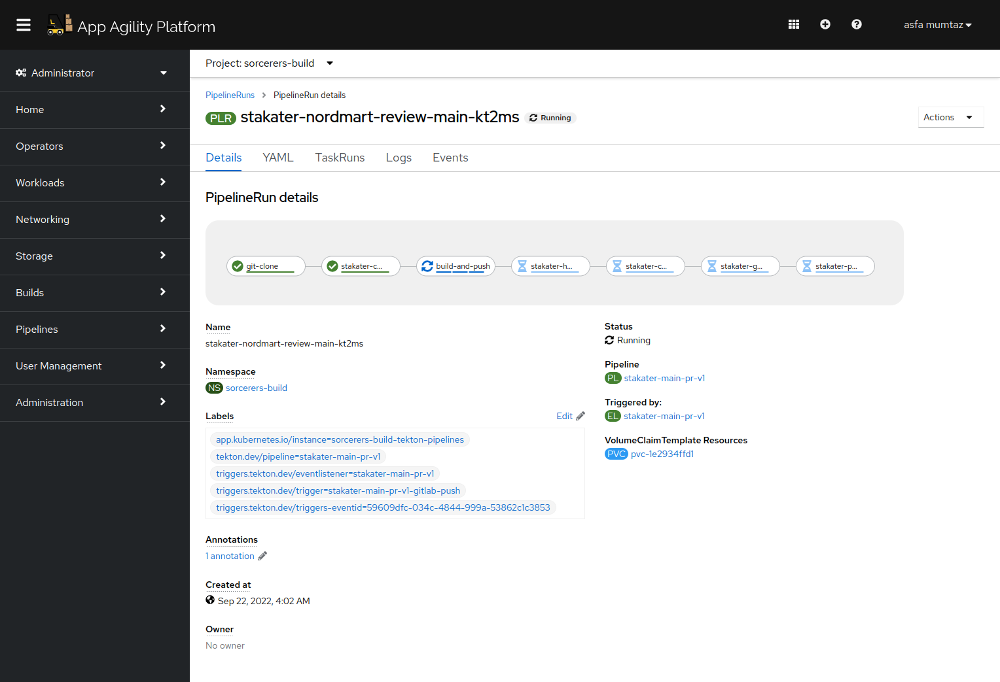
  
12. Open the logs tab and click build-and-push. Remember the **`tag`** and **`image_sha`** for our image that we will later match with pod spec.. 

    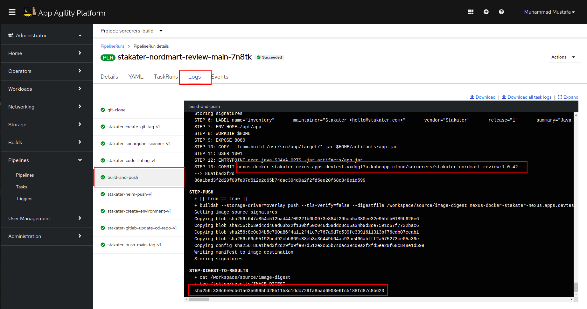


13. When the pipeline is finished, Our `<TENANT_NAME>/nordmart-apps-gitops-config` repo is updated with the new Helm chart version that contains the latest application image. Go to your `<TENANT_NAME>/nordmart-apps-gitops-config` and view the latest commits at `01-<TENANT_NAME>/02-stakater-nordmart-review/01-dev/Chart.yaml`

    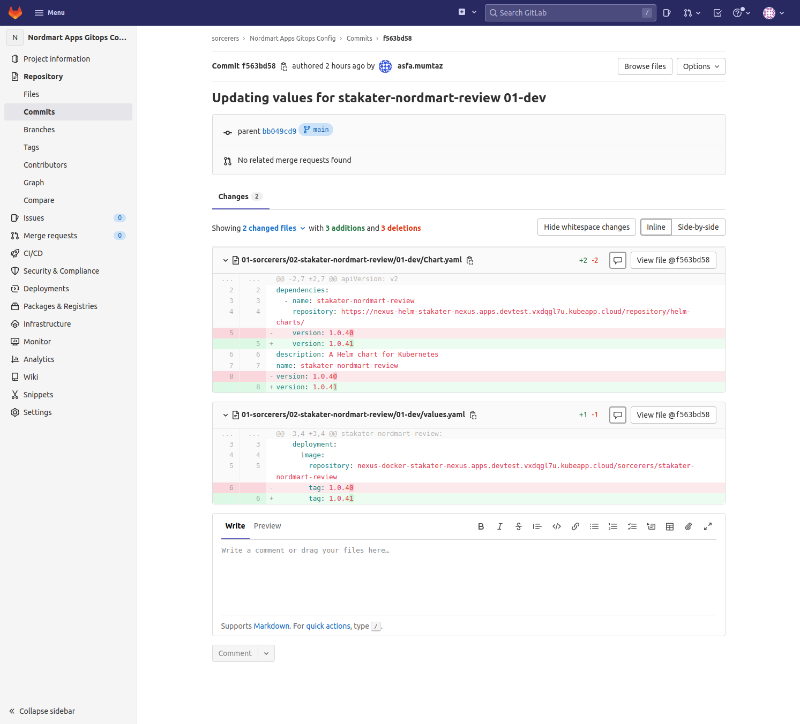

  > For pushes to `main` branch, your application is automatically updated in the `<TENANT_NAME>-dev` namespace.

15. Open our `<TENANT>-stakater-nordmart-review-dev` ArgoCD application and click refresh so that our changes are applied to the cluster.
    
   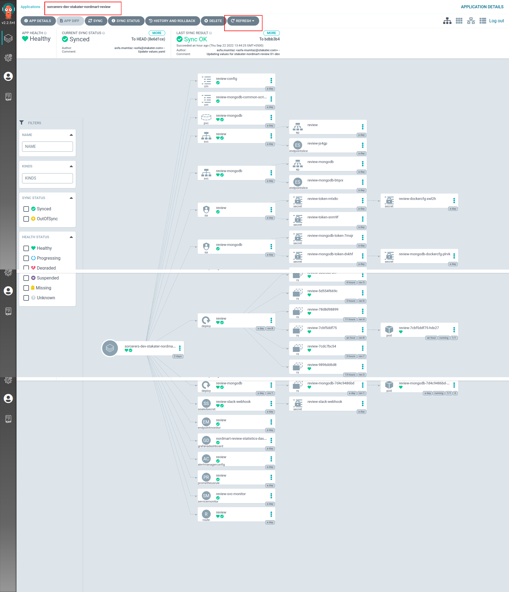

15. Navigate to `Workloads` > `Pods` in the sidebar in `<TENANT_NAME>-dev` namespace >  Select the `Pod` named `review-*` > select `YAML` and scroll down to `status:` key. You'll see that the **`tag`** and **`sha`** in the `build-and-push` step match.
    
   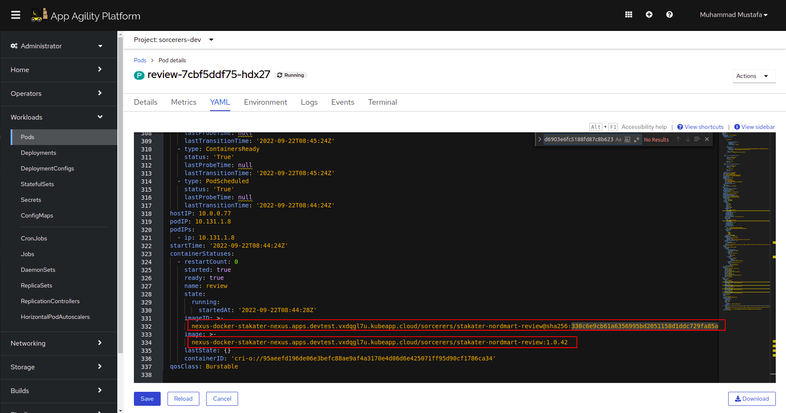

#### Checking Dynamic Test Environment

Now, let's test out the dynamic test environment. 

1. Go back to `stakater-nordmart-review` and open up a Merge Request this time instead of pushing directly to main. 
This will trigger the same pipeline.


2. Wait for the pipeline to succeed and then head over to `nordmart-apps-gitops-config`.

3. Navigate to  `nordmart-apps-gitops-config > 01-TENANT_NAME >  02-stakater-nordmart-review > 00-preview`. You should be able to see a yaml file for environment resource.
   
  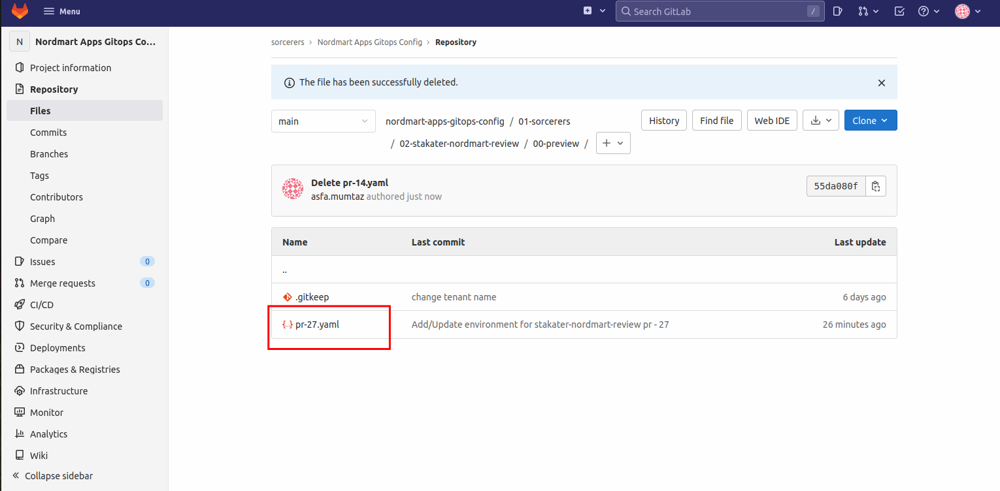

  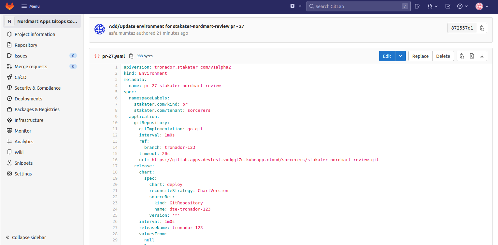


4. Now head over to the openshift console and navigate to projects.

5. Once tronador creates the dynamic environment for you, you should be able to see its project listed there. It will start with the prefix `pr-` followed by your pr number.

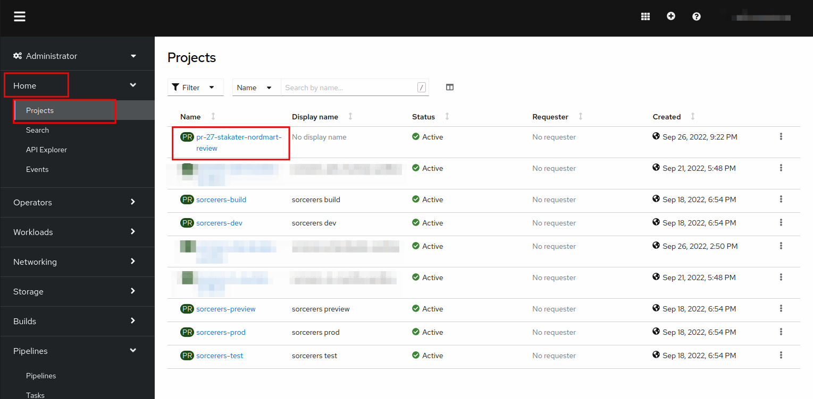


6. Open up the project and click on workload. You will see that it deployed the application in this project for you. 

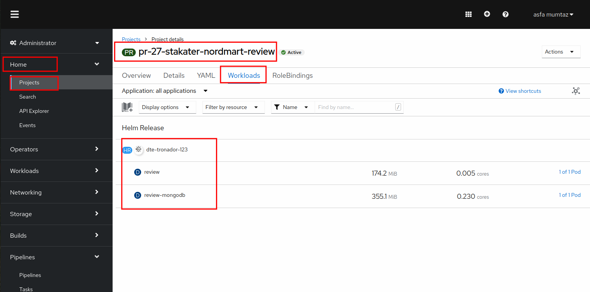

   Congratulations! You have a dynamic test environment for your PR!


