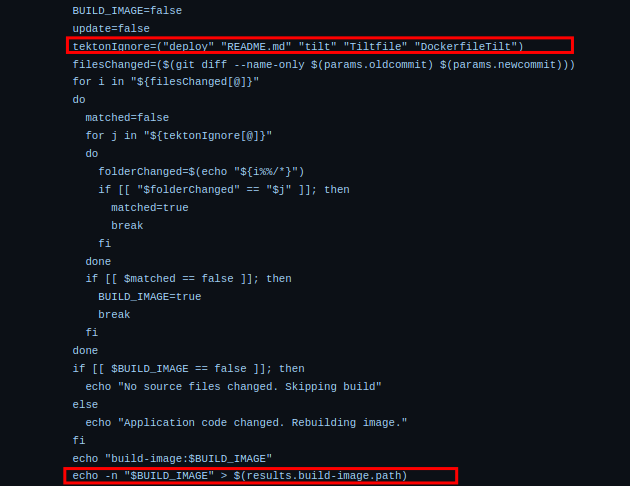
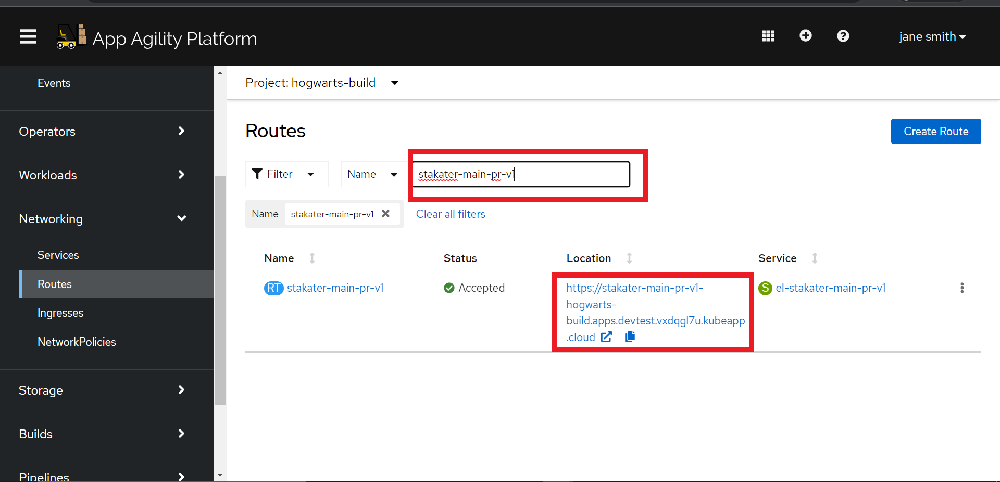

### Tekton Pipeline

> Tekton (OpenShift Pipelines) is the new kid on the block in the CI/CD space. It's grown rapidly in popularity as it's Kubernetes Native way of running CI/CD.

Tekton is deployed as an operator in our cluster and allows users to define in YAML Pipeline and Task definitions. <span style="color:blue;">[Tekton Hub](https://hub.tekton.dev/)</span> is a repository for sharing these YAML resources among the community, giving great reusability to standard workflows.

Tekton is made up of number of YAML files each with a different purpose such as `Task` and `Pipeline`. These are then wrapped together in another YAML file (`PipelineRun`) which represents an instance of a `Pipeline` and a Workspace to create an instance of a pipeline. Given below is an example of a pipeline.


In this snippet of the pipeline used in this exercise, we define:

* `params` are the inputs to the run of the `pipeline`. For example, the git revision to build.
* `tasks` is where we define the meat of the pipeline, the actions that happen at each step of our pipeline. Tasks can be `ClusterTasks` or `Tasks`. `ClusterTasks` are just global tasks shared across all projects. `Tasks`, much like `Pipelines`, are also supplied parameters and workspaces if required.
* `workspace` - A pipeline defines a workspace to show how storage will be shared through its Task. For instance, a task A might clone a git repo to a workspace, and task B might use the same workspace and edit code in the local clone.
## Deploying the Tekton Objects

Unlike most CI/CD solutions, the Tekton pipeline definitions are not stored with the codebase. Instead, they are deployed directly onto the cluster that they will run on.

### Tekton Pipeline Chart
We will use stakater's `pipeline-charts` Helm chart to deploy the tekton resources. The chart contains templates for all required tekton resources such as pipeline, task, eventlistener, triggers, etc. We will fill in the values for these resources and deploy a functioning pipeline.
(Hiding complexity using tekton pipeline chart)


The above chart contains all necessary resources needed to build and run a tekton pipeline. Some of the key things to note above are:
* `eventlistener` -  listens to incoming events like a push to a branch.
* `trigger` - the eventlisterner specifies a trigger which in turn specifies:
   * `interceptor` - it receives data from the event
   * `triggerbinding` - extracts values from the event interceptor
   * `triggertemplate` - defines `pipeline` run resource template in its definition which in turn references the pipeline

(- **Note**: We do not need to define interceptor and triggertemplates in every trigger while using stakater tekton pipeline chart.)
* `pipeline` -  this is the pipeline definition, it wires together all the items above (workspaces, tasks & secrets etc) into a useful & reusable set of activities.
* `tasks` - these are the building blocks of Tekton. They are the custom resources that take parameters and run steps on the shell of a provided image. They can produce results and share workspaces with other tasks.

### SAAP preconfigured cluster tasks:
SAAP is shipped with many ready-to-use tekton cluster tasks. Let's take a look at some of the tasks that we will be using to construct a basic pipeline.

#### 1 - git-clone 🤖🤖🤖

This task clones the repository/code on which pipeline is to executed in the `workspace`

**Parameters:**
The task takes in the following tekton params:
* url - this is the url to clone the repository from. We extract this url from the payload received by the interceptor
* revision - this is the revision or 'branch' of the repository

#### 2 - stakater-create-git-tag-v1 🏷

This task creates the tag for our repository. For push to main branch, it uses git semantic versioning to increment the tag. While for pull requests, it creates a new tag using the commit hash.

**Parameters:**
The task takes in the following params:
* gitrevision - head sha in case of PR and 'master/main' incase of merge to main/master
* oldcommit - hash of the previous commit
* prnumber- this represents the pr number. It is set to 'NA' incase of merge to main

Below is the code snipped from the task:


#### 3 - stakater-build-image-flag-v1 🚩

This task determines whether there is a change in the application source code. If the code has change, it will mark build flag as true. When the source code hasn't changed but there is a change in other files, it will mark build flag as false. This flag will be used in the proceeding tasks to determine whether they should run or not.
Where `imageTag` will be the tag it outputs.

**Parameters:**
* oldcommit - sha hash of the previous commit
* newcommit - sha hash of the current commit



When any files aother than the files included in `tektonIgnore` change, build-image flag is marked as true.

#### 4 - stakater-buildah-v1 🏗

The task contains a small buildah script that builds image using the source code and pushes it to nexus repository.
If `BUILD_IMAGE` flag obtained from the previous task is set to false, this task only retags the previous image and does not build it again.

The task takes parameter needed to build and push the image as params, such as the image repository, image tag, and dockerfile, etc


**Build script:**


**Push script:**


#### 5 - stakater-helm-push-v1 🅿

The helm-push task packages the application helm chart, creates the tag for chart, and finally pushes it to the chart repository.

The repo path, chart repository url, prnumber, git revision, and git tag are taken as parameters

#### 6 - stakater-update-cd-repo-v3 ⚙️

When the pipeline is triggered by merge on default branch, this task is responsible for updating the image and chart version for the application in the gitops repo.
The gitops repo in our case is the nordmart-apps-gitops-config repo.
In case the pipeline is triggered by a PR, this task creates a Environment Provisioner CR for dynamic test environment.

#### 7 - stakater-push-main-tag-v1 📤

The task updates the tag in git repository when change is pushed to main/master.


#### 8 - stakater-app-sync-and-wait-v1 🔄

Finally, the app-sync-and-wait checks the argocd application that sync and deploys our application. This tasks re-sync the application and waits for it to be in a synced state.


### Deploying a working pipeline

It's finally time to get our hands dirty. Let's use the `tekton-pipeline-chart` and the above tasks to create a working pipeline.

Firstly, we will be populating the values file for the tekton pipeline Chart to create our pipeline.

1. Open up the nordmart-apps-gitops-config repository that we created in section 1 on GitLab.


2. Navigate to `01-TEAM-NAME >  01-tekton-pipelines > 00-build` folder.


3. Inside the `00-build` folder that you just created, add the following Chart.yaml

      ```
   apiVersion: v2
   dependencies:
     - name: pipeline-charts
       repository: https://stakater.github.io/stakater-charts  
       version: 0.0.29
   description: Helm chart for Tekton Pipelines
   name: main-pr-v1
   version: 0.0.1

      ```
   This Chart.yaml uses the pipeline chart as a dependency.

4. Now let's fill in the values file for our chart. Create a values.yaml in the same folder and add the following values:
   ```
   apiVersion: v2
   pipeline-charts:
      name: stakater-main-pr-v1
      workspaces:
      - name: source
        volumeClaimTemplate:
          accessModes: ReadWriteOnce
          resourcesRequestsStorage: 1Gi
      pipelines:
        tasks:
          - defaultTaskName: git-clone
          - defaultTaskName: stakater-create-git-tag-v1
            params:
              - name: oldcommit
              - name: action
          - taskRef:
              task: stakater-build-image-flag-v1
              kind: ClusterTask
            name: stakater-build-image-flag-v1
            runAfter: 
              - stakater-create-git-tag-v1
            workspaces:
              - name: source
                workspace: source
            params:
              - name: oldcommit
              - name: newcommit
          - defaultTaskName: stakater-buildah-v1
            name: build-and-push
            runAfter:
            - stakater-build-image-flag-v1
            params:
              - name: BUILD_IMAGE
                value: $(tasks.stakater-build-image-flag-v1.results.build-image)
              - name: IMAGE_REGISTRY
                value: $(params.image_registry_url)
              - name: CURRENT_GIT_TAG
                value: $(tasks.stakater-create-git-tag-v1.results.CURRENT_GIT_TAG)
          - defaultTaskName: stakater-helm-push-v1
          - defaultTaskName: stakater-create-environment-v1
          - defaultTaskName: stakater-gitlab-update-cd-repo-v1
          - defaultTaskName: stakater-push-main-tag-v1
          - defaultTaskName: stakater-app-sync-and-wait-v1
            params:
              - name: timeout
                value: "120"
      triggertemplate:
           serviceAccountName: stakater-workshop-tekton-builder
           pipelineRunNamePrefix: $(tt.params.repoName)-$(tt.params.prnumberBranch)
           params:
             - name: repoName
             - name: prnumberBranch
               default: "main"
      eventlistener:
        serviceAccountName: stakater-workshop-tekton-builder
        triggers:               
          - name: pullrequest-create
            interceptors:
            - ref:
               name: "cel"
              params:
                - name: "filter"
                  value: "(header.match('X-Gitlab-Event', 'Merge Request Hook') && body.object_attributes.action == 'open' )"
                - name: "overlays"
                  value:
                    - key: marshalled-body
                      expression: "body.marshalJSON()"
            bindings:
              - ref: stakater-gitlab-merge-request-v1
              - name: oldcommit
                value: "NA"
              - name: newcommit
                value: $(body.object_attributes.last_commit.id)
          - name: pullrequest-synchronize
            interceptors:
            - ref:
               name: "cel"            
              params:
                - name: "filter"
                  value: "(header.match('X-Gitlab-Event', 'Merge Request Hook') && body.object_attributes.action == 'update' )"
                - name: "overlays"
                  value:
                    - key: marshalled-body
                      expression: "body.marshalJSON()"
            bindings:
              - ref: stakater-gitlab-merge-request-v1
              - name: oldcommit
                value: $(body.object_attributes.oldrev)
              - name: newcommit
                value: $(body.object_attributes.last_commit.id)
          - name: push
            interceptors:
            - ref:
               name: "cel"
              params:
                - name: "filter"
                  value: (header.match('X-Gitlab-Event', 'Merge Request Hook') && body.object_attributes.action == 'merge' )
                - name: "overlays"
                  value:
                    - key: marshalled-body
                      expression: "body.marshalJSON()"
            bindings:
              - name: newcommit
                value: $(body.after)
              - name: oldcommit
                value: $(body.before)
              - ref: stakater-pr-v1
                kind: ClusterTriggerBinding
          - name: stakater-pr-cleaner-v2-pullrequest-merge
            create: false
      rbac:
        enabled: false
      serviceAccount:
        name: stakater-workshop-tekton-builder
        create: false

Here we have defined a basic pipeline which clones the repository when it is triggered, builds its image and helm chart, and finally updates the version of application.
5. To deploy our helm chart to the cluster, we need an argocd application that points to this chart.
   Navigate to <TEAM_NAME>/00-argocd-apps/00-build in the nordmart-apps-gitops-config. You will see a file named `tekton-pipelines.yaml` with the folowing content:
```
   
   apiVersion: argoproj.io/v1alpha1
   kind: Application
   metadata:
     name: <TEAN_NAME>-build-tekton-pipelines
     namespace: openshift-gitops
     labels:
       stakater.com/tenant: <TEAN_NAME>
       stakater.com/env: build
       stakater.com/kind: build    
     spec:
       destination:
         namespace: <TEAN_NAME>-build
         server: 'https://kubernetes.default.svc'
       project: <TEAM_NAME>
       source:
         path: <TEAM_NAME>/00-tekton-pipelines/00-build
         repoURL: <URL_FOR_THIS REPOSITORY>
         targetRevision: HEAD
       syncPolicy:
         automated:
           prune: true
           selfHeal: true
 ```        
This is the application that will deploy our pipelines. Now we need to check if the application was synchronised successfully.

6. Update git and wait for our Tekton pipelines to deploy out in ArgoCD. Head over to argocd and search for Application `tekton-pipelines`
###### TODO Add screenshot

7. With our pipelines definitions sync'd to the cluster (thanks Argo CD 🐙👏) and our codebase forked, we can now add the webhook to GitLab `nordmart-review` and `nordmart-review-ui` projects. First, grab the URL we're going to invoke to trigger the pipeline. From your `Openshift Console` select `Routes`. Search for the name of your pipeline ate the right corner. Then copy the URL your pipelin. This will be the webhook URL for your pipeline.




8. Once you have the URL, over on GitLab go to `nordmart-review > Settings > Webhook ` to add the webhook:

   * Add the url we obtained through the last step in the URL box
   * select `Push Events`, leave the branch empty for now
   * select `SSL Verification`
   * Click `Add webhook` button.

   

   You can test the webhook works from GitLab.

   
9. Now let's repeat the process for `nordmart-review-ui`. Go to nordmart-review-ui project and add the webhook there through the same process.
10. With all these components in place - now it's time to trigger pipeline via webhook by checking in some code for Pet Battle API. Lets make a simple change to the application. Edit  `pom.xml` by adding new line in the file.

11. As always, push the code to git ...


    🪄 Observe Pipeline running by browsing to OpenShift UI -> Pipelines from left pane -> Pipelines in your `<TEAM_NAME>-build` project:


🪄OBSERVE PIPELINE RUNNING :D 
