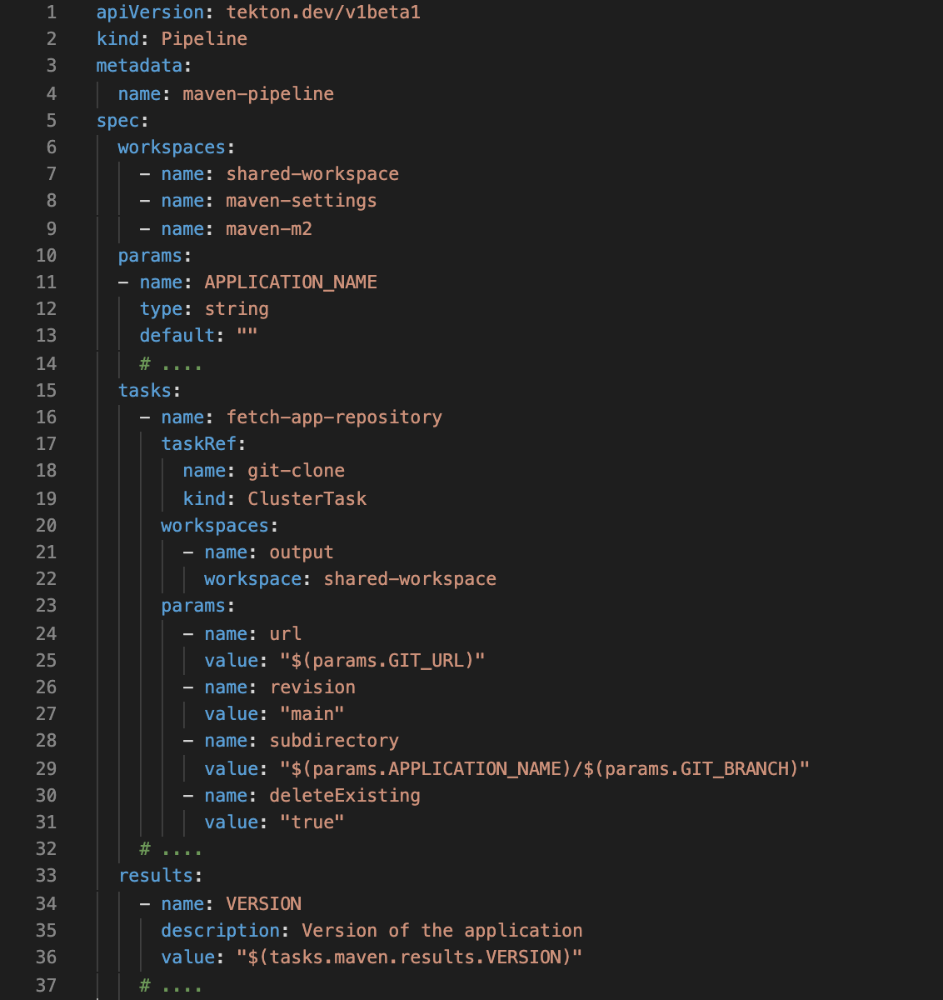
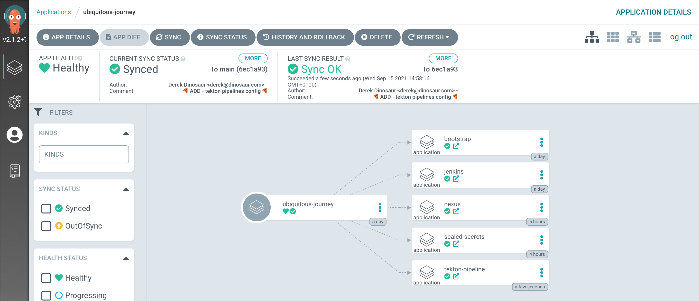
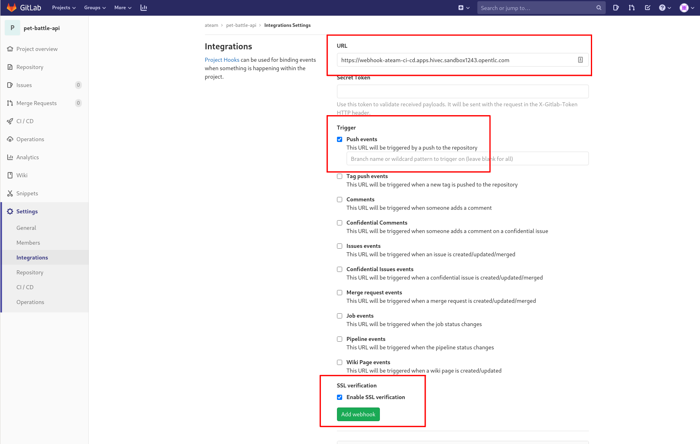
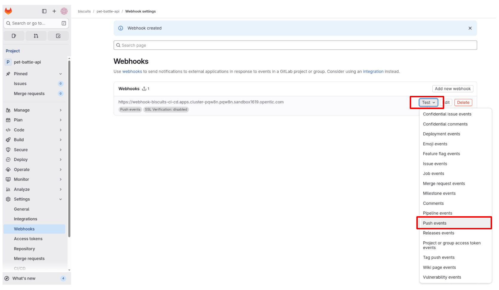
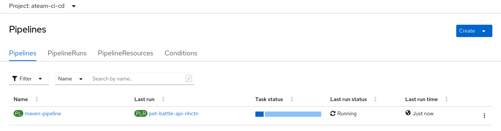

### Tekton Pipeline

> Tekton (OpenShift Pipelines) is the new kid on the block in the CI/CD space. It's grown rapidly in popularity as it's Kubernetes Native way of running CI/CD.

There are many similarities between what Jenkins does and what Tekton does. For example, both can be used to store pipeline definitions as code in a Git repository. Tekton is deployed as an operator in our cluster and allows users to define in YAML Pipeline and Task definitions. <span style="color:blue;">[Tekton Hub](https://hub.tekton.dev/)</span> is a repository for sharing these YAML resources among the community, giving great reusability to standard workflows.

Tekton is made up of number of YAML files each with a different purpose such as `Task` and `Pipeline`. These are then wrapped together in another YAML file (`PipelineRun`) which represents an instance of a `Pipeline` and a Workspace to create an instance of a pipeline.



In this snippet of the pipeline used in this exercise, we define:

* `workspaces` used by the pipeline (config maps, and shared workspaces for each task to use). 
* `params` are the inputs to the run of the `pipeline` eg the application name or the git revision to build. 
* `tasks` is where we define the meat of the pipeline, the actions that happen at each step of our pipeline. Tasks can be `ClusterTasks` or `Tasks`. `ClusterTasks` are just global tasks shared across all projects. `Tasks`, much like `Pipelines`, are also supplied parameters and workspaces if required.  

#### Deploying the Tekton Objects

1. Open the GitLab UI. Create a Project in GitLab under `<TEAM_NAME>` group called `pet-battle-api`. Make the project as **internal**.

    

2. Back in your CodeReady Workspace, we'll fork the PetBattle API code to this newly created repository on git.

    ```bash#test
    cd /projects
    git clone https://github.com/rht-labs/pet-battle-api.git && cd pet-battle-api
    git remote set-url origin https://${GIT_SERVER}/${TEAM_NAME}/pet-battle-api.git
    git branch -M main
    git push -u origin main
    ```

3. Unlike Jenkins, our Tekton pipeline definitions are not stored with the codebase. Instead, they're wrapped as Helm Chart along with our Ubiquitous Journey project. The Tekton Pipelines chart is in the root of the `tech-exercise`:
    <div class="highlight" style="background: #f7f7f7">
    <pre><code class="language-bash">
    tekton
    ├── Chart.yaml
    ├── templates
    │   ├── pipelines
    │   │   └── maven-pipeline.yaml
    │   ├── secrets
    │   │   ├── rolebindings.yaml
    │   │   └── serviceaccount-pipeline.yaml
    │   ├── tasks
    │   │   ├── bake-image.yaml
    │   │   ├── deploy.yaml
    │   │   ├── helm-package.yaml
    │   │   ├── maven.yaml
    │   │   └── verify.yaml
    │   ├── triggers
    │   │   ├── gitlab-event-listener.yaml
    │   │   ├── gitlab-trigger-binding.yaml
    │   │   └── gitlab-trigger-template.yaml
    │   └── workspaces
    │       ├── configmap-maven-settings.yaml
    │       ├── pipeline-serviceaccount.yaml
    │       ├── pv-build-images.yaml
    │       └── pv-maven-m2.yaml
    └── values.yaml
    </code></pre></div>

    Some of the key things to note above are:

   * `workspaces` - these yaml are the volumes to use across each of the `tasks` in the pipeline. ConfigMaps and other resources that are fixed but can be loaded into the pipeline are stored here.
   * `tasks` - these are the building blocks of Tekton. They are the custom resources that take parameters and run steps on the shell of a provided image. They can produce results and share workspaces with other tasks. 
   * `secrets` - secure things used by the pipeline
   * `pipelines` -  this is the pipeline definition, it wires together all the items above (workspaces, tasks & secrets etc) into a useful & reusable set of activities.
   * `triggers` folder stores the configuration for the webhooks. We will add WebHooks from gitlab to trigger our pipeline, using the resources in this directory we expose the webhook endpoint (`gitlab-event-listener.yaml`) and parse the data from it (`gitlab-trigger-binding.yaml`) to trigger a PipelineRun (`gitlab-trigger-template.yaml`)

4. Seeing as Tekton pipelines are just YAML, we can have Argo CD sync the pipelines to the cluster so our code can use them. To deploy the pipeline definitions - edit `ubiquitous-journey/values-tooling.yaml`. Add the reference to the tekton chart we explored by adding the chart to our ArgoCD applications list:

    ```yaml
      # Tekton Pipelines
      - name: tekton-pipeline
        enabled: true
        source: "https://<GIT_SERVER>/<TEAM_NAME>/tech-exercise.git"
        source_ref: main
        source_path: tekton
        values:
          team: <TEAM_NAME>
          cluster_domain: <CLUSTER_DOMAIN>
          git_server: <GIT_SERVER>
    ```

    You can also run this bit of code to do the replacement if you are feeling uber lazy!

    ```bash#test
    if [[ $(yq e '.applications[] | select(.name=="tekton-pipeline") | length' /projects/tech-exercise/ubiquitous-journey/values-tooling.yaml) < 1 ]]; then
        yq e '.applications += {"name": "tekton-pipeline","enabled": true,"source": "https://GIT_SERVER/TEAM_NAME/tech-exercise.git","source_ref": "main","source_path": "tekton","values": {"team": "TEAM_NAME","cluster_domain": "CLUSTER_DOMAIN","git_server": "GIT_SERVER"}}' -i /projects/tech-exercise/ubiquitous-journey/values-tooling.yaml
        sed -i "s|GIT_SERVER|$GIT_SERVER|" /projects/tech-exercise/ubiquitous-journey/values-tooling.yaml
        sed -i "s|TEAM_NAME|$TEAM_NAME|" /projects/tech-exercise/ubiquitous-journey/values-tooling.yaml    
        sed -i "s|CLUSTER_DOMAIN|$CLUSTER_DOMAIN|" /projects/tech-exercise/ubiquitous-journey/values-tooling.yaml    
    fi
    ```

5. Tekton will push changes to our Helm Chart to Nexus as part of the pipeline. Originally we configured our App of Apps to pull from a different chart repository so we also need to update out Pet Battle `pet-battle/test/values.yaml` file to point to the Nexus chart repository deployed in OpenShift. Update the `source` as shown below for the `pet-battle-api`:

    <div class="highlight" style="background: #f7f7f7">
    <pre><code class="language-yaml">
      # Pet Battle Apps
      pet-battle-api:
        name: pet-battle-api
        enabled: true
        source: http://nexus:8081/repository/helm-charts #<- update this
        chart_name: pet-battle-api
        source_ref: 1.2.1 # helm chart version
        values:
          image_name: pet-battle-api
          image_version: latest # container image version
    </code></pre></div>

    You can also run this bit of code to do the replacement if you are feeling uber lazy!

    ```bash#test
    yq e '.applications.pet-battle-api.source |="http://nexus:8081/repository/helm-charts"' -i /projects/tech-exercise/pet-battle/test/values.yaml
    ```

6. Update git and wait for our Tekton pipelines to deploy out in ArgoCD.

    ```bash#test
    cd /projects/tech-exercise
    git add .
    git commit -m  "🍕 ADD - tekton pipelines config 🍕"
    git push 
    ```

    


7. With our pipelines definitions sync'd to the cluster (thanks Argo CD 🐙👏) and our codebase forked, we can now add the webhook to GitLab `pet-battle-api` project. First, grab the URL we're going to invoke to trigger the pipeline:

    ```bash#test
    echo https://$(oc -n ${TEAM_NAME}-ci-cd get route webhook --template='{{ .spec.host }}')
    ```

8. Once you have the URL, over on GitLab go to `pet-battle-api > Settings > Integrations` to add the webhook:

    * select `Push Events`, leve the branch empty for now
    * select `SSL Verification`
    * Click `Add webhook` button.

    

    You can test the webhook works from GitLab.

    

9. With all these components in place - now it's time to trigger pipeline via webhook by checking in some code for Pet Battle API. Lets make a simple change to the application version. Edit pet-battle-api `pom.xml` found in the root of the `pet-battle-api` project and update the `version` number. The pipeline will update the `chart/Chart.yaml` with these versions for us.

    ```xml
        <artifactId>pet-battle-api</artifactId>
        <version>1.3.1</version>
    ```

    You can also run this bit of code to do the replacement if you are feeling uber lazy!

    ```bash#test
    cd /projects/pet-battle-api
    mvn -ntp versions:set -DnewVersion=1.3.1
    ```
 
10.  As always, push the code to git ...

    ```bash#test
    cd /projects/pet-battle-api
    git add .
    git commit -m  "🍕 UPDATED - pet-battle-version to 1.3.1 🍕"
    git push 
    ```

    🪄 Observe Pipeline running by browsing to OpenShift UI -> Pipelines from left pane -> Pipelines in your `<TEAM_NAME>-ci-cd` project:

    

?> **TIP** You can use the **tkn** command line to observe `PipelineRun` logs as well:

```bash
tkn -n ${TEAM_NAME}-ci-cd pr logs -Lf
```

🪄OBSERVE PIPELINE RUNNING :D - At this point check in with the other half of the group and see if you’ve managed to integrate the apps🪄
