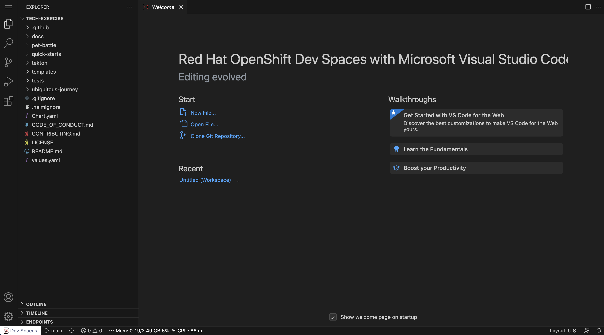

## Setting A New Group

By splitting your team into more groups, you can accelerate your delivery life cycle for Pet Battle Industries. Onboarding a new group in the team will be easy following the next instructions.

1. Login to your Red Hat OpenShift DevSpaces Editor. The link to this will be provided by your instructor.

    

    <p class="warn">
    If the workspace has not been set up for you, you can create one from this `devfile`.
    </br>
    On DevSpaces,  "Create Workspace > Import from Git".
    </br>
    Enter this URL to load the TL500 stack:</br>
    <span style="color:blue;"><a id=crw_dev_filelocation href=""></a></span>
    </p>

2. In your IDE (it may take some time to open ... ⏰☕️), open a new terminal by hitting the hamburger menu on the top left then select `Terminal > New Terminal` from the menu.

    

3. Notice the nifty default shell in the `stack-tl500` container is `zsh` which rhymes with swish. It also has neat shortcuts and plugins - plus all the cool kids are using it 😎! We will be setting our environment variables in both `~/.zshrc` and `~/.bashrc` in case you want to switch to `bash`.

4. Setup your `TEAM_NAME` name in the environment of the CodeReadyWorkspace by running the command below. We will use the `TEAM_NAME` variable throughout the exercises so having it stored in our session means less changing of this variable throughout the exercises 💪. **Ensure your `TEAM_NAME` consists of only lowercase alphanumeric characters or '-', and must start and end with an alphanumeric character (e.g. 'my-name',  or '123-abc.)**

    ```bash#test
    echo export TEAM_NAME="<TEAM_NAME>" | tee -a ~/.bashrc -a ~/.zshrc
    ```

5. Add the `CLUSTER_DOMAIN` to the environment:

    ```bash#test
    echo export CLUSTER_DOMAIN="<CLUSTER_DOMAIN>" | tee -a ~/.bashrc -a ~/.zshrc
    ```

6. Add the `GIT_SERVER` to the environment:

    ```bash#test
    echo export GIT_SERVER="<GIT_SERVER>" | tee -a ~/.bashrc -a ~/.zshrc
    ```

7. Verify the variables you have set:

    ```zsh#test
    source ~/.zshrc
    echo ${TEAM_NAME}
    echo ${CLUSTER_DOMAIN}
    echo ${GIT_SERVER}
    ```

8. Check if you can connect to OpenShift. Run the command below.

    <p class="tip">
    ⛷️ <b>TIP</b> ⛷️ - Before you hit enter, make sure you change the username and password to match your team's login details. If your password includes special characters, put it in single quotes. i.e.: <strong>'A8y?Rpm!9+A3B/KG'</strong>
    </p>

    ```bash
    oc login --server=https://api.${CLUSTER_DOMAIN##apps.}:6443 -u <USER_NAME> -p <PASSWORD>
    ```

9. Check your user permissions in OpenShift by checking your team's `ci-cd` project. 

    ```bash#test
    oc get pods -n ${TEAM_NAME}-ci-cd
    ```

10. We are going to create a Gitlab Personal Access Token (PAT). The token is a more secure and reliable method for accessing Gitlab from our scripts later on. Note, that for reference's sake, you can also generate a PAT in Gitlab under User > Settings > Access Tokens in the Web UI. We use a helper script here to help automate that process. To generate the token, open a terminal if you have not got one open and run the following commands.

    <p class="tip">
    The Gitlab user must be the same used to create the <b>team group</b>, and the <b>tech-exercise</b> project. Currently, only the owners are allowed to commit changes.
    </p>

    Export your Gitlab username.

    ```bash
    export GITLAB_USER=<YOUR_GITLAB_USER>
    ```

    Export your Gitlab password.

    ```bash
    export GITLAB_PASSWORD=<YOUR_GITLAB_PASSWORD>
    ```

    <p class="tip">
    ⛷️ <b>TIP</b> ⛷️ - If your password includes special characters, try putting it in single quotes. ie: <strong>'A8y?Rpm!9+A3B/KG'</strong>
    </p>

    Generate your Gitlab PAT.

    ```bash
    gitlab_pat
    ```

    Echo the `GITLAB_PAT` environment variable.

    ```bash
    echo $GITLAB_PAT
    ```

11. We could update our local `tech-exercise` project with the latest content:

    ```bash#test
    cd /projects/tech-exercise
    git remote set-url origin https://${GIT_SERVER}/${TEAM_NAME}/tech-exercise.git
    git pull
    ```

12. And finally, update our local environment with the latest content of Pet Battle applications:

    The frontend:

    ```bash#test
    cd /projects
    git clone https://${GIT_SERVER}/${TEAM_NAME}/pet-battle.git
    ```

    And the backend:

    ```bash#test
    cd /projects
    git clone https://${GIT_SERVER}/${TEAM_NAME}/pet-battle-api.git    
    ```

🪄🪄 Now, our group is ready to continue with the ongoing tasks... !🪄🪄
