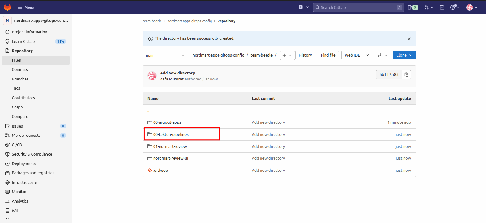
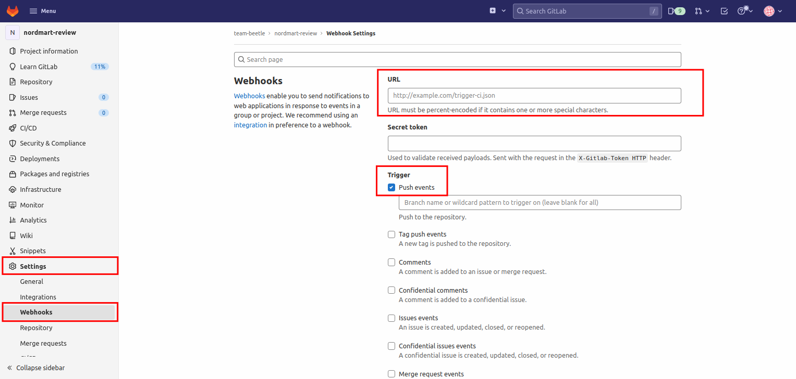

### Tekton Pipeline

> Tekton (OpenShift Pipelines) is the new kid on the block in the CI/CD space. It's grown rapidly in popularity as it's Kubernetes Native way of running CI/CD.

Tekton is deployed as an operator in our cluster and allows users to define in YAML Pipeline and Task definitions. <span style="color:blue;">[Tekton Hub](https://hub.tekton.dev/)</span> is a repository for sharing these YAML resources among the community, giving great reusability to standard workflows.

Tekton is made up of number of YAML files each with a different purpose such as `Task` and `Pipeline`. These are then wrapped together in another YAML file (`PipelineRun`) which represents an instance of a `Pipeline` and a Workspace to create an instance of a pipeline.


In this snippet of the pipeline used in this exercise, we define:

* `params` are the inputs to the run of the `pipeline` eg the application name or the git revision to build.
* `tasks` is where we define the meat of the pipeline, the actions that happen at each step of our pipeline. Tasks can be `ClusterTasks` or `Tasks`. `ClusterTasks` are just global tasks shared across all projects. `Tasks`, much like `Pipelines`, are also supplied parameters and workspaces if required.

#### Deploying the Tekton Objects

Unlike most CI/CD solutions, the Tekton pipeline definitions are not stored with the codebase. Instead, they are deployed directly onto the cluster that they will run on. We will use stakater's `pipeline-charts` Helm chart to deploy the tekton resources.


The above chart contains all necessary resources needed to build and run a tekton pipeline. Some of the key things to note above are:
* `workspace` - TODO
* `tasks` - these are the building blocks of Tekton. They are the custom resources that take parameters and run steps on the shell of a provided image. They can produce results and share workspaces with other tasks.
* `pipelines` -  this is the pipeline definition, it wires together all the items above (workspaces, tasks & secrets etc) into a useful & reusable set of activities.
* `triggers` folder stores the configuration for the webhooks. We will add WebHooks from gitlab to trigger our pipeline, using the resources in this directory we expose the webhook endpoint (`gitlab-event-listener.yaml`) and parse the data from it (`gitlab-trigger-binding.yaml`) to trigger a PipelineRun (`gitlab-trigger-template.yaml`)

### TODO ADD tasks explanation
We will be populating the values file for this Chart to deploy our pipelines.

1. Open up the nordmart-apps-gitops-config repository that we created in section 1 on GitLab.

2. Now create a folder named `00-tekton-pipelines` in the <TEAM_NAME> folder.
   

   Inside the `tekton-pipelines` folder, add a `00-build` folder.

3. Inside the `00-build` folder that you just created, add the following Chart.yaml

      ```
   apiVersion: v2
   dependencies:
       - name: pipeline-charts
         repository: https://stakater.github.io/stakater-charts
         version: 0.0.26
   description: Helm chart for Tekton Pipelines
   name: main-pr-v1
   version: 0.0.26

      ```
   This Chart.yaml uses the pipeline chart as a dependency.
4. Now let's fill in the values file for our chart. Create a values.yaml in the same folder and add the following values:
   ```
   apiVersion: v2
   pipeline-charts:
      name: stakater-main-pr-v1
      workspaces:
      - name: source
        volumeClaimTemplate:
        accessModes: ReadWriteOnce
        resourcesRequestsStorage: 1Gi
      pipelines:
        finally:
          - taskName: stakater-set-commit-status-v1
            name: set-commit-status-task-result
        tasks:
          - taskName: stakater-set-commit-status-v1
            params:
            - name: state
              value: pending 
          - taskName: git-clone
          - taskName: stakater-create-git-tag-v1
            params:
            - name: oldcommit
            - name: action
          - taskName: stakater-build-image-flag-v1
            runAfter:
            - stakater-create-git-tag-v1
            workspaces:
            - name: source
              workspace: source
              params:
              - name: oldcommit
              - name: newcommit
          - taskName: stakater-buildah-v1
            name: build-and-push
            runAfter:
            - stakater-build-image-flag-v1
              params:
              - name: BUILD_IMAGE
                value: $(tasks.stakater-build-image-flag-v1.results.build-image)
              - name: IMAGE_REGISTRY
                value: $(params.image_registry_url)
              - name: CURRENT_GIT_TAG
                value: $(tasks.stakater-create-git-tag-v1.results.CURRENT_GIT_TAG)
          - taskName: stakater-comment-on-github-pr-v1
          - taskName: stakater-helm-push-v1
          - taskName: stakater-update-cd-repo-v3
          - taskName: stakater-push-main-tag-v1
          - taskName: stakater-app-sync-and-wait-v1
            params:
            - name: timeout
              value: "120"
        triggertemplate:
           serviceAccountName: stakater-tekton-builder
           pipelineRunNamePrefix: $(tt.params.repoName)-$(tt.params.prnumberBranch)
        eventlistener:
           serviceAccountName: stakater-tekton-builder
           triggers:               
           - name: pullrequest-create
             interceptors:
             - ref:
               name: "cel"
             params:
             - name: "filter"
               value: "(header.match('X-Gitlab-Event', 'Merge Request Hook') && body.object_attributes.action == 'open' )"
             - name: "overlays"
               value:
                 - key: marshalled-body
                   expression: "body.marshalJSON()"
             bindings:
             - ref: stakater-pr-v1
             - name: oldcommit
               value: "NA"
             - name: newcommit
               value: $(body.object_attributes.last_commit.id)
           - name: pullrequest-synchronize
             interceptors:
             - ref:
               name: "cel"            
             params:
             - name: "filter"
               value: "(header.match('X-Gitlab-Event', 'Merge Request Hook') && body.object_attributes.action == 'update' )"
             - name: "overlays"
               value:
                 - key: marshalled-body
                   expression: "body.marshalJSON()"
             bindings:
             - ref: stakater-pr-v1
             - name: oldcommit
               value: $(body.object_attributes.oldrev)
             - name: newcommit
               value: $(body.object_attributes.last_commit.id)
           - name: push
             interceptors:
             - ref:
               name: "cel"
             params:
             - name: "filter"
               value: (header.match('X-Gitlab-Event', 'Merge Request Hook') && body.object_attributes.action == 'merge' )
             - name: "overlays"
               value:
                 - key: marshalled-body
                   expression: "body.marshalJSON()"
             bindings:
             - name: newcommit
               value: $(body.after)
             - name: oldcommit
               value: $(body.before)
             - ref: stakater-pr-v1
               kind: ClusterTriggerBinding
           - name: stakater-pr-cleaner-v2-pullrequest-merge
             create: false
        rbac:
          enabled: false
        serviceAccount:
          name: stakater-tekton-builder
          create: false

Here we have defined a basic pipeline which clones the repository when it is triggered, builds its image and helm chart, and finally updates the version of application.
5. To deploy our helm chart to the cluster, we need an argocd application that points to this chart.
   Navigate to <TEAM_NAME>/00-argocd-apps/00-build in the nordmart-apps-gitops-config and create a file named `tekton-pipelines.yaml` with the folowing content:
```
   
   apiVersion: argoproj.io/v1alpha1
   kind: Application
   metadata:
          name: <TEAN_NAME>-build-tekton-pipelines
      namespace: openshift-gitops
      labels:
        stakater.com/tenant: <TEAN_NAME>
        stakater.com/env: build
        stakater.com/kind: build    
      spec:
         destination:
           namespace: <TEAN_NAME>-build
           server: 'https://kubernetes.default.svc'
         project: <TEAM_NAME>
         source:
            path: <TEAM_NAME>/00-tekton-pipelines/00-build
            repoURL: <URL_FOR_THIS REPOSITORY>
             targetRevision: HEAD
         syncPolicy:
           automated:
           prune: true
           selfHeal: true
 ```        

6. Update git and wait for our Tekton pipelines to deploy out in ArgoCD.

7. With our pipelines definitions sync'd to the cluster (thanks Argo CD 🐙👏) and our codebase forked, we can now add the webhook to GitLab `nordmart-review` and `nordmart-review-ui` projects. First, grab the URL we're going to invoke to trigger the pipeline:

    ```bash#test
    echo https://$(oc -n ${TEAM_NAME}-build get route webhook --template='{{ .spec.host }}')
    ```

8. Once you have the URL, over on GitLab go to `nordmart-review > Settings > Webhook ` to add the webhook:

    * Add the url we obtained through the last step in the URL box
    * select `Push Events`, leave the branch empty for now
    * select `SSL Verification`
    * Click `Add webhook` button.

   

   You can test the webhook works from GitLab.

   
9. Now let's repeat the process for `nordmart-review-ui`. Go to nordmart-review-ui project and add the webhook there through the same process.
10. With all these components in place - now it's time to trigger pipeline via webhook by checking in some code for Pet Battle API. Lets make a simple change to the application. Edit  `pom.xml` by adding new line in the file.

1As always, push the code to git ...


    🪄 Observe Pipeline running by browsing to OpenShift UI -> Pipelines from left pane -> Pipelines in your `<TEAM_NAME>-build` project:


?> **TIP** You can use the **tkn** command line to observe `PipelineRun` logs as well:

```bash
tkn -n ${TEAM_NAME}-build pr logs -Lf
```

🪄OBSERVE PIPELINE RUNNING :D 