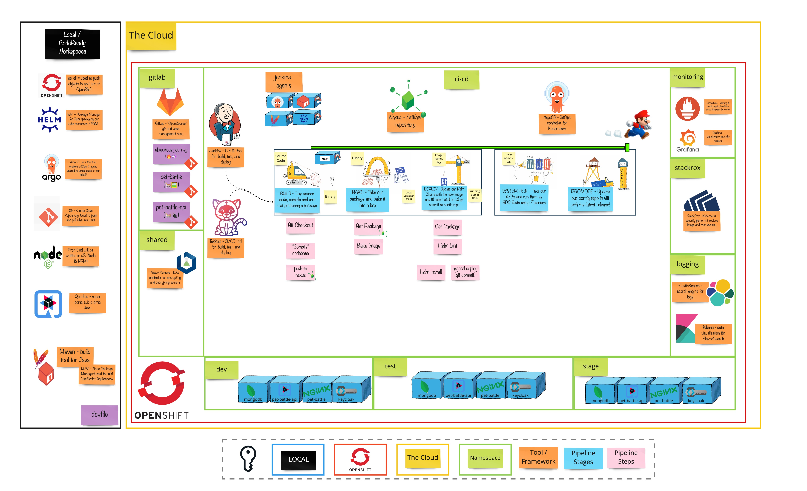

# Exercise 2 - Attack of the Pipelines

> The Job of a Pipeline is to prove that your code is not ready for production.

## 👨‍🍳 Exercise Intro

**Continuous Delivery** is the ability to get code changes - *features*, *configuration changes*, *bug fixes*, *experiments* - into production or into the hands of your users **safely**, **quickly** and in a **sustainable** way. Part of the engineering approach to CD is to codify the build, test and release process so that software can be reliably released at any time. This is the job of the **pipeline**. By doing so, building, testing and releasing software becomes faster and happens more frequently.

## 🖼️ Big Picture

## 🔮 Learning Outcomes

- Can manage App Config via git
- Can automatically build / bake / deploy software Jenkins or Tekton
- Can store secrets used by my pipeline securely in git

## 🔨 Tools used in this exercise!
* [SealedSecrets](https://github.com/bitnami-labs/sealed-secrets) - Helps us to encrypt the secrets to store safely, even to a public repository.
* [Tekton](https://tekton.dev/) -  Cloud Native CI/CD tool, allowing us to build, test, and deploy anywhere.
* [Jenkins](https://jenkins.io/) - Open Source Build automation server. Highly customisable with plugins.
* [Nexus](https://www.sonatype.com/nexus-repository-sonatype) - Repository manager for storing lots of application types. Can also host `npm` and `Docker` registries.
