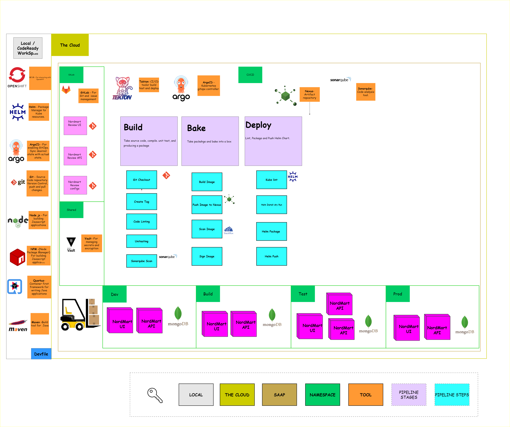

# Exercise 2 - Attack of the Pipelines

> The Job of a Pipeline is to prove that your code is ready for production.

## 👨‍🍳 Exercise Intro

**Continuous Delivery** is the ability to get code changes - *features*, *configuration changes*, *bug fixes*, *experiments* - into production or into the hands of your users **safely**, **quickly** and in a **sustainable** way. Part of the engineering approach to CD is to codify the build, test and release process so that software can be reliably released at any time. This is the job of the **pipeline**. By doing so, building, testing and releasing software becomes faster and happens more frequently.

## 🖼️ Big Picture

## 🔮 Learning Outcomes

- Can manage App Config via git
- Can automatically build / test / deploy software via Tekton
- Can fetch secrets used by my pipeline from our secure secrets vault

## 🔨 Tools used in this exercise!

- [ExternalSecrets](https://external-secrets.io/v0.6.0-rc1/api/externalsecret/) - Helps us to fetch secrets from a secure secrets store.
- [Tekton](https://tekton.dev/) - Cloud Native CI/CD tool, allowing us to build, test, and deploy anywhere.
- [Nexus](https://www.sonatype.com/nexus-repository-sonatype) - Repository manager for storing lots of application types. Can also host npm and Docker registries.
