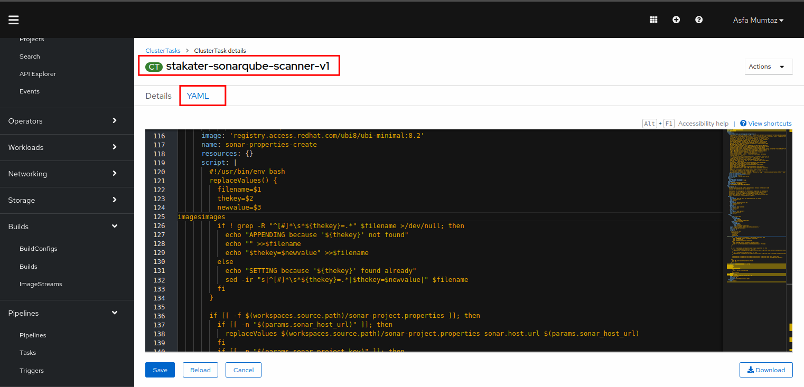

# Sonar Scanning

> Sonarqube is a tool that performs static code analysis. It looks for pitfalls in coding and reports them. It's great tool for catching vulnerabilities!
> SAAP cluster comes shipped with sonarqube. 
## Task


## Deploy Sonarqube using GitOps

In this section we are going to improve our already built `main-pr-v1` pipeline and add sonarqube scaning to it. 
The SAAP cluster is shipped with many useful predefined cluster tasks. A sonarqube cluster task is also present amongst these tasks. We will use the same task and incorporate it in to our pipeline.

1. To view the already defined sonarqube cluster task, open up the `Pipelines` section from the left menu and click `Tasks`
   
    

2. Select `ClusterTasks`. A number of tasks will be displayed on your screen. Scroll down and select the task `stakater-sonarqube-scanner-v1`
   
   
3. CLick YAML to display the tasks definition.
   


#### Integrate the pipeline with Tekton:
## TODO
1. Open the Chart we added to 00-tekton-pipelines folder in section 2.
2. Open the values file in the editor. After the `stakater-create-git-tag-v1`, reference the sonarqube task and add a runAfter field to make it run after the create-git-tag-v1 task:

```
- taskName: stakater-sonarqube-scanner-v1
  runAfter:
    - stakater-create-git-tag-v1

```
The pipeline will now become:
   ````
   apiVersion: v2
   pipeline-charts:
   name: stakater-main-pr-v1
   workspaces:
   - name: source
     volumeClaimTemplate:
     accessModes: ReadWriteOnce
     resourcesRequestsStorage: 1Gi
     pipelines:
     finally:
      - taskName: stakater-set-commit-status-v1
        name: set-commit-status-task-result
      - taskName: stakater-notify-slack-v1
        name: notify-slack
        params:
         - name: namespace
         - name: author
         - name: gitrevision
         - name: repo
           value: $(params.repoName)
         - name: gitrepositoryurl
         - name: tekton-base-url
         - name: prnumber
           tasks:
      - taskName: stakater-set-commit-status-v1
        params:
         - name: state
           value: pending
      - taskName: git-clone
      - taskName: stakater-create-git-tag-v1
        params:
         - name: oldcommit
         - name: action
      - taskName: stakater-sonarqube-scanner-v1
        runAfter:
          - stakater-create-git-tag-v1
      - taskName: stakater-build-image-flag-v1
        runAfter:
         - stakater-create-git-tag-v1
           workspaces:
         - name: source
           workspace: source
           params:
            - name: oldcommit
            - name: newcommit
      - taskName: stakater-buildah-v1
        name: build-and-push
        runAfter:
         - stakater-build-image-flag-v1
           params:
            - name: BUILD_IMAGE
              value: $(tasks.stakater-build-image-flag-v1.results.build-image)
            - name: IMAGE_REGISTRY
              value: $(params.image_registry_url)
            - name: CURRENT_GIT_TAG
              value: $(tasks.stakater-create-git-tag-v1.results.CURRENT_GIT_TAG)
      - taskName: stakater-comment-on-github-pr-v1
      - taskName: stakater-helm-push-v1
      - taskName: stakater-update-cd-repo-v3
      - taskName: stakater-push-main-tag-v1
      - taskName: stakater-app-sync-and-wait-v1
        params:
         - name: timeout
           value: "120"
           triggertemplate:
           serviceAccountName: stakater-tekton-builder
           pipelineRunNamePrefix: $(tt.params.repoName)-$(tt.params.prnumberBranch)
           eventlistener:
           serviceAccountName: stakater-tekton-builder
           triggers:
      - name: pullrequest-create
        interceptors:
         - ref:
           name: "cel"
           params:
         - name: "filter"
           value: "(header.match('X-Gitlab-Event', 'Merge Request Hook') && body.object_attributes.action == 'open' )"
         - name: "overlays"
           value:
            - key: marshalled-body
              expression: "body.marshalJSON()"
              bindings:
         - ref: stakater-pr-v1
         - name: oldcommit
           value: "NA"
         - name: newcommit
           value: $(body.object_attributes.last_commit.id)
      - name: pullrequest-synchronize
        interceptors:
         - ref:
           name: "cel"            
           params:
         - name: "filter"
           value: "(header.match('X-Gitlab-Event', 'Merge Request Hook') && body.object_attributes.action == 'update' )"
         - name: "overlays"
           value:
            - key: marshalled-body
              expression: "body.marshalJSON()"
              bindings:
         - ref: stakater-pr-v1
         - name: oldcommit
           value: $(body.object_attributes.oldrev)
         - name: newcommit
           value: $(body.object_attributes.last_commit.id)
      - name: push
        interceptors:
         - ref:
           name: "cel"
           params:
         - name: "filter"
           value: (header.match('X-Gitlab-Event', 'Merge Request Hook') && body.object_attributes.action == 'merge' )
         - name: "overlays"
           value:
            - key: marshalled-body
              expression: "body.marshalJSON()"
              bindings:
         - name: newcommit
           value: $(body.after)
         - name: oldcommit
           value: $(body.before)
         - ref: stakater-pr-v1
           kind: ClusterTriggerBinding
      - name: stakater-pr-cleaner-v2-pullrequest-merge
        create: false
        rbac:
        enabled: false
        serviceAccount:
        name: stakater-tekton-builder
        create: false

````
4. Now open Argocd and check if the changes were synchronized. 
5. If the sync is green, you're good to go. You have successfully added sonarqube to your pipeline!
