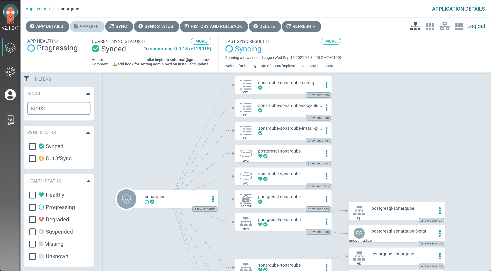
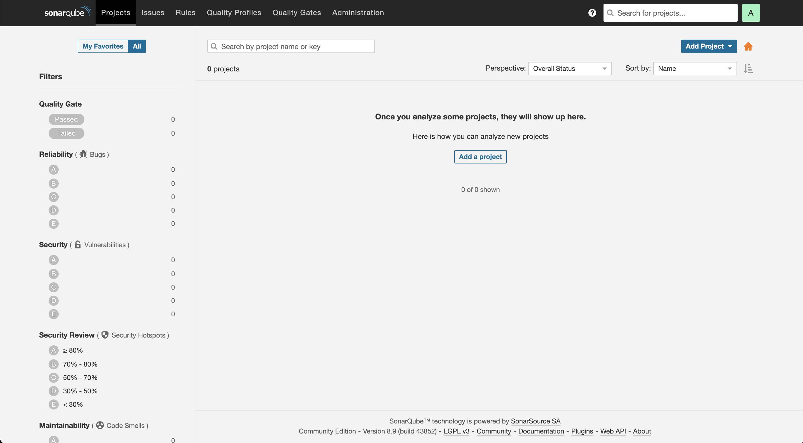

# Sonar Scanning

> Sonarqube is a tool that performs static code analysis. It looks for pitfalls in coding and reports them. It's great tool for catching vulnerabilities!

## Task


## Deploy Sonarqube using GitOps

1. Create a SealedSecrets in our git repository for the Sonarqube admin user _(yes, because it is GitOps!)_ so that the deployment and pipeline can leverage the secret when executing.

    ```bash
    cat << EOF > /tmp/sonarqube-auth.yaml
    apiVersion: v1
    data:
      username: "$(echo -n admin | base64 -w0)"
      password: "$(echo -n admin123 | base64 -w0)"
      currentAdminPassword: "$(echo -n admin | base64 -w0)"
    kind: Secret
    metadata:
      labels:
        credential.sync.jenkins.openshift.io: "true"
      name: sonarqube-auth
    EOF
    ```

2. Just as before, use `kubeseal` command line to seal the secret definition just created.

    ```bash
    kubeseal < /tmp/sonarqube-auth.yaml > /tmp/sealed-sonarqube-auth.yaml \
        -n ${TEAM_NAME}-ci-cd \
        --controller-namespace tl500-shared \
        --controller-name sealed-secrets \
        -o yaml
    ```

    We want to grab the results of this sealing activity, in particular the `encryptedData`.

    ```bash
    cat /tmp/sealed-sonarqube-auth.yaml| grep -E 'username|password|currentAdminPassword'
    ```

    The output should look like this with massively long nonsense strings:
    <div class="highlight" style="background: #f7f7f7">
    <pre><code class="language-yaml">
        username: AgAj3JQj+EP23pnzu...
        password: AgAtnYz8U0AqIIaqYrj...
        currentAdminPassword: AgAtnYz8U0AqIIaqYrj...
    </code></pre></div>

3. Open up `ubiquitous-journey/values-tooling.yaml` file and extend the **Sealed Secrets** entry. Copy the output of `username`, `password` and `currentAdminPassword` from the previous command and update the values. Make sure you indent the data correctly.

    Find the Sealed Secrets entry, it should look like this (don't copy this bit!)
    <div class="highlight" style="background: #f7f7f7">
    <pre><code class="language-yaml">
      # Sealed Secrets
      - name: sealed-secrets
        values:
          secrets:
    </code></pre></div>

    and add `sonarqube-auth` entry (copy this bit!):

    ```yaml
            - name: sonarqube-auth
              type: Opaque
              labels:
                credential.sync.jenkins.openshift.io: "true"
              data:
                username: AgAj3JQj+EP23pnzu...
                password: AgAtnYz8U0AqIIaqYrj...
                currentAdminPassword: AgCHCphbYpeLYMPK...
      ```

    and push the changes:

    ```bash
    cd /projects/tech-exercise
    git add ubiquitous-journey/values-tooling.yaml
    git commit -m  "🍳 ADD - sonarqube creds sealed secret 🍳"
    git push
    ```
  <p class="tip">If you get an error like <b>error: failed to push some refs to..</b>, please run <b><i>git pull --rebase</i></b>, then <b><i>git push</i></b> again.</p>

4. Verify that you have the secret definition available in the cluster by checking the UI or on the terminal:

    ```bash
    oc get secrets -n <TEAM_NAME>-ci-cd | grep sonarqube-auth
    ```

5. Install **Sonarqube**, the code quality tool. Edit `ubiquitous-journey/values-tooling.yaml` file in your IDE  and add to the `applications` list:

    ```yaml
      # Sonarqube
      - name: sonarqube
        enabled: true
        source: https://redhat-cop.github.io/helm-charts
        chart_name: sonarqube
        source_ref: "0.1.0"
        values:
          account:
            existingSecret: sonarqube-auth
          initContainers: true
          plugins:
            install:
              - https://github.com/checkstyle/sonar-checkstyle/releases/download/9.2/checkstyle-sonar-plugin-9.2.jar
              - https://github.com/dependency-check/dependency-check-sonar-plugin/releases/download/2.0.8/sonar-dependency-check-plugin-2.0.8.jar
    ```

6. Git add, commit, push your changes (GITOPS WOOOO 🪄🪄). On ArgoCD you'll see it come alive.

    ```bash
    cd /projects/tech-exercise
    git add .
    git commit -m  "🦇 ADD - sonarqube 🦇"
    git push 
    ```

    

7. Connect to Sonarqube UI to verify if the installation is successful (username `admin` & password `admin123`):

    ```bash
    echo https://$(oc get route sonarqube --template='{{ .spec.host }}' -n ${TEAM_NAME}-ci-cd)
    ```

    

    Now that we have the tool deployed ...

#### In your groups pick the tool you'd like to integrate the pipeline with:

| 🐈‍⬛ **Jenkins Group** 🐈‍⬛  |  🐅 **Tekton Group** 🐅 |
|-----------------------|----------------------------|
| * Configure your pipeline to run code analysis | * Configure your pipeline to run code analysis |
| * Configure your pipeline to check the quality gate | * Configure your pipeline to check the quality gate |
| * Improve your application code quality | * Improve your application code quality |
| <span style="color:blue;">[jenkins](3-revenge-of-the-automated-testing/1a-jenkins.md)</span> | <span style="color:blue;">[tekton](3-revenge-of-the-automated-testing/1b-tekton.md)</span> |
