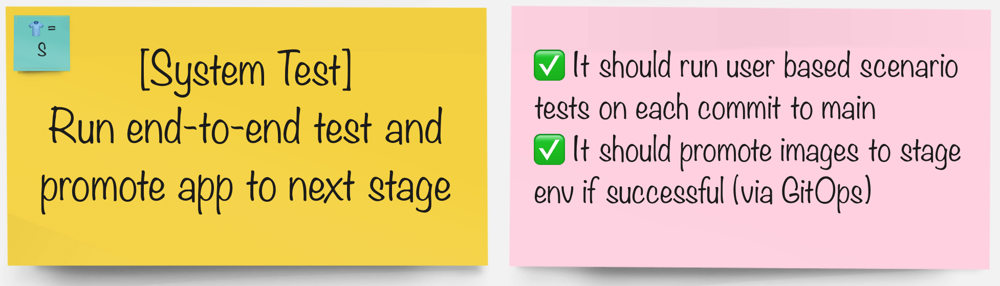

# System Tests

> Validate the sum of the parts of the system are behaving as expected before moving them on to the next stage.

## Task

#### In your groups pick the tool you'd like to integrate the pipeline with:

| 🐈‍⬛ **Jenkins Group** 🐈‍⬛  |  🐅 **Tekton Group** 🐅 |
|-----------------------|----------------------------|
| *  | *  |
| [jenkins](3-revenge-of-the-automated-testing/10a-jenkins.md) | [tekton](3-revenge-of-the-automated-testing/10b-tekton.md) |
