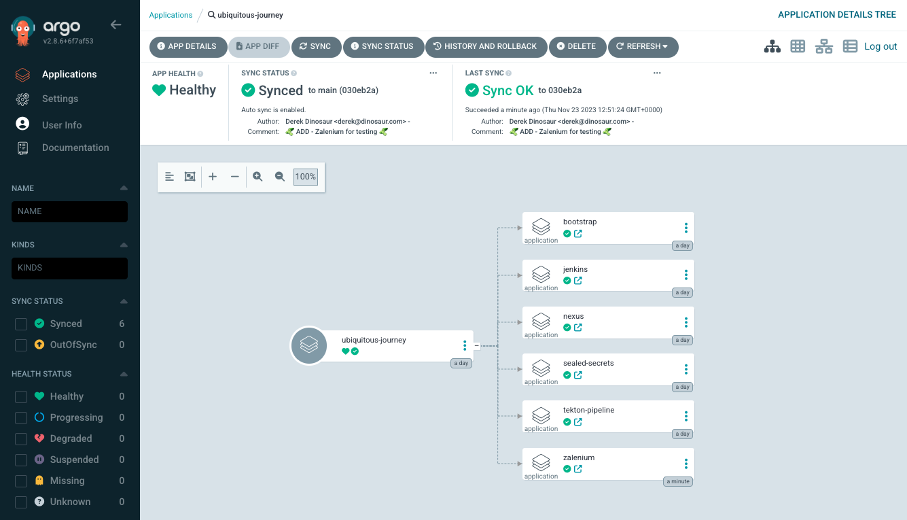
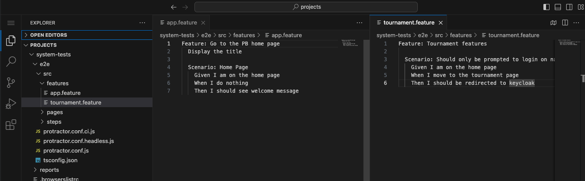
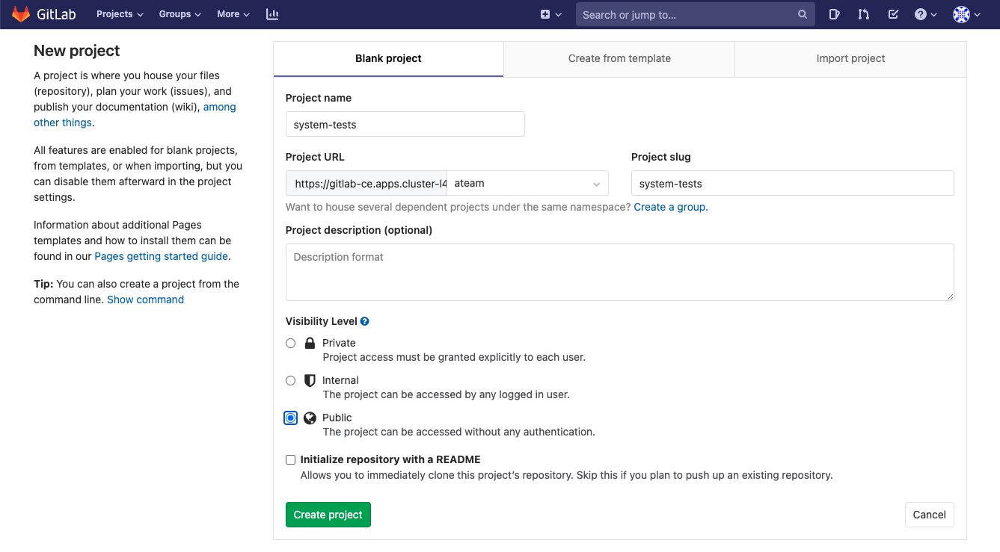

# 🦤 System Tests 🦤

> Validate the sum of the parts of the system are behaving as expected before moving them on to the next stage. Driving the front end as a user would, we can validate the system is working togther from all it's individual components.

## Task


### Deploy Zalenium (selenium grid for kube!)

> Zalenium is a flexible and scalable container based Selenium Grid with video recording, live preview, basic auth & dashboard.

1. To add Zalenium to our cluster, it's been packaged up as a helm chart. We can add this helm chart to our `values-tooling` file. Open this up in your Dev Spaces and add the configuration for `Zalenium` so our GitOps controller can pick it up and roll out the change 🐙

    ```yaml
      # Zalenium
      - name: zalenium
        enabled: true
        source: https://github.com/zalando/zalenium.git
        source_path: charts/zalenium
        source_ref: "master"
        values:
        hub:
            serviceType: ClusterIP
            openshift:
            route:
                enabled: true
            serviceAccount:
            create: false
            desiredContainers: 0
    ```

2. Commit the changes to see them reflected in ArgoCD

    ```bash#test
    cd /projects/tech-exercise
    git add .
    git commit -m  "🥒 ADD - Zalenium for testing 🥒"
    git push
    ```

    

3. Once Zalenium is installed, then create a route to access the Zalenium Dashboard:

    ```bash#test
    oc expose svc/zalenium -n <TEAM_NAME>-ci-cd
    oc get route/zalenium --template='{{.spec.host}}' -n <TEAM_NAME>-ci-cd
    ```

### Add the System Tests to git and execute our pipeline

> An existing project containing some end to end tests and a corresponding Jenkinsfile have been created for you. They use JavaScript to execute. These tests are written in a BDD style syntax and are fairly basic but illustrative of what can be achieved with automated testing



1. Open GitLab and create a new project called `system-tests`. Make it *public* and ensure it's within your team name (`<TEAM_NAME>`) group (`ateam`  in the screenshot below)

    


2. In your Dev Spaces, fork the upstream `system-tests` project and push it to the new GitLab project.

    ```bash#test
    cd /projects
    git clone https://github.com/petbattle/system-tests.git && cd system-tests
    git remote set-url origin https://${GIT_SERVER}/${TEAM_NAME}/system-tests.git
    git branch -M main
    git push -u origin main
    ```

#### In your groups pick the tool you'd like to integrate the pipeline with:

| 🐈‍⬛ **Jenkins Group** 🐈‍⬛  |  🐅 **Tekton Group** 🐅 |
|-----------------------|----------------------------|
| * Add a system test task to our pipeline | * Add a system test task to our pipeline |
| <span style="color:blue;">[jenkins](3-revenge-of-the-automated-testing/11a-jenkins.md)</span> | <span style="color:blue;">[tekton](3-revenge-of-the-automated-testing/11b-tekton.md)</span> |
