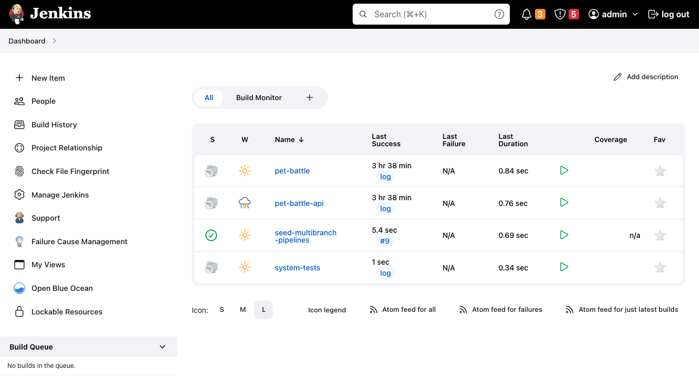
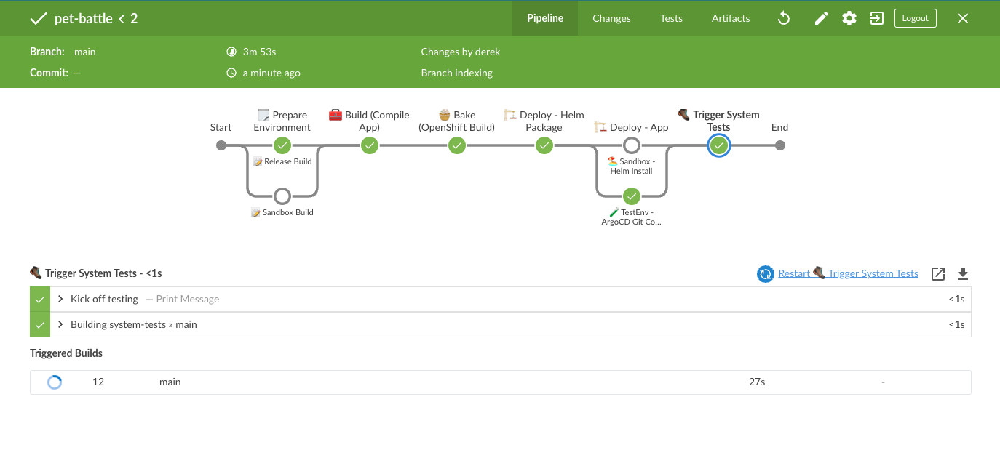
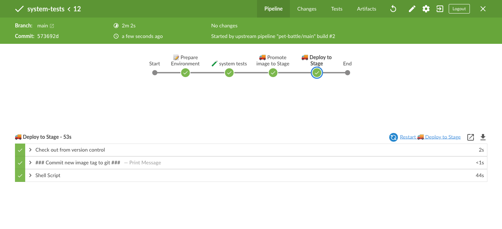
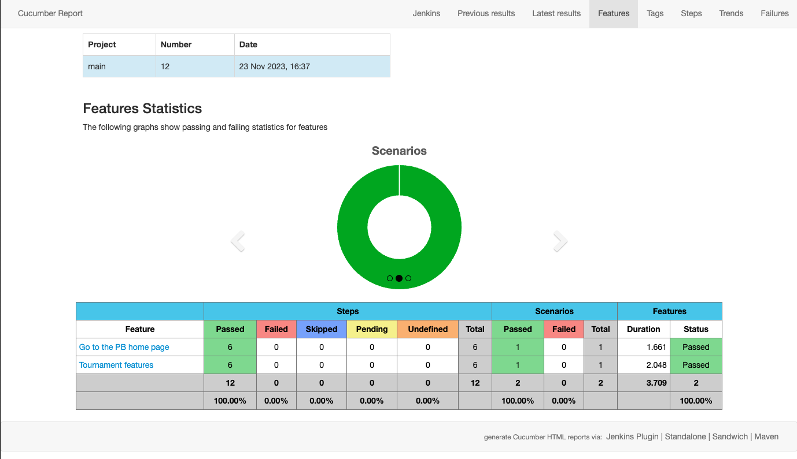
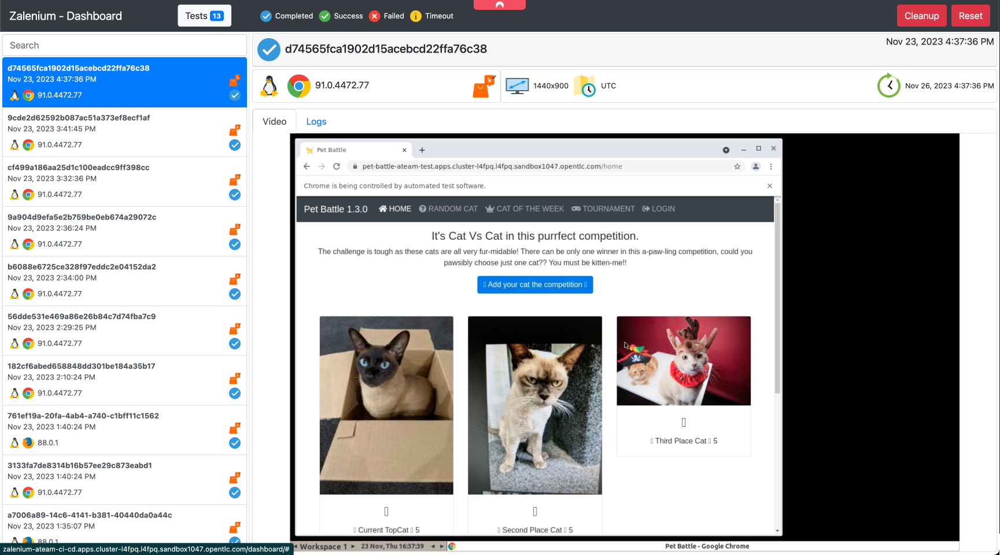

## Extend Jenkins Pipeline with System Test

1. Jenkins is setup automatically to scan repositories for a `Jenkinsfile` so it will detect this new pipeline automatically. Login to see it in place :) [🦵 if it doesn't appear within a few seconds, you can probs just kick the `seed-multibranch-pipelines` job and it will appear a moment after]

    

2. This job can be manually run - but we want to automate everything! So let's join up the Jenkins front end pipeline to this suite of tests and only then promote our application. Open the `pet-battle/Jenkinsfile` and append the following snippet to trigger the build of the downstream job under the heading `// 🥾 Trigger System Tests` as shown below:

    ```groovy
            // 🥾 Trigger System Tests

            stage("🥾 Trigger System Tests") {
              options { skipDefaultCheckout(true) }            
              agent { label "master" }
              when { expression { GIT_BRANCH.startsWith("master") || GIT_BRANCH.startsWith("main") }}
              steps {
                    echo "Kick off testing"
                    build job: "system-tests/main", 
                                parameters: [[$class: 'StringParameterValue', name: 'APP_NAME', value: "${APP_NAME}" ],
                                            [$class: 'StringParameterValue', name: 'CHART_VERSION', value: "${CHART_VERSION}"],
                                            [$class: 'StringParameterValue', name: 'VERSION', value: "${VERSION}"]], 
                                wait: false
              }
            }
    ```

3. With the trigger in place, let's bump our application version. Edit the `package.json` in the root of the `pet-battle` front end repository and bump the version to a new number eg `1.3.0` as per below (this might differ for your env depending on how many of the other modules you've done 🦆🍔)

    ```json
    {
        "name": "pet-battle",
        "version": "1.3.0",
        // more stuff here
    }
    ```

4. Commit these changes to see the whole picture come together on Jenkins.

    ```bash
    cd /projects/pet-battle
    git add .
    git commit -m  "🦤 ADD - new Jenkins step and version change 🦤"
    git push
    ```

5. On Jenkins you should see the builds kicking off - and see how one triggers the other. Jenkins job for Pet Battle also has an additional stage

    

    

    <p class="warn">
    ⛷️ <b>NOTE</b> ⛷️ - If you have not created definitions in your `pet-battle/stage/values.yaml` for the stage environment, the last step will fail. Have a <a href="/tech-exercise/#/2-attack-of-the-pipelines/2-app-of-apps?id=deploying-pet-battle">look here for instructions to fix this</a> if you've skipped step 4 from exercise 2. 
    </p>

6. Once the job has executed successfully, you can show the reports of the test execution and what browswer was used etc. To view this report, you need to swap to classic jenkins view and go to `system-tests/main` job. On the left hand side you'll see the `Cucubmer Reports` on the menu. 

    

7. Zalenium also has some cool features, you can show the tests execution both live and via the recording. Just go to the url of your running Zalenium http://zalenium-<TEAM_NAME>-ci-cd.<CLUSTER_DOMAIN>/dashboard to see a recording of the test cases executing. Note - for the live execution of tests it's http://zalenium-<TEAM_NAME>-ci-cd.<CLUSTER_DOMAIN>/grid/admin/live?refresh=5


