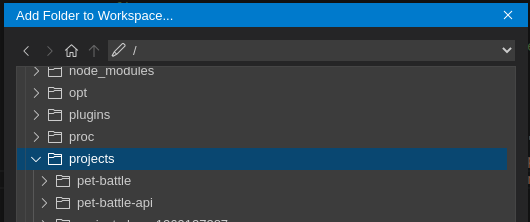
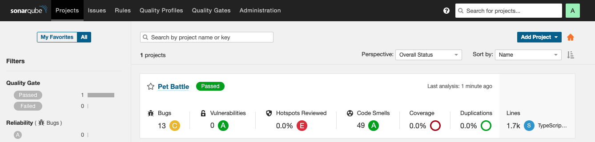

## Extend Jenkins Pipeline with Sonar Scanning

> In this exercise, we'll connect our code base to Sonar for quality metrics

1. Open the CodeReadyWorkspace and create a sonar file in the root of the `pet-battle` project. This file contains the information of Sonarqube instance and other properties for the scanner to use while assessing the code base.

    ```javascript
    cd /projects/pet-battle
    cat << EOF > sonar-project.js
    const scanner = require('sonarqube-scanner');

    scanner(
      {
        serverUrl: 'http://sonarqube-sonarqube:9000',
        options: {
          'sonar.login': process.env.SONARQUBE_USERNAME,
          'sonar.password': process.env.SONARQUBE_PASSWORD,
          'sonar.projectName': 'Pet Battle',
          'sonar.projectDescription': 'Pet Battle UI',
          'sonar.sources': 'src',
          'sonar.tests': 'src',
          'sonar.inclusions': '**', // Entry point of your code
          'sonar.test.inclusions': 'src/**/*.spec.js,src/**/*.spec.ts,src/**/*.spec.jsx,src/**/*.test.js,src/**/*.test.jsx',
          'sonar.exclusions': '**/node_modules/**',
          //'sonar.test.exclusions': 'src/app/core/*.spec.ts',
          // 'sonar.javascript.lcov.reportPaths': 'reports/lcov.info',
          // 'sonar.testExecutionReportPaths': 'coverage/test-reporter.xml'
        }
      },
      () => process.exit()
    );
    EOF
    ```

2. Then we need to introduce SonarQube credentials to `Jenkinsfile` - these are already being synchronized to the cluster from Git, we just have to tell our pipeline to use them. Add the followings to the list of other `CREDS` in the `environment {}` block in the `Jenkinsfile`.

    <p class="warn">
    ⛷️ <b>NOTE</b> ⛷️ - If you are using DevSpaces in OpenShift 4.11+ you may need to add the `pet-battle` folder to you Che Workspace to open the `Jenkinsfile`
    </p>

    

    ```groovy
            SONARQUBE_CREDS = credentials("${OPENSHIFT_BUILD_NAMESPACE}-sonarqube-auth")
    ```

    You'll have something like this afterwards:
    <div class="highlight" style="background: #f7f7f7">
    <pre><code class="language-groovy">
    environment {
        // .. other stuff ...
            // Credentials bound in OpenShift
            GIT_CREDS = credentials("${OPENSHIFT_BUILD_NAMESPACE}-git-auth")
            NEXUS_CREDS = credentials("${OPENSHIFT_BUILD_NAMESPACE}-nexus-password")
            SONAR_CREDS = credentials("${OPENSHIFT_BUILD_NAMESPACE}-sonar-auth")
        // .. more stuff ...
    }
    </code></pre></div>

3. And add a shell step in to `stage("🧰 Build (Compile App)")` stage of the pipeline we added previously where `// SONARQUBE SCANNING` placeholder is. This needs to be happen before the build.

    ```bash
                    // 🌞 SONARQUBE SCANNING EXERCISE GOES HERE 
                    echo '### Running SonarQube ###'
                    sh '''
                      export SONARQUBE_USERNAME=${SONARQUBE_CREDS_USR}
                      export SONARQUBE_PASSWORD=${SONARQUBE_CREDS_PSW}
                      npm run sonar
                    '''
    ```

4. Push the changes to the git repository, which also will trigger a new build.

    ```bash
    cd /projects/pet-battle
    git add Jenkinsfile sonar-project.js
    git commit -m "🧦 test code-analysis step 🧦"
    git push
    ```

5. Observe the pipeline and when scanning is completed, browse the Sonarqube UI to see the details.

    
