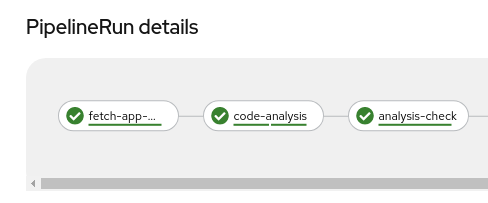

### Extend Tekton Pipeline with Sonar Scanning

> What are we going to do

Add `code-analysis` step to our pipeline. Edit `maven-pipeline.yaml` file, add this step before the `maven` build step:

```yaml
    # Code Analysis
    - name: code-analysis
      taskRef:
        name: maven
      params:
        - name: WORK_DIRECTORY
          value: "$(params.APPLICATION_NAME)/$(params.GIT_BRANCH)"
        - name: GOALS
          value:
            - test
            # - org.owasp:dependency-check-maven:check
            - sonar:sonar
        - name: MAVEN_BUILD_OPTS
          value:
            - '-Dsonar.host.url=http://sonarqube-sonarqube:9000'
            - '-Dsonar.userHome=/tmp/sonar'
            - '-Dsonar.login=admin'
            - '-Dsonar.password=admin123'
      runAfter:
        - fetch-app-repository
      workspaces:
        - name: maven-settings
          workspace: maven-settings
        - name: maven-m2
          workspace: maven-m2
        - name: output
          workspace: shared-workspace
```

Browse to Sonarqube URL


Add the `sonarqube-quality-gate-check.yaml` Task
```bash
curl -sLo /projects/tech-exercise/tekton/templates/tasks/sonarqube-quality-gate-check.yaml https://raw.githubusercontent.com/petbattle/ubiquitous-journey/main/tekton/tasks/sonarqube-quality-gate-check.yaml
```

Add `code-analysis-check` step to our pipeline.

```yaml
    # Code Analysis Check
    - name: analysis-check
      retries: 1
      taskRef:
        name: sonarqube-quality-gate-check
      workspaces:
        - name: output
          workspace: shared-workspace
      params:
      - name: WORK_DIRECTORY
        value: "$(params.APPLICATION_NAME)/$(params.GIT_BRANCH)"
      runAfter:
      - code-analysis
```



`TODO`
- [ ] Code Exercise to fix up Security HotSpots and improve quality
- [ ] Document steps
